# 📈 Stock Lab · AI 모의투자 연구실

> 토스증권 **실시간 시세**를 받아 **AI 분석팀 7명**이 종목을 고르고 토론하며, 서버가 **위험 한도 안에서만** 가상 자금으로 모의매매하는 개인용 웹 서비스입니다.
> **실제 증권 주문 경로는 없습니다.** 전략의 수익성은 검증되지 않았습니다.

<p>


</p>

---

## 📑 목차

1. [한눈에 보기](#-한눈에-보기)
2. [화면 디자인](#-화면-디자인)
3. [전체 구조](#-전체-구조)
4. [AI 분석팀 — 역할과 흐름](#-ai-분석팀--역할과-흐름)
5. [AI 공급자 전환과 사용량 관리](#-ai-공급자-전환과-사용량-관리)
6. [검증 계획 · 거래 성적표](#-검증-계획--거래-성적표)
7. [AI 판단 검증 (성과 채점)](#-ai-판단-검증-성과-채점)
8. [실거래 준비 (구조만 · 잠김)](#-실거래-준비-구조만--잠김)
9. [매매·위험 관리 규칙](#-매매위험-관리-규칙)
10. [관심 종목](#-관심-종목)
11. [오늘의 집중 종목](#-오늘의-집중-종목)
12. [1개월 스윙 전략](#-1개월-스윙-전략)
13. [조건부 자동 진입](#-조건부-자동-진입)
14. [폴더 구조](#-폴더-구조)
15. [설치와 실행](#-설치와-실행)
16. [환경 변수](#-환경-변수)
17. [운영·백업·복구](#-운영백업복구)
18. [API](#-api)
19. [테스트](#-테스트)
20. [보안 설계](#-보안-설계)
21. [알려진 한계](#-알려진-한계)

---

## 🔎 한눈에 보기

| 항목 | 내용 |
|---|---|
| **무엇을** | 국내·미국 주식/ETF 중 **매일 아침 데이터와 뉴스로 시장별 집중 종목을 고르고**, 그 안에서 AI가 종목을 골라 분석한 뒤 가상 계좌로 모의매매 |
| **종목 구성** | 후보 풀 36종목 → 일봉 데이터로 **상승 추세 종목**을 거른 뒤 AI가 뉴스·테마를 확인해 **시장별 3개** ([상세](docs/UNIVERSE.md)). 목록 밖 신규 매수 금지 · 보유 종목은 유지/교체 판단 |
| **시세** | 토스증권 Open API (**조회 전용**) · 정규장·최신 호가만 사용 · 호가는 병렬 조회 · 시장 순위·국내 투자자별 수급도 조회 |
| **AI** | 1순위 Claude CLI (Opus 5.5) → 2순위 Codex CLI (GPT-6.1-Sol · 깊이 high). **구독 사용률이 전환 기준(기본 80%, 이 서버는 90%)에 닿으면 분석을 시작하기 전에** 다음 AI로 전환하고, 쓸 수 있는 AI가 없으면 오류 없이 대기 ([상세](#-ai-공급자-전환과-사용량-관리)) |
| **비용** | Claude·Codex는 서버에 로그인된 **구독 사용량**으로 호출 (추가 API 비용 없음). Gemini는 무료 등급이 검색이 안 되고 불안정해 기본 구성에서 뺐습니다(선택) |
| **매매 방식** | 직접 승인 / 자동 모의매매 중 선택 |
| **전략** | **1개월 스윙** (최대 30일 보유 · 밤새 보유 · 추적 손절) · 기본 전략(5단계). 종목 선정 + 6단계 전문가팀 ([상세](docs/MONTH.md)). **당일 단타는 2026-10-01에 제거**(비용·속도에서 구조적으로 불리) |
| **분석 주기** | **20분마다** 확인하되 **규칙 신호(골든크로스·모멘텀·평균회귀·돌파)가 있을 때만 AI를 호출**(신호가 없으면 0회). 구독 사용량이 빠듯하면 간격을 고르게 늘림(사용량 배분) |
| **분석 자료** | 오늘만이 아니라 **최근 3개월 일봉**(서버가 계산한 수익률·이동평균·변동폭·고저점)과 이 종목의 지난 판단·체결 기록, **직전 분석 메모**(그때 결론·가격 변화·조건 계획의 결과) |
| **조사 재사용** | 같은 종목을 1시간 안에 다시 분석하면 앞선 **업무 배정·기업·뉴스 조사를 다시 쓰고** 시세 분석·반대 검토·최종 판단만 새로 해 AI 호출을 **6회 → 3회**로 줄임. 가격이 1.5% 움직이거나 거래량이 급증하면 새로 조사 ([상세](docs/REUSE.md)) |
| **조건부 진입** | AI가 관망하면서 "이 가격에 닿으면 매수" 계획을 남기면 **서버가 AI 호출 없이 호가만 감시**하다가 조건이 맞을 때 같은 위험 규칙으로 모의매수. 계획을 기다리는 종목은 다시 분석하지 않아 사용량도 아낌 ([상세](docs/ENTRY.md)) |
| **검증** | 실험을 시작할 때 **검증 계획**(기간·표본·판정 기준)을 고정하고, 거래 성적표(승률·기대값·95% 신뢰구간)와 **같은 기간 지수 ETF 보유**(KODEX 200·S&P500) 비교로 "실제 돈을 맡길 만한가"를 판정 ([상세](docs/VERIFICATION.md)). AI 판단은 1·5·21거래일 뒤 종가로 채점해 "항상 관망"·"매번 매수"·규칙 4종·**"AI 없이 규칙대로"**와 비교 |
| **비용·체결** | **실제 요율**: 토스 수수료 국내 0.015% · 미국 0.1%(주문 10달러 이하 무료), 국내 **주식** 매도 거래세 0.20%(ETF 면제), 슬리피지 가정 0.05%. 익절은 목표가 **지정가**, 손절은 그때의 호가로 체결 |
| **AI 분담** | 조사(업무 배정·기업·시세·뉴스)는 가벼운 모델(Sonnet 5.5), 판단(종목 선정·반대 검토·최종 전략)은 주력 모델(Opus 5.5) → 분석 1회의 구독 사용량 절감. 대체 AI(Codex)는 다시 쓸 수 있게 되면 자동으로 응답 확인 |
| **실거래** | 🔒 **잠김** — 실제 주문 코드가 없음. 나중을 위한 안전 구조(주문 관문·한도·대사·보호 주문)와 **그림자 모드**만 구현 ([상세](docs/LIVE_TRADING.md)) |
| **자금** | 통화별 분리 운용 (KRW / USD), 환전 없음 · 차입·공매도 없음 |
| **실행 환경** | Debian 13 · Docker Compose (`app` 1개 + PostgreSQL `db` 1개) + 호스트 systemd 중계 서비스 |
| **재부팅 복구** | 서버가 꺼졌다 켜져도 부팅 서비스가 앱을 올리고, **시작을 눌러 둔 상태면 분석을 자동으로 이어감** ([상세](#-서버가-꺼졌다-켜져도-유지)) |

### 기술 스택

| 계층 | 사용 기술 |
|---|---|
| 백엔드 | Python 3.12, FastAPI, Uvicorn(워커 1개), SQLAlchemy, httpx |
| 데이터베이스 | PostgreSQL 17 (상태·실험 기록을 JSON으로 저장) |
| 프론트엔드 | 순수 HTML / CSS / JavaScript (빌드 도구 없음) |
| AI 중계 | Python 표준 라이브러리만 사용하는 HTTP 서버 (`bridge/ai_bridge.py`) |
| 배포 | Docker Compose (읽기 전용 컨테이너), systemd |

---

## 🎨 화면 디자인

라이트(반투명 유리)와 다크(네온 우주) 두 테마를 지원하는 **Aurora Glass** 디자인입니다. 프레임워크나 빌드 도구 없이 HTML · CSS · JavaScript만 사용합니다. 설계와 검증 방법은 **[docs/DESIGN.md](docs/DESIGN.md)** 에 있습니다.

| 라이트 · 글래스 | 다크 · 네온 |
|---|---|
| 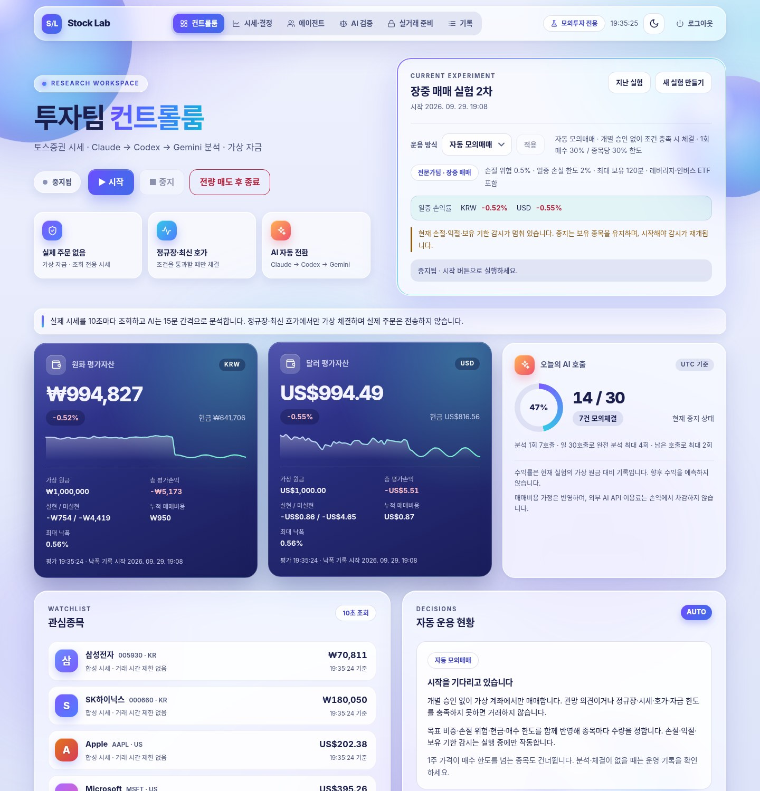 | 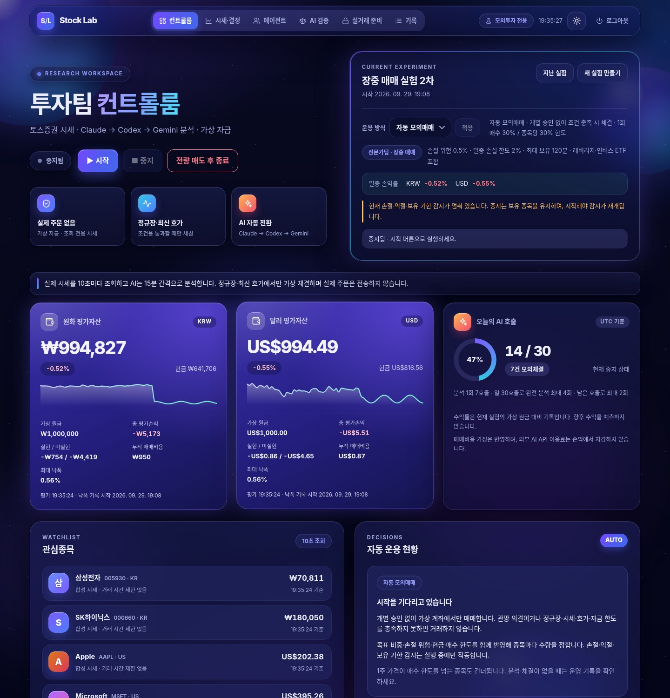 |

| 모바일 · 라이트 | 모바일 · 다크 | 분석 중인 에이전트 데스크 |
|---|---|---|
| 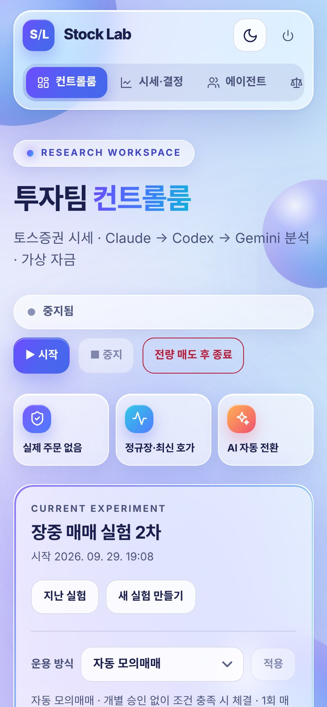 | 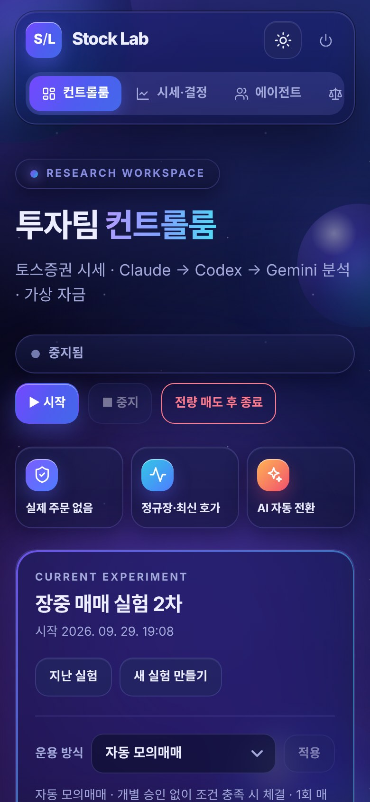 | 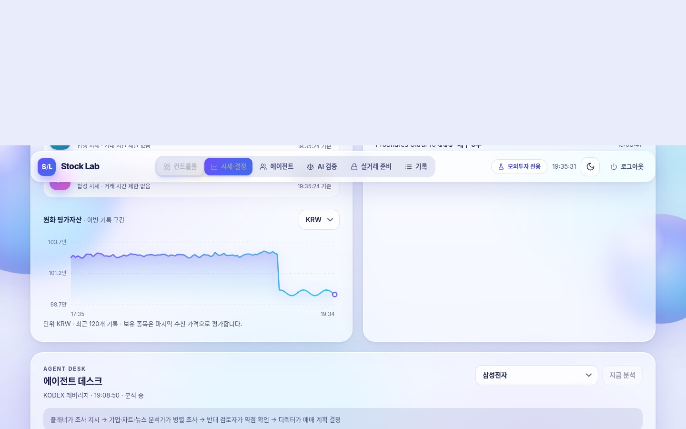 |

| AI 판단 검증 · 다크 | 승인 대기 결정 · 다크 |
|---|---|
| 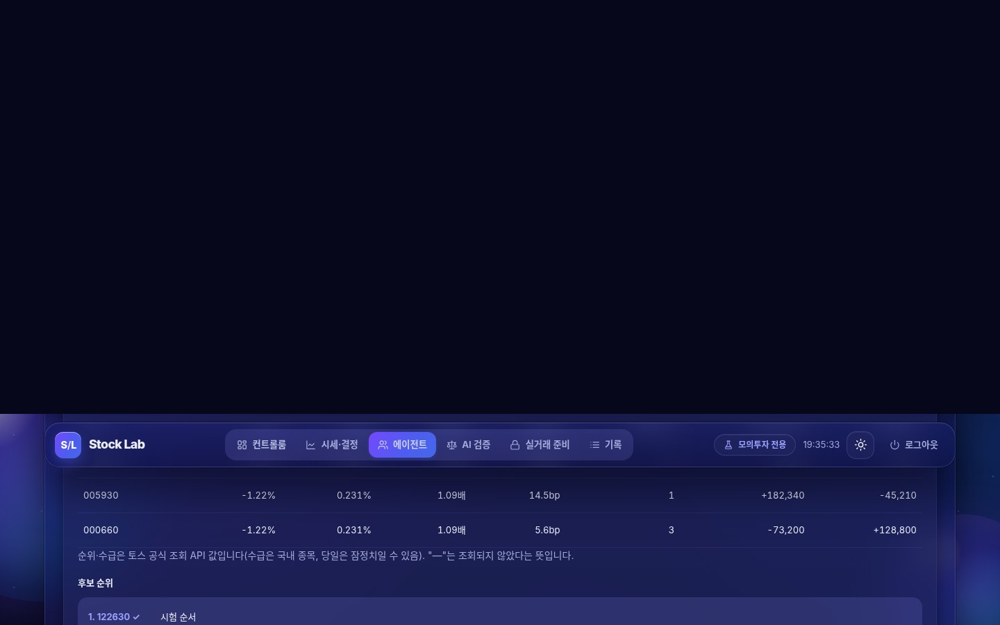 | 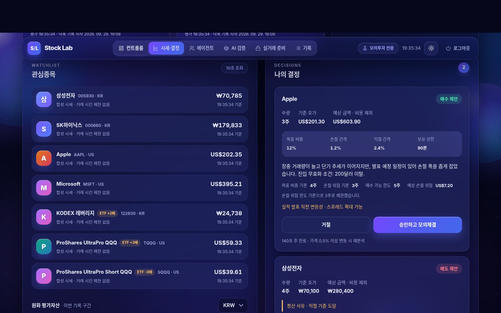 |

> 스크린샷은 실제 계좌가 아닌 **합성 데모 데이터**입니다.

| 특징 | 내용 |
|---|---|
| 두 테마 | 상단 해·달 버튼으로 전환, 선택 기억, 저장이 없으면 기기 설정을 따름, 첫 화면 깜빡임 없음 |
| 화면 요소 | 유리 카드 · 광택 구체 배경 · KPI 타일(스파크라인) · 링/도넛 게이지 · 부드러운 곡선 차트 · AI vs 규칙 비교 막대 |
| 글자 대비 | 실제 렌더링 픽셀로 측정해 WCAG AA 기준 **미달 0건** (약 3,800개 글자, 라이트·다크·모바일) |
| 반응형 | 데스크톱 → 태블릿 → 모바일 (상단 탭이 스크롤을 따라 현재 구역을 표시) |
| 보안 정책 안에서 | 인라인 스타일·외부 폰트·외부 이미지를 쓰지 않는 엄격한 CSP에서 동작 |
| 갱신 안정성 | 화면이 2초마다 갱신돼도 바뀐 부분만 교체 → 애니메이션·호버·선택 상태 유지 |
| 자동 검증 | `tests/test_ui_contract.py` + 실제 브라우저 점검 도구 `tools/design-lab/` |

---

## 🏗 전체 구조

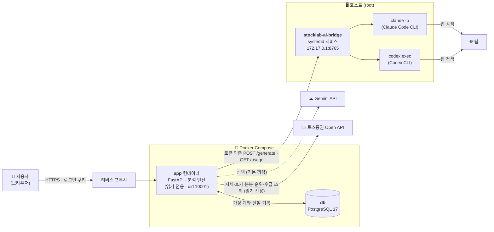

**왜 중계 서비스가 필요한가?**
앱은 보안을 위해 **읽기 전용 컨테이너**에서 일반 사용자 권한으로 돕니다. 반면 `claude`·`codex` CLI와 로그인 정보는 **호스트의 root**에 있습니다. 컨테이너는 호스트 CLI를 직접 실행할 수 없으므로, 호스트의 작은 HTTP 서비스가 요청을 받아 CLI를 대신 실행합니다.

### 백그라운드 작업 루프

| 루프 | 주기 | 하는 일 |
|---|---|---|
| 시세 갱신 | `QUOTE_POLL_SECONDS` (기본 10초) | 호가·체결가 갱신, 성과 기록, 일일 손실 한도 확인, **AI 판단 채점** |
| 청산 감시 | 시세 갱신과 함께 | 손절·**추적 손절**·익절·최대 보유 기간·종목 교체 시 모의청산 (1개월 스윙은 마감 전 일괄 청산 없음) |
| 조건 진입 감시 | 시세 갱신과 함께 (청산 감시·전량 매도 다음) | AI가 남긴 가격 계획을 호가와 비교: 무효 가격·기한이면 폐기, 조건이 맞으면 재확인 뒤 같은 위험 규칙으로 주문. **AI 호출 없음** |
| 시장 정보 | 15초마다 확인 (순위 1분 · 수급 5분 간격, **별도 루프**) | 토스 공식 순위·국내 투자자별 수급 조회 — 실패해도 시세·청산에 영향 없음 |
| 집중 종목 · 채점 | 30초마다 확인 (목록은 시장별 하루 1회, 개장 90분 전부터) | 일봉으로 후보를 거르고 AI 뉴스 브리핑으로 오늘의 목록 작성 — 실패해도 기본 종목으로 진행. 같은 루프에서 **1개월 스윙 판단의 일봉 채점**(15분에 한 번) |
| 지수 비교 · AI 확인 · 알림 | 집중 종목 루프와 함께 (지수 일봉 15분, AI 확인 10분 간격) | 지수 ETF(KODEX 200·SPY) 일봉으로 같은 기간 보유 수익 계산 · 하루 넘게 응답이 없던 대체 AI에 작은 확인 요청 · 새 체결·경고를 휴대폰 알림(`NOTIFY_URL` 설정 시) |
| 전량 매도 처리 | 시세 갱신과 함께 | "전량 매도 후 종료" 요청 처리 |
| 분석 사이클 | `ANALYSIS_INTERVAL_SECONDS` (기본 **20분**, 사용량 배분이 늘릴 수 있음) | 후보 수집 → **일봉 3개월 조회 · 규칙 신호 게이트** → (신호 있을 때만) AI 종목 선정 → AI 분석 → 제안/체결 → 판단 기록 |

---

## 🤖 AI 분석팀 — 역할과 흐름

### 전문가팀 전략 (종목 선정 + 6단계, AI 호출 최대 7회)

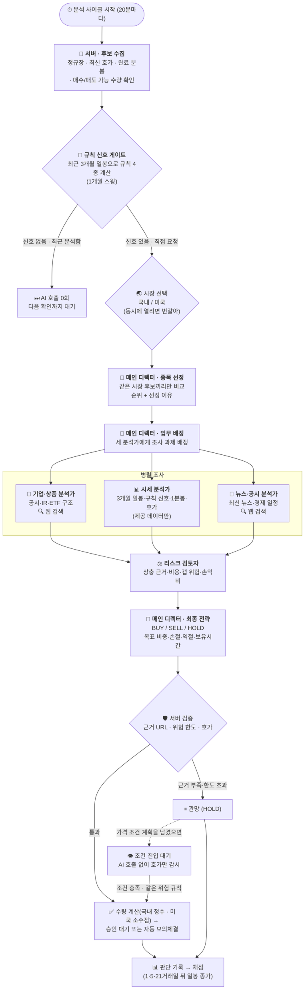

| # | 역할 | 입력 | 출력 | 웹 검색 |
|:-:|---|---|---|:-:|
| 0 | 🎯 메인 디렉터 · 종목 선정 | 같은 시장 후보들의 요약 지표 | 종목 1개 + 후보 순위·이유 | ❌ |
| 1 | 🧭 메인 디렉터 · 업무 배정 | 종목·계좌·시세 | 분석가 3명의 조사 과제 | ❌ |
| 2 | 🏢 기업·상품 분석가 | 배정 과제 | 공시·IR·ETF 구조 요약 + 출처 | ✅ |
| 2 | 📊 시세 분석가 | **최근 3개월 일봉과 서버 계산 요약**·규칙 신호·최근 1분봉·호가 | 추세·지지/저항·진입 가격대·무효화 조건 | ❌ |
| 2 | 📰 뉴스·공시 분석가 | 배정 과제 | 최신 뉴스·공시 + 출처·게시일 | ✅ |
| 3 | ⚖️ 리스크 검토자 | 앞선 3개 보고서 | 약점·반대 근거·관망 이유 | ❌ |
| 4 | 🎯 메인 디렉터 · 최종 전략 | 전체 보고서 | 매매 판단 + 전략 수치 | ❌ |

> 1개월 스윙에서는 규칙 신호가 있는 종목만 이 흐름을 탑니다. **후보가 1개면 종목 선정 호출도 생략**해 6회입니다.

> **조사 재사용**: 같은 종목을 `RESEARCH_REUSE_SECONDS`(기본 1시간) 안에 다시 분석하면 ①②(업무 배정·기업·뉴스)는 앞선 보고서를 다시 쓰고 **시세 분석가 → 반대 검토 → 디렉터 3회**만 호출합니다. 조사 때보다 가격이 1.5% 이상 움직였거나 거래량이 평소의 3배로 늘었거나 근거 출처가 없었거나 사용자가 "지금 분석"으로 요청했으면 처음부터 다시 조사합니다. 재사용 보고서는 원래 조사 시각·가격을 그대로 달고 다녀서 연쇄로 재사용해도 낡은 조사가 살아남지 않습니다. ([상세](docs/REUSE.md))

> **기본 전략(5단계)**: 종목은 서버가 순서대로 고르고, 기업 분석가 → 차트 분석가 → 뉴스 분석가 → 반대 검토자 → 디렉터를 순서대로 실행합니다.

### AI 종목 선정

| 항목 | 내용 |
|---|---|
| 후보 | 서버가 거래 가능 여부를 먼저 확인한 종목만 (정규장, 최신 호가, 분봉 20개 이상, 살 수 있거나 팔 수 있는 수량) |
| 시장 분리 | **국내와 미국 종목은 서로 비교하지 않음.** 시장을 먼저 정하고 그 시장 안에서 선정. AI에게는 그 시장 통화의 현금·손익만 전달 |
| AI가 받는 후보별 지표 | 호가 스프레드(bp), 5·20·60분 수익률, 1분 변동성, 최근 5분 거래량 배율, 남은 장 시간, 보유 수량·평가손익, 최근 분석 시각·판단, **시장 거래량·거래대금·급등·급락 순위**, **국내 종목의 외국인·기관 순매수(주)** |
| 안전장치 | 후보에 없는 종목을 고르면 거부 → 다음 AI로. 모두 실패하면 서버가 순서대로 선택 |
| 순위·수급 표시 | "100위 밖"은 상위 100위에 못 들었다는 뜻, `null`은 **조회되지 않았다**는 뜻으로 구분해서 전달. 순위는 10분이 지나면 현재 값으로 보여주지 않음. 수급은 조회 시각을 함께 전달하고 당일 값은 잠정치로 표시 |
| 선정 생략 | 사용자가 "지금 분석"으로 종목을 직접 지정했을 때, 후보가 1개뿐일 때 |
| 기록 | 실행 기록에 `selected_by` = `ai` / `user` / `server` |

### 최종 전략이 반환하는 값

| 필드 | 1개월 스윙 | 의미 |
|---|---|---|
| `stance` | BUY / SELL / HOLD | 매매 판단 |
| `target_weight_pct` | 0 ~ 30 | 해당 통화 평가자산 대비 목표 비중(%) |
| `stop_loss_pct` | 2 ~ 15 | 손절 폭(%) |
| `take_profit_pct` | 3 ~ 40 | 익절 폭(%) — 매수 시 **손절 폭의 1.5배 이상** |
| `max_holding_minutes` | 1,440 ~ 43,200 (1 ~ 30일) | 최대 보유(분) |
| `evidence` | 최대 15개 | 주장 · 출처 URL · 게시일 |
| `entry_type` | none / breakout / pullback | **디렉터만.** 관망하면서 남기는 조건 진입 계획의 종류 ([상세](docs/ENTRY.md)) |
| `entry_level` · `entry_invalidate` | 기준 가격 · 무효 가격 | 돌파는 기준 위로 넘으면, 눌림은 기준까지 내려오면 매수 · 무효 가격 이하로 내려가면 폐기 |
| `entry_minutes` | 30 ~ 1,440 | 계획을 유지할 시간(분) |

### 근거(출처) 검증 규칙

- AI가 적은 URL은 **실제로 검색해서 받은 결과 URL과 일치할 때만** 근거로 인정합니다. 지어낸 URL은 제거됩니다.
- 기업·뉴스 분석가 보고서에 **검증된 출처가 하나도 없으면** 최종 판단은 서버가 강제로 **HOLD**로 바꿉니다.
- 게시일을 확인할 수 없으면 `null`로 두고 "확인되지 않음"으로 표시합니다.

| AI | 출처 검증 방법 |
|---|---|
| Claude | CLI 출력(stream-json)에 담긴 **WebSearch 결과 URL 목록**과 대조 |
| Codex | 결과 목록을 주지 않으므로, 중계 서비스가 **인용 URL에 직접 접속**해 존재 확인 (내부망 주소 차단) |
| Gemini | 응답의 **Google Search grounding** 메타데이터와 대조 |

---

## 🔁 AI 공급자 전환과 사용량 관리

분석 사이클을 **시작하기 전에** 어느 AI로 돌릴지 정하고, 그 사이클은 같은 AI로 끝냅니다. 한도가 다 찬 뒤에 알게 되어 사이클이 도중에 죽는 일을 막기 위한 것입니다.

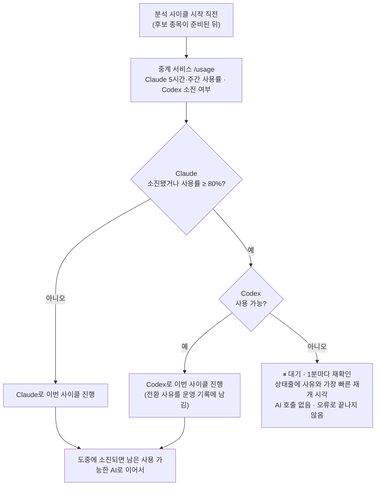

### 현재 설정

| 순서 | 공급자 | 호출 방식 | 모델 | 추론 깊이 | 비용 |
|:-:|---|---|---|:-:|---|
| 1 | **Claude** | `claude -p` (중계) | `claude-opus-5-5` | medium | Claude 구독 사용량 |
| 2 | **Codex** | `codex exec` (중계) | `gpt-6.1-sol` | high | ChatGPT 구독 사용량 |
| (선택) | Gemini | REST API (앱 직접) | `gemini-3.5-flash` | high | 무료 등급 — **기본 구성에서 제외** ([아래](#선택-gemini)) |

> 전환 기준 `AI_SWITCH_AT_PCT`: 이 서버는 **90%**(기본값 80%, 2026-10-01 변경). 남는 10%는 같은 계정으로 직접 쓰는 대화형 사용을 위한 여유입니다.

### 사용량을 어떻게 아는가

| 공급자 | 알 수 있는 것 | 출처 |
|---|---|---|
| Claude | 5시간 창·주간 창의 **실제 사용률과 초기화 시각** | 중계 서비스가 **2분마다** 계정의 사용량 경로(Claude Code `/usage`와 같은 곳)를 이 서버의 로그인으로 직접 읽음. 호출할 때마다 오는 `rate_limit_event`도 기록 |
| Codex | 5시간 창·주간 창의 사용률과 초기화 시각 | 2분마다 ChatGPT 사용량 경로(Codex 설정 화면과 같은 곳)를 직접 읽음. 그 밖에 `"You've hit your usage limit ..."` 메시지 파싱 |
| 일찍 초기화 | 2분 안에 반영 | 직접 읽은 값에 여유가 있으면 대기 기록을 지움. 직접 읽기가 안 될 때(공식 문서가 없는 경로라 바뀔 수 있음)는 앱이 막혀 있다고 보는 AI에 **3시간마다 작은 확인 요청**(대기 기록 통과)을 보냄. `USAGE_DIRECT=off`로 직접 읽기 끔 |
| 재시작 | 기록 유지 | 중계 서비스가 `bridge-state.json`(권한 600)에 저장하고 켜질 때 읽음 |

앱은 사이클 시작 전에 중계 서비스의 `GET /usage`(토큰 인증)를 읽고(20초 캐시), 호출 결과에 사용률이 실려 오면 바로 반영합니다.

### 전환 규칙

| 상황 | 동작 |
|---|---|
| 어느 창이든 사용률 ≥ `AI_SWITCH_AT_PCT` (기본 **80%**) | 그 공급자는 **이번 사이클에서 제외**하고 다음 AI 사용 |
| 초기화 시각이 지난 창 | 0%로 계산 (오래된 읽기값으로 막지 않음) |
| 여러 창이 기준을 넘음 | **모든 창이 초기화된 뒤**에 다시 사용 (더 늦은 시각 기준) |
| 사용률 정보가 없음 · 중계 서비스에 연결 실패 | 사용 가능으로 간주 (마지막 기록이 있으면 그것을 유지) |
| 쓸 수 있는 AI가 하나도 없음 | 사이클을 **시작하지 않고 대기** — 1분마다 재확인, 상태줄에 사유와 가장 빠른 재개 시각 표시 |
| 진행 중인 사이클 | 시작할 때 고른 AI로 끝냄 (도중에 80%를 넘어도 이어감, 소진되면 다음 AI) |
| 다음 사이클 | 다시 판단. 첫 번째 AI가 돌아오면 "되돌아왔습니다"를 기록 |
| 아침 집중 종목 브리핑 | 쓸 수 있는 AI가 없으면 건너뜀 (일봉 데이터만으로 선정) |
| 시세 · 손절/익절 감시 | AI와 무관하게 계속 |

> 한도까지 몇 번의 사이클을 더 돌릴 수 있는지는 예측하지 않습니다. 80%는 "한 사이클을 끝낼 여유가 남아 있는 지점"에 대한 안전 마진이며, 값은 `AI_SWITCH_AT_PCT`로 바꿀 수 있습니다.

### 사용량 배분 (`app/pacing.py`)

분석 1번은 Claude 5시간 창의 **약 10~20%**를 씁니다(측정값). 10분 간격이면 창을 한 시간도 안 돼 다 쓰고 몇 시간을 쉽니다. 그래서 간격을 **최소 간격**으로 두고, 창이 그 속도를 감당하지 못할 때만 늘립니다.

| 항목 | 내용 |
|---|---|
| 계산 | 지금 분석의 비용을 먼저 빼고, 전환 기준(80%)까지 남은 사용률로 더 할 수 있는 횟수를 센 뒤, **세션 끝 또는 창 초기화까지** 남은 시간을 그 횟수+1로 나눕니다 |
| 예 | 새 창에서 분석 1번 15% → 앞으로 4번 더 가능 → 5시간이면 75분 간격 (세션 마감까지 1시간이면 12분 간격) |
| 비용 추정 | 분석 전후 창 사용률의 차이로 **스스로 배웁니다**(처음 15%, 3~40%로 제한). 창이 초기화된 경우는 제외 |
| 범위 | 전문가팀 분석 전체. 사용률을 알려주지 않는 AI(Codex)는 배분하지 않음. 분석 1회 비용은 최근 9번 측정의 **중앙값**으로 잡아, 같은 계정을 쓰는 다른 작업(대화형 세션)이 끼어든 한 번의 측정이 계획을 두 배로 늘리지 못함 |
| 한계 | 설정한 간격보다 **짧아지지는 않음**(최대 75분). 판단과 체결에는 관여하지 않음 |
| 끄기 | `.env`의 `QUOTA_PACING=off`. 화면에는 "분석 간격 10분(보유 중 5분) · 사용량에 맞춰 지금은 N분"으로 표시 |

### 사용량 소진 감지 (사이클 도중 대비)

| 공급자 | 감지 방법 | 재시도 시점 |
|---|---|---|
| Claude | `rate_limit_event.status = "rejected"` 또는 한도 관련 오류 문구 | CLI가 알려준 초기화 시각(`resetsAt`) |
| Codex | `"You've hit your usage limit ... try again at <시각>"` | 메시지 속 시각 파싱 (실패 시 30분 후) |

소진된 공급자는 초기화 시각까지 **호출하지 않고 즉시 건너뜁니다**. 대시보드의 "AI 사용량" 카드에 공급자별 사용률(5시간·주간)과 소진·전환 상태가 표시됩니다.

### 역할별 모델 분담 (`AI_LIGHT_ROLES`)

| 역할 | 모델 |
|---|---|
| 업무 배정 · 기업·상품 분석 · 시세 분석 · 뉴스 분석 | 가벼운 모델 `CLAUDE_MODEL_LIGHT` (기본 Sonnet 5.5) |
| 종목 선정 · 반대 검토 · 최종 전략 · 아침 브리핑 | 주력 모델 `CLAUDE_MODEL` (Opus 5.5) |

조사는 출처를 찾아 요약하는 일이라 가벼운 모델로 충분하고, 결정은 가장 강한 모델이 내립니다. 분석 1회가 쓰는 구독 사용량이 줄어 같은 창에서 더 자주 볼 수 있습니다(실제 절감 폭은 운영하며 측정). 중계 서비스가 요청마다 `.env`를 읽으므로 모델을 바꾸면 바로 반영됩니다.

### 대체 AI 응답 확인

하루 넘게 실제 응답이 없던 AI(주로 Codex)가 다시 쓸 수 있게 되면, 서버가 아주 작은 확인 요청을 한 번 보내 설정한 모델로 정말 답하는지 확인하고 결과를 **AI 사용량 칸과 운영 기록**에 남깁니다. 실패하면 3시간 뒤 다시 확인합니다. 대체 AI가 고장 난 것을 Claude가 막혔을 때 처음 알게 되는 일을 막기 위한 것입니다.

### 선택: Gemini

기본 구성에서는 뺐습니다. 무료 등급이 Google 검색을 지원하지 않아 조사 역할을 못 하고, 서버 혼잡(503)·시간 초과가 잦았습니다. 다시 쓰려면 `.env`의 `AI_PROVIDERS=claude,codex,gemini`로 바꾸고 `GEMINI_API_KEY`를 설정하세요. 이 경우 Gemini는 사용량 정보를 주지 않아 **소진·오류가 났을 때만** 순서가 넘어갑니다.

| 항목 | 상태 |
|---|---|
| 텍스트 생성 (`gemini-3.5-flash`) | ✅ 가능 |
| Google 검색 grounding | ❌ 무료 등급 불가 (429) → `GEMINI_SEARCH=off` |
| 결과 | 검색 역할(기업·뉴스)은 건너뛰어 사이클이 매매 없이 끝남 |
| 하루 호출 한도 | `AI_DAILY_CALL_LIMIT` — **Gemini 호출만** 계산 (UTC 기준) |

---

## ✅ 검증 계획 · 거래 성적표

"이걸로 실제 돈을 벌 수 있나"를 감이 아니라 **미리 정한 기준**으로 판정하는 장치입니다. 새 실험을 시작하는 순간 기준이 고정되고, 대시보드의 검증 칸에 진행률과 판정이 매번 다시 계산됩니다. 설계·근거는 [docs/VERIFICATION.md](docs/VERIFICATION.md)에 있습니다.

| 항목 | 기준 (시작할 때 고정) |
|---|---|
| 표본 | 최소 **8주** · 청산된 거래 **30건** · 5거래일 채점된 판단 **100건**이 모두 차기 전에는 판정하지 않음 |
| 기대값 | 거래당 기대값 > 0 이고 **95% 신뢰구간 하한도 > 0** (수수료·세금 차감, 소표본은 t분포로 넓게) |
| 지수 비교 | 계좌 수익률 ≥ 같은 기간 **지수 ETF를 그냥 들고 있었을 때**(KRW: KODEX 200, USD: SPDR S&P 500) |
| 낙폭 | 최대 낙폭 ≤ 같은 기간 지수 ETF의 최대 낙폭 (최소 3%까지 허용 · 2026-10-03부터) |
| 운 배제 | 가장 좋았던 3일을 빼도 플러스 |
| 레버리지 | 레버리지 ETF 거래가 있으면, 그것을 빼고도 기대값 > 0 |

- **전략 지문**: 프롬프트·규칙 값·한도·비용 가정·모델 설정의 해시를 계획과 함께 저장합니다. 검증 중에 전략이 바뀌면 "두 전략이 섞임" 경고가 뜨고, 그 결과는 새 실험으로 다시 재야 합니다.
- **거래 성적표**: 처음 매수(보유 0주)부터 전부 팔 때까지를 거래 1건으로 보고 승률·평균 이익/손실·손익비·기대값(95% 구간)·수익 팩터·평균 보유일을 장부 그대로(수수료·세금 포함) 계산합니다. AI 분석 매수/조건 진입, 조사 재사용/새 조사, 레버리지 ETF/그 외로 나눠서도 봅니다.
- **AI 판단 vs 규칙대로**: 1개월 스윙의 분석은 모두 규칙 신호에서 시작하므로, 같은 시점에 "규칙대로 그냥 샀다/팔았다면"과 AI의 실제 판단을 비교하면 **AI의 거부권이 가치를 더하는지** 알 수 있습니다.
- **판 뒤의 흐름**: 청산한 종목을 5·20거래일 더 따라가고, 익절 거래는 "목표가에 팔지 않고 같은 추적 손절로 계속 들고 있었다면(C)"과 비교해 매수 신호 종류(추세형·평균회귀형)별로 보여 줍니다. 매매 규칙은 바꾸지 않는 참고 지표입니다. 과거 데이터로 같은 질문을 미리 재는 백테스트는 [tools/data](tools/data/README.md)에 있습니다.
- **통과해도 아무것도 켜지지 않습니다.** "소액 실거래를 검토할 만하다"는 뜻이고, 실제 돈은 따로 결정합니다.

---

## 📊 AI 판단 검증 (성과 채점)

AI의 최종 판단이 **아무것도 안 하는 것보다 나은지** 측정합니다. 매매에는 영향을 주지 않습니다. (`app/evaluation.py`)

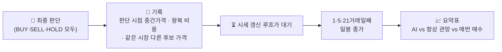

| 지표 | 계산 | 해석 |
|---|---|---|
| **AI 판단 (비용 차감)** | 매수 = 수익률 − 비용, 매도 = 피한 하락폭 − 비용, 관망 = 0% 의 평균 | 이 값이 **0% 이하면** 관망보다 못함 |
| 항상 관망 | 0% | 기준선 |
| 매번 매수 | 분석한 종목을 매번 샀을 때 (비용 차감) | AI 판단이 이것보다 나아야 선별 능력이 있음 |
| 매수 적중률 | 수익률 > 왕복 비용 인 비율 | |
| 매도 적중률 | 매도 후 가격이 내려간 비율 | |
| 관망 · 놓친 상승 | 관망했는데 비용 이상 오른 비율 | 너무 보수적인지 확인 |
| 종목 선정 | AI가 고른 종목의 변동폭 vs 다른 후보 평균 변동폭 | 움직일 종목을 고르는지 확인 |
| AI별 건수 | Claude · Codex · Gemini 판단 건수 | |
| **규칙 기반 4종** | 같은 판단 시점·같은 가격·같은 비용으로 기계적 규칙을 채점 | **AI가 이 단순 규칙보다 꾸준히 낫지 않다면 AI 판단에 의존할 이유가 없음** |

### 비교 기준이 되는 규칙 (`app/rules.py`)

완료된 **일봉**만 쓰고, 튜닝하지 않은 교과서적 기본값입니다. 1개월 스윙에서는 이 규칙이 **AI 호출 여부를 정하는 게이트**이기도 합니다([상세](docs/MONTH.md#-규칙-신호-게이트)). 한국투자증권 공개 샘플의 "프리셋 전략과 비교한다"는 아이디어만 참고했고 코드는 가져오지 않았습니다.

| 규칙 | 매수 | 매도 | 관망 |
|---|---|---|---|
| 골든크로스 | 최근 3봉 안에 5봉 평균이 20봉 평균을 **상향 돌파** | 하향 돌파 | 그 외 |
| 모멘텀 | 20봉 수익률이 자기 변동성의 **+1배 이상** | -1배 이하 | 그 외 |
| 평균회귀 | 20봉 평균보다 **2표준편차 이상 낮음** | 2표준편차 이상 높음 | 그 외 |
| 돌파 | 종가가 직전 20봉 **고가보다 높음** | 직전 20봉 저가보다 낮음 | 그 외 |

모멘텀은 변동성으로 나눠서 종목 가격 수준과 무관하게 비교됩니다. 계산에 필요한 봉이 모자라면 그 규칙은 그 판단에서만 제외됩니다.

| 채점 규칙 | 내용 |
|---|---|
| 가격 | 매수·매도 호가의 **중간가격** |
| 비용 | 왕복 수수료 + 왕복 슬리피지 + (국내) 매도세 + 판단 시점 스프레드 |
| 신선도 | 30초 이내 시세만 사용. 앱이 10분 넘게 꺼져 제때 채점하지 못하면 **누락** 처리 |
| 표본 | 대표 기준(5거래일) 채점 **30건 미만이면 "표본 부족" 경고**. 한 달짜리 판단은 표본이 쌓이는 데 몇 주가 걸립니다 |
| 1개월 스윙 채점 | 판단일 이후 1·5·21번째 **거래일 종가**(완료된 일봉)로 15분마다 채움. 봉이 끝내 오지 않으면 "누락" |
| 보관 | 최근 1,000건 (실험별로 보관) |

> ⚠️ 이 지표는 모의 데이터 기반의 짧은 기간 측정입니다. 좋은 숫자가 나와도 미래 수익을 보장하지 않습니다.

---

## 🔒 실거래 준비 (구조만 · 잠김)

> **이 버전은 실제 주문을 보낼 수 없습니다.** 나중에 실거래로 바꿀 때 필요한 안전 장치의 **구조와 로직**만 만들어 두었습니다. 자세한 설계·체크리스트는 **[docs/LIVE_TRADING.md](docs/LIVE_TRADING.md)** 를 보세요.

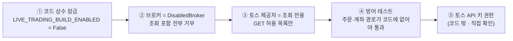

| 구성 요소 | 하는 일 | 상태 |
|---|---|:-:|
| 잠금 (`lock.py`) | 환경변수로는 못 켜는 코드 상수. `.env`에 `LIVE_TRADING=on`을 써도 **무시**되고 화면에 표시 | ✅ 동작 |
| **그림자 모드** (`shadow.py`) | 모의 제안마다 "실거래였다면 나갔을 주문"을 한도·가격 검사까지 거쳐 **기록만** 함 | ✅ 동작 |
| 절대 금액 한도 (`limits.py`) | 1회·하루 금액, 횟수, 손실, 종목 보유, 허용 종목. **매도(청산)는 한도에 막히지 않음** | ✅ 동작(그림자) |
| 주문 관문 (`gate.py`) | 미리보기 → 1회용 확인 토큰 → 실행. 멱등키 항상 사용, 결과 불명확 시 **정지** | 🧩 로직·테스트 완료 |
| 주문 상태 (`lifecycle.py`) | `UNKNOWN`은 추측으로 없애지 않음 | 🧩 로직·테스트 완료 |
| 증권사 대사 (`reconcile.py`) | 앱 장부 ↔ 증권사 잔고·주문 비교, 보유 수량 불일치는 거래 정지 | 🧩 로직·테스트 완료 |
| 증권사 측 손절 (`protective.py`) | OCO 조건주문 계획과 목표 상태 동기화 | 🧩 로직·테스트 완료 |
| **토스 주문 어댑터** | 실제 증권사 통신 | ⛔ **없음** |

화면의 **"실거래 준비"** 패널에서 잠금 상태, 한도, 그림자 주문(전송 가능/차단과 차단 사유)을 볼 수 있습니다. 막힌 주문이 많다면 모의투자의 주문 크기가 실거래 한도보다 크다는 뜻입니다.

---

## 🛡 매매·위험 관리 규칙

AI는 **판단과 비중만** 제안하고, 실제 주식 수는 **서버가 계산**합니다. AI의 `quantity`는 참고값일 뿐 체결 권한이 없습니다.

| 규칙 | 기본값 / 범위 | 설명 |
|---|---|---|
| 거래당 위험 비율 | 0.5% (0.1 ~ 2) | 손절 시 잃는 금액이 평가자산의 이 비율을 넘지 않도록 수량 제한 |
| 일일 손실 한도 | 2% (1 ~ 10) | 통화별(KRW: 서울, USD: 뉴욕 기준 일자) 도달 시 **신규 매수 중단 + 청산 시도** |
| 종목당 최대 비중 | 30% (10~100%) | 해당 통화 평가자산 대비. 새 실험에서 정함 |
| 1회 매수 한도 | 30% (1~100%) | 한 번의 매수 금액 상한. 손절 위험(거래당 0.5%) 규칙이 실제 수량을 먼저 제한하는 경우가 많음 |
| **소수점 거래** | 미국 종목 | 소수점 4자리, 주문 1건 최소 약 1달러 (`FRACTIONAL_US`). 원금이 작아도 비싼 종목을 살 수 있음. **시뮬레이션 가정**이며 실제 증권사 규칙과 다를 수 있고, 잠긴 실거래 구조(정수 주식)에는 그림자 주문으로 남기지 않음 |
| 국내 종목 | 정수 주식 | 1주 가격이 종목당 한도를 넘으면 살 수 없으므로 집중 종목에서도 제외 |
| 최대 보유 | 30일 (1 ~ 30일) | 초과 시 모의청산. 밤새 보유하고 마감 전 일괄 청산하지 않음 |
| 추적 손절 | 1개월 스윙 | 가격이 목표의 절반에 닿으면 손절가를 매수가+0.3%로, 이후 최고가−손절 폭으로 **올리기만** 함 ([상세](docs/MONTH.md#-추적-손절)) |
| 손익비 | 익절 ≥ 손절 × 1.5 | 미달 시 매수 제안 거부 |
| **최소 익절 폭** | 왕복 비용의 **3배** (`MIN_TAKE_COST_RATIO`) | 익절 폭이 수수료·슬리피지·국내 매도세·호가 스프레드를 합한 **왕복 비용의 3배 미만**이면 매수와 조건 진입을 거부합니다(목표가 비용에 잡아먹히는 거래). 실제 요율로 국내 주식 약 1.0%, ETF 약 0.4%, 미국 약 0.9%(+스프레드의 3배)이며, 1개월 스윙은 익절 폭이 원래 3% 이상이라 스프레드가 넓은 종목에서만 걸림. AI에게는 비용과 최소 익절 폭을 입력(`context.constraints`)으로 미리 알려 줌, 주문 직전에 호가로 다시 확인. `0`이면 끔 |
| 호가 잔량 | 최우선 호가 수량 이내 | 호가보다 많이 체결하지 않음 |
| 레버리지 ETF | 가격에 배수를 다시 곱하지 않음 | 현금으로만 매수, 실험별로 포함 여부 선택 (새 실험 기본값: **제외**) |
| 체결 조건 | **정규장만** · 30초 이내 시세 | 국내 평일 09:00~15:20(종가 동시호가·시간외 제외), 미국 평일 09:30~16:00 뉴욕 시간(한국 22:30~05:00, 겨울 23:30~06:00 · 프리·애프터마켓 제외). 토스 거래 일정과 **고정 시간 잠금**(`app/hours.py`)을 모두 통과해야 체결. 장 밖에서 손절가에 닿으면 다음 정규장 첫 호가에 매도 |
| 조건 진입 | 돌파는 기준가~+0.5%, 눌림은 기준가 이하 · 새 호가 2번 연속 · 동시 3개 | 가격만 확인하되 **분석이 낸 매수와 같은 위험 규칙**을 그대로 통과해야 체결. 무효 가격 이하·기한 경과면 폐기 ([상세](docs/ENTRY.md)) |
| 비용 | **실제 요율** (2026년 토스증권·세율) | 수수료 국내 0.015% · 미국 0.1%(주문 10달러 이하 무료), 국내 **주식** 매도 거래세 0.20%(ETF 면제), 슬리피지 가정 0.05%. 국내 주식은 왕복 약 0.33%, ETF 약 0.13%, 미국 약 0.30% + 호가 스프레드 |
| 체결 방식 | 증권사 괄호 주문처럼 | 익절은 **목표가 지정가**로(시세가 더 올라 있어도 목표가), 손절·추적 손절·기한 청산은 그때의 매수호가(시장가)로 |

### 사용자 조작

| 버튼 | 동작 |
|---|---|
| **시작** | 선택한 방식(직접 승인 / 자동)으로 분석 시작 — 눌러 둔 상태는 재시작·재부팅 뒤에도 이어집니다 |
| **중지** | 분석·미승인 제안·청산 감시 중지 — **보유 주식은 유지**. 재시작 뒤에도 멈춰 있습니다 |
| **전량 매도 후 종료** | 확인 후 최신 호가로 모의청산 시도, 불가하면 대기 |
| **새 실험** | 원금·한도·전략을 새로 정해 시작 (이전 실험은 보관) |
| 서버·앱 재시작 시 | 원금·현금·보유분·거래 기록 보존. **시작을 눌러 둔 상태였다면 자동 재개**, 중지·전량 매도를 눌렀다면 중지 유지 (진행 중이던 분석 1건과 대기 제안은 버림). **이미 예정된 다음 분석 시각은 그대로**(재시작이 분석 순서를 앞당기지 않음)이고, 대기 중이던 조건 진입 계획은 5분 안의 짧은 재시작이면 유지 |

---

## 📋 관심 종목

| 시장 | 종목코드 | 이름 | 유형 | 비고 |
|:-:|---|---|---|---|
| 🇰🇷 | 005930 | 삼성전자 | 주식 | |
| 🇰🇷 | 000660 | SK하이닉스 | 주식 | |
| 🇰🇷 | 122630 | KODEX 레버리지 | ETF | KOSPI 200 일일 2배 |
| 🇺🇸 | AAPL | Apple | 주식 | |
| 🇺🇸 | MSFT | Microsoft | 주식 | |
| 🇺🇸 | TQQQ | ProShares UltraPro QQQ | ETF | Nasdaq-100 일일 3배 |
| 🇺🇸 | SQQQ | ProShares UltraPro Short QQQ | ETF | Nasdaq-100 일일 -3배 |

| 정규장 (한국 시간) | 시간 |
|---|---|
| 🇰🇷 한국 | 09:00 ~ 15:30 |
| 🇺🇸 미국 | 22:30 ~ 05:00 (서머타임 해제 시 23:30 ~ 06:00) |

> 정규장이 아니면 "정규장 또는 유효한 호가를 기다리고 있습니다" 상태로 대기합니다. **고장이 아닙니다.**

---

## 🎯 오늘의 집중 종목

위 7종목은 **기본(고정) 종목**입니다. 새 실험은 기본적으로 **일일 집중 종목** 방식으로 시작하며, 매일 개장 90분 전에 시장별로 그날 살펴볼 종목을 다시 고릅니다. 자세한 설계와 안전 규칙은 [docs/UNIVERSE.md](docs/UNIVERSE.md)에 있습니다.

**상승 추세가 이어질 종목**을 고릅니다. (예전 단타용 "변동성 우선" 기준은 단타와 함께 제거했습니다.)

| | 1개월 스윙 |
|---|---|
| 우선하는 종목 | 상승 추세가 이어질 종목 |
| 방향 | 상승 추세만 |
| 제외 | 하락 추세·이미 급등한 종목 |
| AI 브리핑 | 앞으로 한 달 이익 기대 종목 |
| 채점 | 다음 거래일 종가 수익률 |

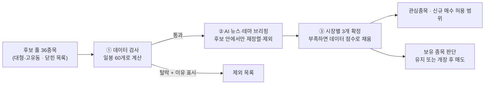

| 단계 | 하는 일 | 지키는 규칙 (코드로 강제) |
|---|---|---|
| ① 데이터 검사 | 1개월 수익률·20일선 대비·5일 수익률·하루 변동폭·거래대금을 서버가 계산 | **하락 추세 제외 · 이미 급등한 종목 추격 금지 · 너무 조용하거나 거친 종목 제외 · 거래대금 부족 제외** |
| ② AI 브리핑 | 웹 검색으로 뉴스·테마·일정 확인, 종목별 "이미 가격에 반영됐을 위험" 표시 | **후보 밖 종목은 무시 · 출처 URL이 없으면 통째로 무시 · 반영 위험 high는 제외** |
| ③ 확정 | AI 선정 우선, 부족하면 데이터 점수 순으로 채움 | 실패해도 데이터만으로 진행 · 계산 자체가 3번 실패하면 기본 종목 사용 |
| 매매 | 목록 밖 종목은 **신규 매수 불가** | 청산·손절·익절·보유시간 규칙은 그대로 |
| 보유 종목 | 목록에서 빠졌어도 시세·청산 감시 유지, 추가 매수 없음 | 추세 유지 → 유지 · 추세 꺾임 → 개장 20분 뒤 매도 |
| 채점 | 선정 다음 거래일 종가를 후보 전체·기존 고정 종목 평균과 비교해 기록 | 표본 수를 항상 표시 · 우위를 주장하지 않음 |

---

## 📅 1개월 스윙 전략

새 실험의 기본 투자 기간입니다. 종목을 **최대 30일** 들고 가며 한 달 안에 가장 큰 이익을 노립니다. 설계·범위·검증은 [docs/MONTH.md](docs/MONTH.md)에 있습니다.

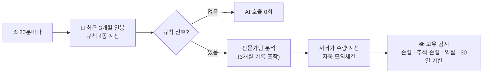

| 항목 | 내용 |
|---|---|
| 분석 대상 | 신호 있는 종목만: 보유 안 한 종목은 **매수 신호**, 보유 종목은 **매도 신호**. 방금 분석한 종목은 6시간 쉬되 가격이 ±3% 움직이거나 새 신호가 생기면 다시 |
| 분석 자료 | 최근 3개월 일봉 + 서버가 계산한 수익률·이동평균·변동폭·고저점 + 규칙 신호 + 이 종목의 지난 판단·체결 + 오늘의 집중 종목 사유 + 최근 1분봉 30개 |
| 매매 계획 | 손절 2~15% · 익절 3~40%(손절의 1.5배 이상) · 보유 1~30일 · 비중 최대 30% — 수량은 서버가 위험 한도로 계산 |
| 이익 지키기 | **추적 손절**: 가격이 목표의 절반에 닿으면 손절가를 올리고 이후 최고가를 따라감(내려가지 않음) |
| 밤새 보유 | 마감 전 일괄 청산 없음. 장이 닫힌 동안은 청산도 미뤄지고 갭은 손절이 막지 못함 |
| 채점 | 1·5·21거래일 뒤 일봉 종가, 규칙 4종과 같은 시점·같은 비용으로 비교 |
| 익절 방식 (`exit_mode`) | 새 실험 기본 **추적 손절로 계속**(`trail`): 익절가에 닿아도 팔지 않고 최고가를 따라 손절가를 올려 그 손절이나 30일 기한에 청산. 2006~2026 미국·국내 약 70만 건 백테스트에서 같은 매수의 "목표가 전량 익절"보다 거래당 +0.05~0.12%p(95% 구간 0 위). 이전 실험은 `target` |
| 매수 신호 거르기 (`signal_filter`) | 새 실험 기본 `research`: 사전 등록 연구에서 2006~2018·2019~2026 모두 손실이었던 매수 신호는 AI를 부르지 않음 — 국내 개별 주식의 골든크로스·모멘텀·돌파, 미국 개별 주식의 모멘텀·돌파, 미국 ETF의 돌파. 매도 신호·직접 요청은 그대로 ([연구](tools/data/README.md)) |
| 과거 근거 (`evidence`) | 새 실험 기본 `on`: 매 분석에 종목별 **근거 묶음**(신호의 20년 성적, 이 종목의 과거 결과, 비슷한 상황, 시장 상황, SEC·DART 재무·공시)을 넣고, 역할별로 수치 인용·반대 근거 제시를 지시. 판단·체결에 "과거 근거 우호적·불리·엇갈림"을 기록하고 성적표에서 나눠 봄 |
| 계좌 크기 | 1주만 사도 손절 시 손실이 거래당 위험 한도를 넘는 국내 종목은 분석 대상에서 빠짐(계좌가 커지면 다시 들어옴). 새 실험 기본 원금은 시장별 최소 권장액: 국내 700만 원, 미국 750달러 |
| 당일 단타 | 2026-10-01 제거. 거래가 잦을수록 비용(국내 주식 거래세 0.20%)과 속도(뉴스는 초 단위로 반영)에서 불리해 1개월 스윙만 남김 |

---

## 🎯 조건부 자동 진입

AI가 관망하면서 **"지금은 아니지만 이 가격에 닿으면 사겠다"** 는 계획을 남기면, 서버가 그 가격만 지켜보다가 조건이 맞을 때 **AI를 다시 부르지 않고** 같은 위험 규칙으로 모의매수합니다. 관망만 이어지던 단타에서 "조건은 말하지만 실행할 길이 없던" 구조적 문제를 풀기 위한 기능입니다. 설계·범위·검증은 [docs/ENTRY.md](docs/ENTRY.md)에 있습니다.

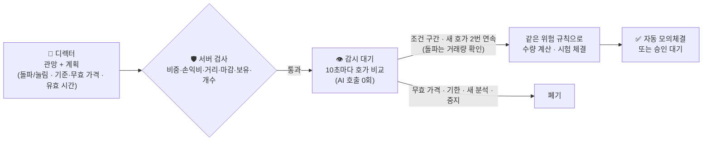

| 항목 | 내용 |
|---|---|
| 계획의 모양 | `breakout`(현재가 위 기준을 넘으면) / `pullback`(아래 기준까지 내려오면) + 기준 가격 · **무효 가격** · 유효 시간. 디렉터가 관망일 때만 |
| 받아 주는 조건 | 비중 > 0 · 손익비 ≥ 1.5 · 현재가에서 15% 이내 · 보유하지 않은 종목 · 동시 3개 |
| 체결 조건 | 돌파: 기준 ≤ 매도호가 ≤ 기준×1.005(쫓아 사지 않음) · 눌림: 매도호가 ≤ 기준 · 새 호가 **2번 연속** · 주문 직전 재조회 · 돌파는 직전 5분 거래량 ≥ 그 전 20분 평균 |
| 끝나는 방식 | 체결 · 승인 대기 · 기한 만료 · 무효 가격 이탈 · 새 분석으로 교체 · 위험 규칙 보류 · 취소(중지·긴 재시작·집중 종목 이탈) · 5분 안의 짧은 재시작(배포)은 계획을 그대로 유지 |
| 사용량 | 감시에 AI 0회. 계획을 기다리는 종목은 다시 분석하지 않음 |
| 직전 분석 메모 | 같은 종목을 다시 분석할 때 직전 결론·가격 변화·계획 결과를 입력에 넣어 조사 범위를 좁힘 |
| 끄기 | `CONDITIONAL_ENTRY=off` |

---

## 📁 폴더 구조

```text
stock-lab/
├── app/                      # FastAPI 애플리케이션 (Docker 이미지에 포함)
│   ├── main.py               # 웹 서버 · 로그인 · API · 백그라운드 루프
│   ├── engine.py             # 분석 사이클 · 모의체결 · 승인/거절 · 청산
│   ├── desk.py               # 전문가팀 전략 · 시장별 AI 종목 선정 · 규칙 신호 게이트 적용 · 손절/추적 손절/익절/보유기한 감시 · 일일 손실 한도
│   ├── evaluation.py         # AI 판단 기록 · 30/60분 및 1·5·21거래일 채점 · 기준선 비교
│   ├── gate.py               # 규칙 신호 게이트: 어떤 종목에 AI를 부를지 · 재분석 대기
│   ├── history.py            # 3개월 일봉 정리 · 서버 계산 요약 · 이 종목의 지난 판단 기록
│   ├── rules.py              # 규칙 기반 비교 기준 4종 (골든크로스·모멘텀·평균회귀·돌파)
│   ├── reuse.py              # 조사 재사용: 다시 써도 되는 앞선 조사 찾기 · 새로 조사해야 하는 경우 (순수 함수)
│   ├── scorecard.py          # 거래 성적표: 왕복 거래 · 승률·기대값·95% 신뢰구간 · 지수 ETF 보유 비교 (순수 함수)
│   ├── verification.py       # 검증 계획: 시작할 때 고정하는 판정 기준 · 전략 지문 · 판정
│   ├── afterexit.py          # 판 뒤의 흐름: 청산 후 5·20거래일 추적 · 익절 대신 추적 손절(C)이었다면 비교 (측정만)
│   ├── hours.py              # 시장별 정규장 고정 시간 잠금 (국내 09:00~15:20 · 미국 09:30~16:00 뉴욕)
│   ├── notify.py             # 휴대폰 알림 (선택, NOTIFY_URL): 새 체결·경고
│   ├── entry.py              # 조건부 자동 진입: 계획 검사 · 돌파/눌림 가격 판정 · 거래량 비교 · 원장 정리 (순수 함수)
│   ├── pacing.py             # 사용량 배분: AI 구독 창에 맞춰 분석 간격을 늘림
│   ├── shares.py             # 주식 수 계산: 국내 정수 · 미국 소수점(4자리) · 최소 주문 금액
│   ├── intel.py              # 토스 공식 순위·투자자별 수급 정리 · 캐시
│   ├── live/                 # 실거래 준비 구조 (잠김)
│   │   ├── lock.py           #   잠금 상수 · 설정
│   │   ├── limits.py         #   절대 금액 한도
│   │   ├── intent.py         #   주문 의도 · 멱등키
│   │   ├── gate.py           #   주문 관문 (미리보기·확인 토큰·실행)
│   │   ├── lifecycle.py      #   주문 상태
│   │   ├── broker.py         #   브로커 인터페이스 + 잠긴 스텁
│   │   ├── reconcile.py      #   증권사 잔고 대사
│   │   ├── protective.py     #   증권사 측 손절·익절 계획
│   │   └── shadow.py         #   그림자 주문 기록
│   ├── agents.py             # AI 프롬프트 · 공급자 전환 · 응답/근거 검증 (트렌드 브리핑 포함)
│   ├── universe.py           # 오늘의 집중 종목: 일봉 지표 · 필터 · 점수 · AI 결과 병합 · 보유 종목 판단 · 채점
│   ├── focus.py              # 집중 종목 빌드 시점 · 게시 · 신규 매수 제한 · 실패 시 기본 종목
│   ├── usage.py              # AI 구독 사용량 판단 · 사이클 시작 전 전환 규칙
│   ├── risk.py               # 위험 기반 주식 수 계산 · 투자 기간별 범위 · 추적 손절 계산
│   ├── providers.py          # 토스 시세(조회 전용 GET 허용 목록·호출 제한 대응·호가 병렬·캔들 보정) / 데모 시세
│   ├── store.py              # PostgreSQL 상태 저장 · 실험 보관
│   ├── performance.py        # 평가자산 · 수익률 기록
│   ├── search_display.py     # 검색 표시 격리
│   ├── instruments.py        # 기본 종목 + 후보 풀 카탈로그 (닫힌 목록)
│   ├── config.py             # 환경 변수 설정
│   └── static/               # 화면 (index.html · style.css · app.js · theme.js · favicon.svg)
├── bridge/
│   └── ai_bridge.py          # 호스트 중계 서비스 (claude -p / codex exec)
├── docs/
│   ├── LIVE_TRADING.md       # 실거래 전환 설계 · 체크리스트
│   ├── DESIGN.md             # 화면 디자인 · 토큰 · 접근성 · 검증 방법
│   ├── UNIVERSE.md           # 오늘의 집중 종목 설계 · 안전 규칙 · 검증
│   ├── MONTH.md              # 1개월 스윙 전략 설계 · 규칙 신호 게이트 · 추적 손절 · 채점
│   ├── ENTRY.md              # 조건부 자동 진입 설계 · 안전 규칙 · 직전 분석 메모 · 검증
│   ├── REUSE.md              # 조사 재사용 설계 · 재사용 조건 · 안전 규칙 · 검증
│   ├── VERIFICATION.md       # 검증 계획 · 거래 성적표 · 지수 비교 · 판정 기준
│   └── screenshots/          # 화면 스크린샷 (합성 데이터)
├── tools/
│   ├── design-lab/           # 화면 검수 도구 (데모 서버 · 스크린샷 · 동작/대비 점검)
│   └── data/                 # 과거 데이터 보관소(시세·SEC·DART 수집) · 매도 방식 백테스트 — 사이트와 분리
├── deploy/
│   ├── stocklab-ai-bridge.service   # 중계 서비스 systemd 유닛
│   ├── stocklab.service             # 부팅 시 앱·DB를 올리는 systemd 유닛
│   ├── stocklab-backup(.service/.timer) # 매일 06:10 DB 백업 · 30일 지난 백업 정리
│   └── stocklab-up                  # LAN 주소가 생길 때까지 기다린 뒤 DB → 앱(항상 새로 만듦) 순서로 올림
├── tests/                    # pytest (980개)
├── compose.yaml              # app + db 구성
├── Dockerfile
├── setup.sh                  # 최초 설치 (비밀값 자동 생성)
├── backup.sh                 # DB 백업 (pg_dump)
└── .env.example              # 설정 예시 → .env로 복사
```

### 모듈 관계

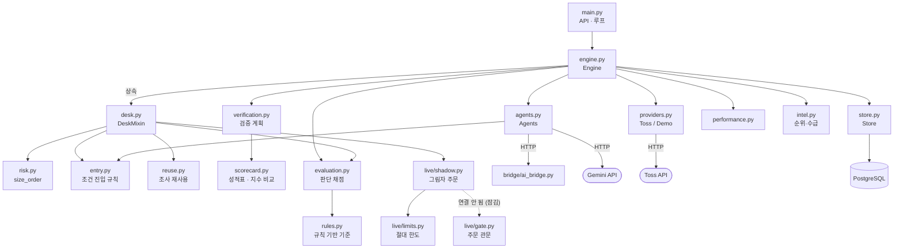

---

## 🚀 설치와 실행

### 준비물

| 항목 | 용도 |
|---|---|
| Docker + Docker Compose | 앱·DB 실행 |
| python3 | `setup.sh`, 중계 서비스 |
| Claude Code CLI (`claude`) — 로그인 완료 | 1순위 AI |
| Codex CLI (`codex`) 0.159 이상 — 로그인 완료 | 2순위 AI. `gpt-6.1-sol`은 0.158.0에서 "지원되지 않는 모델" 오류가 나서 올려야 했습니다 (`npm i -g @openai/codex`) |
| 토스증권 Open API 키 | 실시세 (`MARKET_MODE=toss`) |
| Gemini API 키 (선택) | 기본 구성에서는 사용하지 않음 |

### 1) 앱 설치

```bash
git clone <이 저장소> /opt/stock-lab
cd /opt/stock-lab
cp .env.example .env        # 값 채우기 (아래 환경 변수 표 참고)
bash setup.sh               # 비밀값 생성 + 컨테이너 빌드·실행
```

> `setup.sh`는 앱 비밀번호를 화면에 출력합니다. 기존 서버 점검용으로는 쓰지 마세요.

### 2) AI 중계 서비스 설치 (호스트)

```bash
# .env에 AI_BRIDGE_TOKEN 생성
python3 -c "import secrets;print('AI_BRIDGE_TOKEN='+secrets.token_hex(32))" >> .env

sudo cp deploy/stocklab-ai-bridge.service /etc/systemd/system/
sudo systemctl daemon-reload
sudo systemctl enable --now stocklab-ai-bridge
curl http://172.17.0.1:8765/health          # {"ok": true, ...}
```

`compose.yaml`의 `extra_hosts: host.docker.internal:host-gateway`로 컨테이너가 호스트 중계 서비스에 접근합니다.

### 3) 부팅 자동 시작 (호스트)

서버가 꺼졌다 켜져도 앱·DB가 스스로 올라오게 합니다. (동작 원리는 [운영·백업·복구](#-서버가-꺼졌다-켜져도-유지) 참고)

```bash
sudo install -m755 deploy/stocklab-up /usr/local/bin/stocklab-up
sudo install -m644 deploy/stocklab.service /etc/systemd/system/stocklab.service
sudo systemctl daemon-reload
sudo systemctl enable --now stocklab.service
```

> `APP_HOST`(LAN 주소)를 쓴다면 공유기에서 이 서버의 주소를 **고정(예약)** 하세요. 주소가 바뀌면 부팅 서비스가 4분을 기다린 뒤 실패합니다.

### 3-1) 매일 자동 백업 (호스트)

```bash
sudo install -m 755 deploy/stocklab-backup /usr/local/bin/stocklab-backup
sudo install -m 644 deploy/stocklab-backup.service deploy/stocklab-backup.timer /etc/systemd/system/
sudo systemctl daemon-reload && sudo systemctl enable --now stocklab-backup.timer
```

매일 06:10(미국장 마감 뒤, 국내 집중 종목 계산 전)에 DB를 `backups/`에 덤프하고, 30일 지난 덤프와 배포 때 남긴 코드 묶음을 지웁니다. 보안 업데이트는 `unattended-upgrades`(Debian 보안 저장소만, 자동 재부팅 없음)로 받는 것을 권장합니다.

### 4) 동작 확인

```bash
docker compose ps
docker compose exec -T app python -c "import urllib.request;print(urllib.request.urlopen('http://host.docker.internal:8765/health').read())"
```

---

## ⚙ 환경 변수

| 구분 | 변수 | 예시 | 설명 |
|---|---|---|---|
| 접속 | `APP_PASSWORD` | (자동 생성) | 웹 로그인 비밀번호 (8자 이상) |
| 접속 | `SESSION_SECRET` | (자동 생성) | 로그인 쿠키 서명 키 (32자 이상) |
| 접속 | `APP_HOST` | `127.0.0.1` | 바인딩 주소 |
| 접속 | `APP_PUBLIC_ORIGIN` | `https://stock.example.com` | 프록시 뒤 공개 주소 |
| 접속 | `TRUSTED_PROXY_IPS` | `192.168.1.179` | 공개 사이트를 전달하는 터널의 주소. 이 주소에서 온 요청만 `CF-Connecting-IP`(실제 접속자)를 믿고 로그인 실패 제한을 접속자별로 셈. 비우면 모든 접속을 보낸 주소로 셈 |
| 시세 | `MARKET_MODE` | `toss` / `demo` | 실시세 / 합성 시세 |
| 시세 | `TOSS_CLIENT_ID`, `TOSS_CLIENT_SECRET` | | 토스 Open API |
| 시세 | `TOSS_PARALLEL` | `4` | 호가 병렬 조회 수 (1~8). 호출 한도는 **그룹별**로 처리: 429를 받은 그룹만 쉬고, 시세 그룹의 한도(응답 헤더) 이하로 제한 |
| AI | `AI_PROVIDERS` | `claude,codex` | 시도 순서 (Gemini는 기본 제외, 필요하면 뒤에 추가) |
| AI | `AI_SWITCH_AT_PCT` | `80` | 구독 사용률(5시간·주간 창)이 이 값(%)에 닿으면 **분석을 시작하기 전에** 다음 AI로 전환 (10~99) |
| AI | `AI_BRIDGE_URL` | `http://host.docker.internal:8765` | 앱 → 중계 서비스 주소 |
| AI | `AI_BRIDGE_BIND` | `172.17.0.1:8765` | 중계 서비스 수신 주소 |
| AI | `AI_BRIDGE_TOKEN` | (64자 무작위) | 앱 ↔ 중계 인증 토큰 |
| Claude | `CLAUDE_MODEL` / `CLAUDE_EFFORT` | `claude-opus-5-5` / `medium` | 모델 / 추론 깊이 |
| Claude | `CLAUDE_MODEL_LIGHT` (`CLAUDE_EFFORT_LIGHT`) | `claude-sonnet-5-5` | 조사 역할이 쓰는 가벼운 모델(중계 서비스가 읽음). 비우면 모든 역할이 주력 모델 |
| AI | `AI_LIGHT_ROLES` | `planner,fundamental,technical,news` | 가벼운 모델로 돌릴 역할. 비우면 분담하지 않음 |
| Codex | `CODEX_MODEL` / `CODEX_EFFORT` | `gpt-6.1-sol` / `high` | 모델 / 추론 깊이 |
| Gemini | `GEMINI_API_KEY` | | API 키 |
| Gemini | `GEMINI_MODEL` / `GEMINI_THINKING` | `gemini-3.5-flash` / `high` | 모델 / 추론 깊이 |
| Gemini | `GEMINI_SEARCH` | `off` | 무료 등급이면 off |
| Gemini | `AI_DAILY_CALL_LIMIT` | `30` | Gemini 하루 호출 한도 |
| 주기 | `ANALYSIS_INTERVAL_SECONDS` | `1200` | 1개월 스윙의 분석 간격 (최소 60). 신호가 없으면 이 간격마다 AI 없이 확인만 함 |
| 주기 | `QUOTA_PACING` | `on` | **사용량 배분**: 위 간격이 **최소**이고, AI 구독 창이 그 속도를 감당하지 못할 때만 세션 끝(또는 창 초기화)까지 고르게 나눠 늘림 ([상세](#-ai-공급자-전환과-사용량-관리)) |
| 주기 | `PACE_MAX_SECONDS` | `4500` | 사용량 배분이 늘릴 수 있는 최대 간격 (75분) |
| 주기 | `RESEARCH_REUSE_SECONDS` | `3600` | **조사 재사용** 한도: 같은 종목을 이 시간(초) 안에 다시 분석하면 업무 배정·기업·뉴스 조사를 재사용해 AI 3회만 호출. `0`이면 끔 ([상세](docs/REUSE.md)) |
| 주기 | `RESEARCH_REUSE_MOVE_PCT` | `1.5` | 조사 때보다 가격이 이 비율(%) 이상 움직였으면 새로 조사 |
| 매매 | `MIN_TAKE_COST_RATIO` | `3` | **최소 익절 폭**: 익절 폭이 왕복 비용의 이 배수 미만인 매수·조건 진입은 서버가 거부 (0~20, `0`이면 끔) |
| 매매 | `CONDITIONAL_ENTRY` | `on` | **조건부 자동 진입**: AI가 관망하면서 남긴 가격 계획을 서버가 AI 없이 감시·체결. `off`면 계획을 저장하지 않음 ([상세](docs/ENTRY.md)) |
| 근거 | `EVIDENCE_DIR` | `/evidence` | 과거 데이터 보관소의 근거 묶음·배당·환율 폴더(compose가 `/srv/stocklab-data/evidence`를 읽기 전용으로 연결). 비우면 근거·배당·원화 환산 없음 |
| AI | `USAGE_DIRECT` | `on` | 중계 서비스가 2분마다 Claude·Codex 계정의 사용량을 직접 읽음. `off`면 호출 응답에 실려 오는 값만 씀 |
| 알림 | `NOTIFY_URL` | (비움) | 체결·경고를 휴대폰으로: ntfy 주제 주소(예: `https://ntfy.sh/길고-무작위한-이름`) 등 평문 POST를 받는 주소. 비우면 보내지 않음 |
| 종목 구성 | `FOCUS_PER_MARKET` | `3` | 시장별 오늘의 집중 종목 수 (1~6) |
| 종목 구성 | `FOCUS_AI` | `on` | `off`이면 AI 뉴스 브리핑 없이 일봉 데이터만으로 선정 |
| 주기 | `QUOTE_POLL_SECONDS` | `10` | 시세 갱신 간격 (최소 5) |
| 비용 | `FEE_KR_BPS`, `FEE_US_BPS`, `SELL_TAX_KR_BPS`, `SLIPPAGE_BPS` | `1.5`, `10`, `20`, `5` | 실제 요율 기준 비용(bp). 거래세는 국내 **주식** 매도에만(ETF 면제), 미국은 주문 10달러 이하 수수료 0 |
| 실거래 준비 | `LIVE_TRADING` | `off` | `on`으로 써도 **이 빌드는 무시** (화면에 표시) |
| 실거래 준비 | `LIVE_ALLOW_BUY`, `LIVE_ALLOW_SELL` | `off` | 매수·매도 권한 (그림자 모드는 켜져 있다고 가정) |
| 실거래 준비 | `SHADOW_MODE` | `on` | 그림자 주문 기록 |
| 실거래 준비 | `LIVE_MAX_ORDER_KRW/USD`, `LIVE_MAX_DAILY_NOTIONAL_KRW/USD`, `LIVE_MAX_DAILY_LOSS_KRW/USD`, `LIVE_MAX_POSITION_KRW/USD` | 10만원/100달러 등 | 절대 금액 한도 (자리표시자, 실거래 전 재설정) |
| 실거래 준비 | `LIVE_MAX_DAILY_ORDERS`, `LIVE_MAX_OPEN_ORDERS`, `LIVE_PRICE_BAND_PCT`, `LIVE_ALLOWED_SYMBOLS` | `10`, `3`, `1`, 일반 주식 4종 | 횟수·미체결·가격 범위·허용 종목. 잘못된 값이면 시작 시 오류 |

> 💡 모델·깊이 변경: **Claude·Codex**는 중계 서비스가 요청마다 `.env`를 다시 읽으므로 **수정 즉시 반영**됩니다 (`AI_BRIDGE_BIND`만 재시작 필요). **Gemini** 설정은 앱 재빌드가 필요합니다.

---

## 🧰 운영·백업·복구

| 작업 | 명령 |
|---|---|
| 상태 보기 | `docker compose ps` · `systemctl status stocklab-ai-bridge` |
| 앱 로그 | `docker compose logs --tail=100 app` |
| 중계 로그 | `journalctl -u stocklab-ai-bridge -n 100` |
| 코드 변경 반영 | `docker compose up -d --build --no-deps --wait --wait-timeout 180 app` |
| 중계 재시작 | `sudo systemctl restart stocklab-ai-bridge` |
| DB 백업 | `bash backup.sh` → `backups/stocklab-<시각>.dump` |
| 이미지 되돌리기 | `docker image tag <백업 태그> stock-lab-app:latest` 후 `docker compose up -d --no-build --no-deps --force-recreate app` |

| 과거 데이터 수집 | `systemctl status stocklab-data.timer` · `docker run --rm -v /srv/stocklab-data:/data -v /opt/stocklab-data:/code:ro stocklab-data python collector.py status` ([tools/data](tools/data/README.md)) |

> ⚠️ `docker compose down -v`는 **DB 볼륨을 삭제**합니다. 사용하지 마세요.
> 앱을 재빌드·재시작해도 **시작을 눌러 둔 상태는 자동으로 이어집니다.** 중지를 눌렀다면 멈춰 있습니다.

### 🔌 서버가 꺼졌다 켜져도 유지

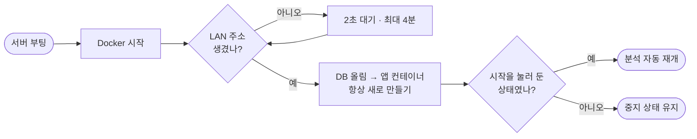

| 항목 | 동작 |
|---|---|
| 부팅 서비스 | `stocklab.service`가 `stocklab-up`을 실행해 앱과 DB를 올립니다. 중계 서비스는 별도 유닛으로 자동 시작 |
| 왜 기다리나 | DHCP 주소가 Docker보다 늦게 잡히면 포트 바인딩이 실패해 앱이 죽습니다(`cannot assign requested address`) |
| 왜 새로 만드나 | Docker가 주소보다 먼저 앱을 자동 재시작하다 실패하면, 그 컨테이너는 내부 네트워크를 잃어 DB를 찾지 못한 채 재시작만 반복합니다(2026-10-02 실제 발생). 그래서 주소가 생긴 뒤 앱을 항상 새로 만듭니다 |
| 이어가는 상태 | 시작 버튼을 누르면 `resume`이 켜지고, 중지·전량 매도를 누르면 꺼집니다. 재부팅·배포·비정상 종료는 값을 바꾸지 않습니다 |
| 재시작 시 정리 | 진행 중이던 분석 1건과 대기 제안은 버리고 다시 시작합니다(예정된 다음 분석 시각은 유지, 5분 안의 재시작이면 조건 진입 계획도 유지). 잔고·보유 종목·체결 기록은 DB에 그대로 |
| 전량 매도 요청 | 재시작 후 자동 재개하지 않습니다 |

설치는 [설치와 실행 3단계](#3-부팅-자동-시작-호스트)를 보세요.

> 자동 재개는 **모의매매에만** 해당합니다. 실거래는 코드 상수로 잠겨 있어 재부팅과 무관하게 켜지지 않습니다.

---

## 🔌 API

모든 `/api/*`는 로그인 쿠키가 필요합니다 (`/api/login` 제외).

| 메서드 | 경로 | 설명 |
|---|---|---|
| POST | `/api/login` · `/api/logout` | 로그인 / 로그아웃 |
| GET | `/health` | 헬스 체크 |
| GET | `/api/state` | 계좌·시세·분석 기록 등 전체 상태 |
| POST | `/api/start` · `/api/stop` | 분석 시작 / 중지 |
| POST | `/api/settings/execution` | 직접 승인 ↔ 자동 모의매매 |
| POST | `/api/analyze` | 특정 종목 즉시 분석 요청 (AI 종목 선정 생략) |
| POST | `/api/proposals/{id}/approve` · `/reject` | 제안 승인 / 거절 |
| POST | `/api/liquidate` | 전량 매도 후 종료 |
| POST · GET | `/api/experiments` | 새 실험 시작 (`horizon`: `month`(기본) \| `intraday`, `max_holding_minutes`는 생략 시 투자 기간의 기본값) / 지난 실험 목록 |
| GET | `/api/experiments/{id}/export` · `/api/export` | 실험 기록 내보내기 |

**중계 서비스** (호스트, 토큰 인증)

| 메서드 | 경로 | 설명 |
|---|---|---|
| GET | `/health` | 상태 + 공급자별 소진 대기 시각 (인증 없음) |
| GET | `/usage` | 공급자별 사용률(5시간·주간 창)·초기화 시각·소진 시각 |
| POST | `/generate` | `{provider, system, prompt, schema, search}` → 구조화된 분석 결과 |

---

## 🧪 테스트

실제 API 키·운영 DB 없이 실행합니다 (외부 HTTP 호출은 테스트에서 차단).

```bash
python -m pip install -r requirements.txt pytest
PYTHONDONTWRITEBYTECODE=1 python -m pytest -q -p no:cacheprovider tests
```

| 파일 | 다루는 내용 |
|---|---|
| `test_engine.py` | 체결·승인·청산·실험 보존, **재시작 복구**(시작해 둔 상태 이어가기·비정상 종료 뒤 재개·중지/전량 매도는 유지) |
| `test_desk_regressions.py` | 장중 위험 수량·자동/직접 체결·손절/익절·기록 보존·AI 종목 선정·시장 분리 |
| `test_month_units.py` | **1개월 스윙의 부품**: 투자 기간별 설정·범위·만료, 추적 손절(시작·이동·올라가기만·목표 아래), 계획 검증과 프롬프트, 3개월 일봉 정리·요약, 규칙 신호 게이트, 거래일 채점 |
| `test_day_focus.py` | (제거된 단타 기능) 변동성 기준 종목 선정 — 엔진에 남은 코드의 회귀 테스트 |
| `test_month_desk.py` | **1개월 스윙 엔진 통합**: 신호 없으면 AI 0회, 신호 종목만 분석, 재분석 대기, 보유 종목은 매도 신호에만, 직접 요청 우회, 일봉 없음, 분석 입력(3개월 일봉·규칙·기록), 밤새 보유·추적 손절 청산, 일봉 채점, 새 실험 기본값, 분석 후보에서 빠진 이유와 일봉 부족 사유 기록, 방금 받은 호가로 후보 고르기·닫힌 시장의 청산 감시 호출 생략 |
| `test_entry.py` | **조건 진입 단위**: 계획 검사(비중·손익비·거리·마감·방향)·유효 시간 조정·돌파/눌림 가격 판정(경계값)·거래량 비교·원장 정리·AI 응답 검증(나쁜 계획은 계획만 버림)·요청에 실린 스키마와 프롬프트 |
| `test_entry_desk.py` | **조건 진입 통합**: 관망+계획 저장 → 새 호가 2번 연속 확인 → 같은 경로로 체결(AI 호출 0회), 추격 금지·거래량 부족·무효 가격·기한·장 닫힘·집중 종목 이탈·위험 규칙 거절·일시 실패 재시도, 중지·전량 매도 때 취소, 짧은 재시작은 유지·긴 중단은 취소, 직접 승인, 스윙 계획, 직전 분석 메모, 모니터 루프 순서, 끄기 스위치 |
| `test_reuse.py` | **조사 재사용 단위**: 재사용 조건(같은 종목·같은 투자 기간·완료된 분석·세 보고서와 과제 3개·한도 시간·출처 근거·가격 기준·거래량 급증), 새로 조사하는 이유 안내, 저장된 보고서 불변, 연쇄 재사용이 원래 시각·가격을 유지 |
| `test_reuse_desk.py` | **조사 재사용 통합**: 두 번째 분석은 시세 분석가·반대 검토·디렉터 3회만 호출, 각 역할이 받는 입력(재사용 표시·나이), 가격 이동·거래량 급증·한도 초과·사용자 요청·출처 없음·다른 종목·끄기 스위치에서는 새 조사, 시세 분석 실패 처리, 스윙, 화면 표시 |
| `test_min_take.py` | **최소 익절 폭**: 왕복 비용(수수료 2번·슬리피지 2번·국내 매도세·스프레드) 계산, 기준 정확히 일치는 통과, 통화·스프레드·세금에 따른 변화, 배수 조절·끄기, 매도·스윙은 영향 없음, 기준 미달 조건 계획은 저장 안 함, 주문 직전 재확인, AI 입력과 프롬프트, 화면 문구 |
| `test_day_interval.py` | 분석 간격 설정 (단타용 짧은 간격은 제거된 기능의 남은 코드) |
| `test_realism.py` | **실제 요율**: 국내 수수료·주식 거래세(ETF 면제)·미국 소액 무료, 손절 위험 계산의 세금, 익절 지정가 체결·손절 시장가 체결, 채점 비용 |
| `test_verification.py` | **검증 계획**: 신뢰구간(t분포), 거래 왕복 구성·성적표·분리, 지수 ETF 보유 비교, 판정(통과·미달·수집 중), 전략 지문, 규칙대로 비교, 하루 단위 평가자산 기록 |
| `test_tiering.py` | **모델 분담**: 조사 역할은 가벼운 모델, 판단 역할은 주력 모델, 끄기·바꾸기 |
| `test_ops.py` | **운영**: 대체 AI 자동 응답 확인(하루 1회·실패 시 3시간 뒤), 휴대폰 알림(첫 조회는 기억만·새 체결과 경고만·실패 무시) |
| `test_pacing.py` | **사용량 배분**: 창이 감당 못 하는 속도를 세션 끝·창 초기화까지 고르게 나누기, 호출 비용 학습 |
| `test_fractional.py` | **소수점 거래**: 4자리 내림·최소 주문 1달러·부분 매도·수량 저장·성과 평가·그림자 주문 제외, 국내 정수 유지, 종목당·1회 한도 |
| `test_affordability.py` | 원금으로 1주도 못 사는 종목을 집중 종목에서 거르기·기존 목록 재조정 |
| `test_gemini.py` | Gemini 요청·응답·출처 검증·추론 깊이·검색 끄기 |
| `test_ai_chain.py` | 공급자 전환 순서·실패 누적·후보 밖 종목 거부 |
| `test_ai_bridge.py` | CLI 출력 파싱·소진 감지·도구 제한·내부망 URL 차단, **Claude 사용률 기록·재시작 뒤 유지·`/usage` 인증** |
| `test_usage_gate.py` | **사용량 기반 전환**: 임계값·초기화 지난 창·소진, 사이클 시작 전 전환/대기/복귀, 진행 중 사이클 유지, 브리핑 건너뜀, 중계 서비스 응답 반영, Gemini 키 없이 시작 |
| `test_search_display.py` | 검색 표시 격리 |
| `test_evaluation.py` | 판단 채점 시점·오래된 시세 배제·마감 채점·기준선 비교·표본 경고 |
| `test_rules.py` | 규칙 기반 신호 4종, 규칙별 채점(같은 시점·같은 비용) |
| `test_regular_hours.py` | **정규장 잠금**: 국내·미국 경계 시각, 동시호가·시간외·프리/애프터마켓·주말, 서머타임 전후의 한국 시간 표시, 모든 체결 거부, 대시보드 표시 |
| `test_afterexit.py` | **판 뒤의 흐름**: 신호 종류 분류, 추적 손절 재연(갭·같은 봉 순서·기한), 5·20거래일 채움·포기, 신호 종류별 요약, 청산 시 기록·조건 진입의 원래 분석, 일봉 작업 연결, 전략 지문 제외 |
| `test_exit_mode.py` | **익절 방식**: 추적 모드는 익절가에서 팔지 않고 손절이 목표를 넘어 따라감, 목표 모드는 그대로, AI 입력, 새 실험 기본값 |
| `test_signal_filter.py` | **매수 신호 거르기**: 연구로 정한 표, 걸러진 신호만 있으면 분석 안 함, 매도·직접 요청은 예외, 상태줄 표시, 시장·종목 유형별 적용 |
| `test_evidence.py` | **근거 묶음**: 신선도·종목 확인, 우호·불리 판정, 분석 입력·판단·체결 기록, 프롬프트(근거가 있을 때만, 전략 지문 불변), 실제 AI 요청에 실림, 성적표 분리 |
| `test_dividends.py` | **배당·세금**: 배당락일 전 매수만 입금, 원천징수 15.4%/15%, 한 번만, 거래 손익에 포함, 미국 양도세 추정 |
| `test_fx.py` | **환율**: 시작 환율·환전 비용, 1,400→1,380원이면 원화 가치 감소, 주가 몫/환율 몫, 늦게 읽힌 환율 |
| `test_hardening.py` | **서버 점검 수정**: 거절 응답의 보안 헤더, 터널 뒤 접속자별 로그인 실패 제한, 로그아웃 시 모든 세션 무효화(재시작·새 실험 뒤에도), 집중 종목에서 빠진 조건 진입 취소, 대기 중 조건 진입 종목 시세 갱신, 레버리지 ETF 기본값, 중계 서비스 로그, 이미지 pip·.bak 제외 |
| `test_toss_provider.py` | 조회 전용 경로 제한, 429 대기, 호출 한도 헤더, 호가 병렬 조회, 오류 코드 표시, **캔들 보정**(수정주가 반올림으로 생긴 작은 어긋남은 범위 안으로, 크게 깨진 봉만 제외, 대부분 깨졌거나 다른 종목 데이터면 거부) |
| `test_intel.py` | 순위·수급 파싱, 신선도, 갱신 주기, 실패 격리, AI 입력 연결 |
| `test_no_live_trading.py` | **실거래 불가 방어 테스트**: 주문·계좌 경로 부재, POST 사용처, 잠금, 스텁 브로커 |
| `test_live_gate.py` | 확인 토큰(1회용·위조·만료), 한도, 결과 불명확 처리, 재전송, 정지 |
| `test_live_structure.py` | 주문 상태, 한도 설정, 잔고 대사, 보호 주문 계획, 그림자 기록 |
| `test_ui_contract.py` | **화면 계약**: JS가 쓰는 id·클래스, 보안 정책(CSP) 준수, 테마·움직임 줄이기 |
| `test_origin_gate.py` | **쓰기 요청 출처 검사**: 프록시가 Host를 바꿔도 공개 주소 로그인 가능, 다른 출처·`null`·유사 도메인·http 다운그레이드는 계속 차단, 거절 사유 로그(헤더만·원인별 1회) |
| `test_universe.py` | **집중 종목 판단 로직**: 일봉 지표 계산, 하락·과열·급등·변동폭·거래대금 필터, 점수, AI 결과 병합(후보 밖 종목·출처 없는 답·"이미 반영" 제외), 보유 종목 유지/매도 판단, 선정 성과 채점 |
| `test_focus_engine.py` | **집중 종목 엔진 통합**: 개장 90분 전 빌드·세션당 1회, 실패 시 기본 종목·3회 후 포기, 429 재시도, 신규 매수 제한, 보유 종목 교체 매도(개장 20분 뒤), 계좌 교체 시 폐기, 실험 설정 API |

> 합성 데이터 테스트 통과는 실제 AI 연결 성공이나 수익성을 뜻하지 않습니다.

---

## 🔒 보안 설계

| 영역 | 조치 |
|---|---|
| 앱 컨테이너 | 읽기 전용 파일시스템, 모든 권한(capabilities) 제거, `no-new-privileges`, 비 root 사용자 |
| 로그인 | HMAC 서명 쿠키 (`HttpOnly`, `SameSite=Strict`, 공개 주소에서는 `Secure`) |
| 쓰기 요청 | 모든 POST는 커스텀 헤더(`X-Stocklab-Action`)와 **출처(Origin) 검사**를 통과해야 합니다. 출처는 접속한 주소이거나, 설정한 공개 주소(`APP_PUBLIC_ORIGIN`)와 **정확히 같아야** 합니다. 앞단 프록시·터널이 Host를 바꿔 전달해도 공개 주소 로그인은 되고, 다른 사이트·`null`·유사 도메인·http 다운그레이드는 막습니다. 거절되면 사유(헤더만)를 로그에 남깁니다. |
| 증권 | 토스 **조회 API만** 호출 (정규식 허용 목록의 GET만 통과, POST는 토큰 발급 1곳뿐), 계좌번호·주문 권한 없음 |
| 실거래 잠금 | 코드 상수 + 스텁 브로커 + 정적 방어 테스트. 환경변수로 켤 수 없음 ([상세](docs/LIVE_TRADING.md)) |
| Claude CLI | 도구는 **WebSearch만** 허용, MCP·슬래시 명령 비활성, 빈 임시 폴더에서 실행 |
| Codex CLI | 읽기 전용 샌드박스, 셸·플러그인·브라우저 등 기능 비활성, 빈 임시 폴더에서 실행 |
| 중계 서비스 | docker 내부 주소에만 바인딩, 64자 토큰 인증(`/usage` 포함), 요청 크기 제한, 사용률·소진 기록은 권한 600 파일 |
| Codex 출처 확인 | 공인 IP로만 접속 (내부망·루프백 차단), 리다이렉트 매 단계 재검사 |
| AI 입력 | 검색 문서·입력 자료 속 지시는 따르지 않도록 명시, 오류 메시지에 비밀값 노출 금지 |
| 거절 응답 | 로그인이 필요하다는 401, 출처 검사의 403도 일반 응답과 **같은 보안 헤더**(CSP·클릭재킹 방지 등)를 붙임 |
| 로그인 실패 제한 | 5분에 10번. 공개 사이트는 터널 하나로 들어오므로, 설정한 터널(`TRUSTED_PROXY_IPS`)의 `CF-Connecting-IP`로 **접속자별로** 셈 (다른 사람의 대입 시도로 주인이 잠기지 않음) |
| 로그아웃 | 이 브라우저 쿠키만 지우는 게 아니라 **그 전에 발급된 모든 세션을 서버에서 무효화** (재시작·새 실험 뒤에도 유지) |
| 비밀값 | `.env`·DB 백업은 `.gitignore`로 제외 |

---

## ⚠ 알려진 한계

- **모의투자 전용**입니다. 실제 주문은 불가능하며 전략의 수익성은 검증되지 않았습니다.
- 호가 조회 지연과 급변동 때문에 손절 가격·보유 시간을 정확히 지킨다고 보장할 수 없습니다.
- **서버 재부팅 복구는 부분 검증**입니다. 앱 컨테이너 재시작 뒤 자동 재개와 부팅 서비스의 재실행은 확인했지만, 호스트를 실제로 재부팅해 처음부터 끝까지 확인한 시험은 아직 없습니다.
- 호가는 종목마다 한 번씩 호출해야 해서(다건 조회 없음) 병렬 조회로 줄였지만, 토스 호출 한도에 걸리면 일부 종목 시세가 잠시 오래될 수 있습니다. 오래된 시세로는 거래하지 않습니다.
- 순위·수급은 AI 종목 선정의 **참고 자료**이며 매매 근거가 아닙니다. 조회 실패 시 해당 항목만 빠집니다.
- 실거래용 주문 어댑터가 없습니다. 관문·대사·보호 주문은 로직과 합성 데이터 테스트까지만 검증됐습니다.
- 출처 링크가 있다는 사실만으로 기사 내용·게시일이 독립 검증된 것은 아닙니다.
- Claude·Codex가 모두 소진됐거나 전환 기준(기본 80%, 이 서버는 90%)을 넘으면 **분석 사이클이 대기**합니다 (오류로 끝나지 않고 AI를 쓰지 않음). 그동안 새 매매 제안은 없고, 시세·손절/익절 감시는 계속됩니다. 재개 시각은 상태줄에 표시됩니다.
- **실제 관측(2026-09-30, 15분 간격 단타 시절)**: Claude 5시간 사용률이 80%에 닿아 10:30~12:30 두 시간 동안 분석이 쉬었고, 창이 초기화된 12:30에 자동으로 다시 시작했습니다. 그래서 1개월 스윙은 분석 간격을 20분으로 늘리고 **규칙 신호가 있을 때만** AI를 부르도록 바꿨습니다. 그래도 사용량은 다른 작업과 계정 단위로 공유되므로 신호가 많은 날에는 다시 80%에 닿을 수 있습니다.
- Codex는 현재 `gpt-6.1-sol` · 깊이 `high`로 설정돼 있지만, 사용량 소진(10/4까지) 때문에 이 조합으로 **응답을 끝까지 받아본 시험은 없습니다** (모델 인식과 소진 메시지 처리까지만 확인). 깊이 high는 느려서 중계 서비스의 제한 시간(검색 없음 170초 · 검색 포함 280초)에 걸릴 수 있습니다.
- 분석 후보를 고를 때는 10초마다 도는 시세 갱신이 방금(15초 이내) 받아 둔 호가를 쓰고, 장이 닫힌 보유 종목은 청산 감시에서 토스를 부르지 않습니다. 예전에는 후보마다 호가를 다시 불러 시세 갱신과 겹치면서 토스 `market-data` 한도에 걸렸고, 그 때문에 순서상 첫 종목(KODEX 200)이 매번 분석 후보에서 빠졌습니다(2026-10-02 수정). 주문 직전에는 지금도 새 호가를 받습니다.
- 사용률은 **AI를 한 번 호출한 뒤에야** 알 수 있습니다(재시작 직후 첫 사이클은 "확인 전"). Codex는 사용률 없이 소진 여부만 알려주고, 구독 사용량은 다른 작업(예: 같은 계정의 대화형 Claude Code)과 **계정 단위로 공유**됩니다.
- 전문가팀 전략은 분석 1건에 AI를 **최대 7회**(후보가 1개면 6회, 같은 종목을 1시간 안에 다시 보면 조사 재사용으로 3회) 호출합니다. 조사 역할을 가벼운 모델로 돌려 사용량을 줄였지만, 구독 사용량은 같은 계정의 다른 작업과 공유되므로 신호가 많은 날에는 전환 기준(80%)에 닿아 잠시 쉴 수 있습니다.
- **1개월 스윙의 한계**: 규칙 4종은 튜닝하지 않은 기본값이라 신호가 없으면 AI를 부르지 않아 뉴스로 갑자기 움직이는 종목을 놓칩니다. 밤사이·주말 갭은 손절이 지켜주지 못하고, 일봉은 하루 늦게 "완료"로 표시되어 오늘 장 중의 급변은 신호에 반영되지 않습니다. 과거는 최근 92일(70거래일)만 봅니다. 한 달짜리 판단은 채점 표본이 쌓이는 데 몇 주가 걸립니다. 레버리지·인버스 ETF는 실험별 선택이며 한 달 가까이 들고 가면 복리 손실이 생길 수 있습니다. ([상세](docs/MONTH.md#-한계))
- **조건부 자동 진입은 가격 조건만 봅니다.** 조건을 정한 뒤 나온 뉴스·공시는 반영하지 못하고, 체결가는 조건 가격이 아니라 그 시점의 호가입니다. 확인 주기가 10초(연속 확인 포함 10~20초)라 순간적인 급등락은 놓칠 수 있고, 거래량 확인은 돌파에만 있습니다(눌림은 가격만 봄). 표본이 없어 이 기능이 관망 문제를 풀어 줄지는 아직 모릅니다. ([상세](docs/ENTRY.md#-한계))
- **조사 재사용은 조사를 최대 1시간 묵힙니다.** 가격(1.5%)·거래량(3배)이 움직이지 않는 공시·뉴스는 감지하지 못하고, 품질에 미치는 영향은 아직 재 본 적이 없습니다(판단 기록의 `reused` 표시로 나중에 비교 가능). 불안하면 `RESEARCH_REUSE_SECONDS=0`으로 끕니다. ([상세](docs/REUSE.md#-한계))
- **최소 익절 폭은 바닥일 뿐 수익 보장이 아닙니다.** 목표가 비용보다 충분히 큰지만 보고, 그 목표에 실제로 닿을 확률은 판단하지 못합니다. 1개월 스윙은 익절 3% 이상·손절 2% 이상이라 손익분기 승률이 낮은 편입니다(예: 익절 10%·손절 5%·왕복 비용 0.33%면 약 36%, 예전 단타 계획은 약 65%). 너무 빡빡하면 `MIN_TAKE_COST_RATIO`로 조절합니다.
- **검증 기준을 통과해도 수익이 보장되지는 않습니다.** 표본 기준(8주·거래 30건·판단 100건)은 최소치이고, 1개월 스윙은 거래가 적어 판정까지 몇 달이 걸릴 수 있습니다. 지수 비교는 일봉 종가 기준이며 배당·분배금은 양쪽 모두 반영하지 않습니다.
- 보유 중 배당은 반영하지 않습니다(보수적). 액면분할이 나면 가격이 갑자기 내려가 손절로 처리될 수 있습니다(후보는 대형주 36종목이라 드묾).
- 모델 분담(조사는 Sonnet)이 판단 품질에 미치는 영향은 아직 재 보지 않았습니다. 검증 계획의 전략 지문에 모델 설정이 들어가 있어, 바꾸면 경고가 뜹니다.
- 휴대폰 알림을 ntfy 공개 서버로 받으면 주제 이름을 아는 사람은 누구나 구독할 수 있으니 길고 무작위한 이름을 쓰세요. 알림에는 모의 체결 내역이 담깁니다.
- 당일 단타는 새 실험에서 고를 수 없지만, 엔진 안에 단타용 코드 일부(변동성 종목 선정·짧은 분석 간격 등)가 테스트와 함께 남아 있습니다. 어디서도 켜지지 않습니다.
- 토스의 수정주가 캔들은 배당·분할 뒤 값을 하나씩 반올림해서, 봉의 저가·고가가 시가·종가를 살짝 벗어날 때가 있습니다. 0.5% 이내는 범위 안으로 보정하고 그보다 크게 깨진 봉은 그 봉만 뺍니다(예전에는 봉 하나 때문에 그 종목을 통째로 건너뛰었습니다). 보정·제외한 개수와 종목별로 분석 후보에서 빠진 이유는 에이전트 데스크의 규칙 신호 줄에 표시됩니다.
- 국내·미국 정규장은 시간이 겹치지 않아, 실제로는 낮엔 국내 후보끼리·밤엔 미국 후보끼리 선정합니다.
- **오늘의 집중 종목은 과거 1개월 성과와 당일 뉴스를 바탕으로 한 선정일 뿐 수익을 보장하지 않습니다.** 후보 풀은 대형·고유동 36종목의 닫힌 목록이라 새로 뜨는 종목은 대상이 아니고, 후보가 모두 하락 추세면 그 시장은 오늘 신규 매수 없이 보유분만 관리합니다. 선정 성과 채점은 종가 기준 참고치이며 표본이 쌓이기 전에는 아무것도 증명하지 못합니다.
- 개장 전에는 호가가 없어 스프레드는 선정 단계에서 거래대금으로 대신 거르고, 실제 스프레드 검사는 장중 매매 단계에서 합니다. 데이터만으로 고른 목록은 1개월 강세 종목을 위로 올리므로, 뉴스가 반영된 뒤의 종목이 섞일 수 있습니다(AI 브리핑이 있을 때 이를 걸러냅니다).
- 집중 종목 브리핑은 시장별 하루 1회 웹 검색 AI 호출이 추가됩니다.
- 중계 서비스는 CLI 로그인 정보 때문에 **root로 실행**됩니다.
- 신규 DB 기본 원금은 KRW 10,000,000 / USD 10,000입니다. 원하는 원금은 새 실험 화면에서 지정하세요.
