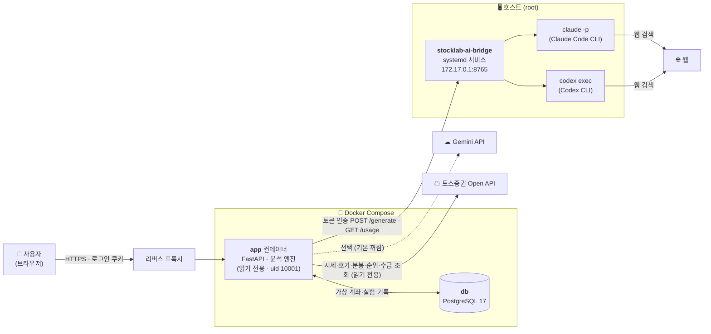
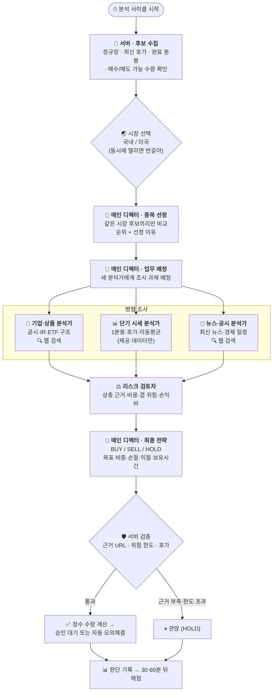
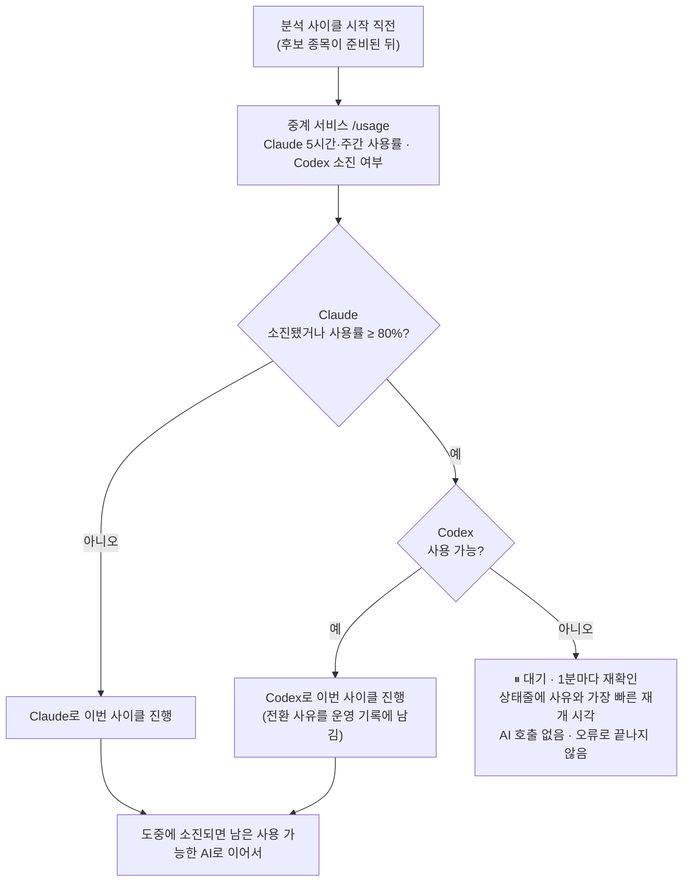
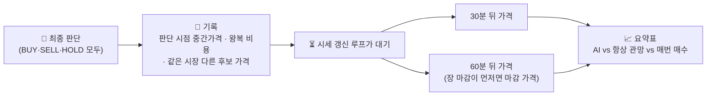
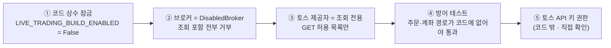
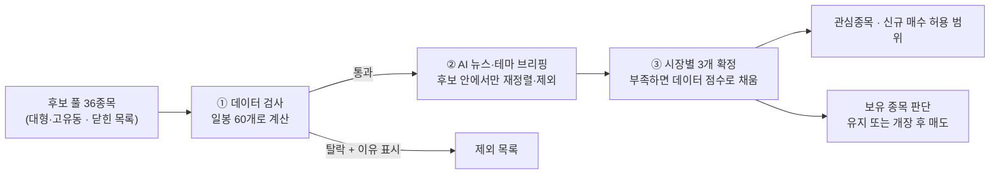
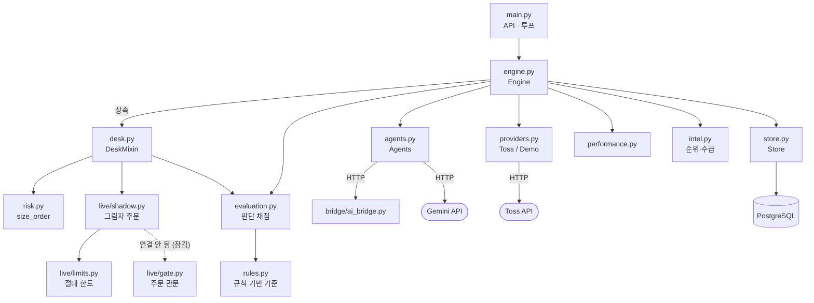
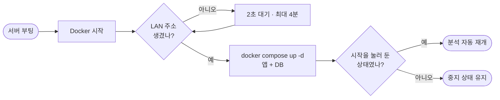

# 📈 Stock Lab · AI 모의투자 연구실

> 토스증권 **실시간 시세**를 받아 **AI 분석팀 7명**이 종목을 고르고 토론하며, 서버가 **위험 한도 안에서만** 가상 자금으로 모의매매하는 개인용 웹 서비스입니다.
> **실제 증권 주문 경로는 없습니다.** 전략의 수익성은 검증되지 않았습니다.

<p>


</p>

---

## 📑 목차

1. [한눈에 보기](#-한눈에-보기)
2. [화면 디자인](#-화면-디자인)
3. [전체 구조](#-전체-구조)
4. [AI 분석팀 — 역할과 흐름](#-ai-분석팀--역할과-흐름)
5. [AI 공급자 전환과 사용량 관리](#-ai-공급자-전환과-사용량-관리)
6. [AI 판단 검증 (성과 채점)](#-ai-판단-검증-성과-채점)
7. [실거래 준비 (구조만 · 잠김)](#-실거래-준비-구조만--잠김)
8. [매매·위험 관리 규칙](#-매매위험-관리-규칙)
9. [관심 종목](#-관심-종목)
10. [오늘의 집중 종목](#-오늘의-집중-종목)
11. [폴더 구조](#-폴더-구조)
12. [설치와 실행](#-설치와-실행)
13. [환경 변수](#-환경-변수)
14. [운영·백업·복구](#-운영백업복구)
15. [API](#-api)
16. [테스트](#-테스트)
17. [보안 설계](#-보안-설계)
18. [알려진 한계](#-알려진-한계)

---

## 🔎 한눈에 보기

| 항목 | 내용 |
|---|---|
| **무엇을** | 국내·미국 주식/ETF 중 **매일 아침 데이터와 뉴스로 시장별 집중 종목을 고르고**, 그 안에서 AI가 종목을 골라 분석한 뒤 가상 계좌로 모의매매 |
| **종목 구성** | 후보 풀 36종목 → 일봉 데이터로 거른 뒤 AI가 뉴스·테마를 확인해 **시장별 3개** ([상세](docs/UNIVERSE.md)) · 목록 밖 신규 매수 금지 · 보유 종목은 유지/교체 판단 |
| **시세** | 토스증권 Open API (**조회 전용**) · 정규장·최신 호가만 사용 · 호가는 병렬 조회 · 시장 순위·국내 투자자별 수급도 조회 |
| **AI** | 1순위 Claude CLI (Opus 5.5) → 2순위 Codex CLI (GPT-6.1-Sol · 깊이 high). **구독 사용률이 80%에 닿으면 분석을 시작하기 전에** 다음 AI로 전환하고, 쓸 수 있는 AI가 없으면 오류 없이 대기 ([상세](#-ai-공급자-전환과-사용량-관리)) |
| **비용** | Claude·Codex는 서버에 로그인된 **구독 사용량**으로 호출 (추가 API 비용 없음). Gemini는 무료 등급이 검색이 안 되고 불안정해 기본 구성에서 뺐습니다(선택) |
| **매매 방식** | 직접 승인 / 자동 모의매매 중 선택 |
| **전략** | 장중 전략(종목 선정 + 6단계, 수십 분~수 시간 보유) · 기본 전략(5단계) |
| **검증** | 모든 AI 판단을 30분·60분 뒤 가격으로 자동 채점, "항상 관망"·"매번 매수"·**규칙 기반 4종**(골든크로스·모멘텀·평균회귀·돌파)과 비교 |
| **실거래** | 🔒 **잠김** — 실제 주문 코드가 없음. 나중을 위한 안전 구조(주문 관문·한도·대사·보호 주문)와 **그림자 모드**만 구현 ([상세](docs/LIVE_TRADING.md)) |
| **자금** | 통화별 분리 운용 (KRW / USD), 환전 없음 · 차입·공매도 없음 |
| **실행 환경** | Debian 13 · Docker Compose (`app` 1개 + PostgreSQL `db` 1개) + 호스트 systemd 중계 서비스 |
| **재부팅 복구** | 서버가 꺼졌다 켜져도 부팅 서비스가 앱을 올리고, **시작을 눌러 둔 상태면 분석을 자동으로 이어감** ([상세](#-서버가-꺼졌다-켜져도-유지)) |

### 기술 스택

| 계층 | 사용 기술 |
|---|---|
| 백엔드 | Python 3.12, FastAPI, Uvicorn(워커 1개), SQLAlchemy, httpx |
| 데이터베이스 | PostgreSQL 17 (상태·실험 기록을 JSON으로 저장) |
| 프론트엔드 | 순수 HTML / CSS / JavaScript (빌드 도구 없음) |
| AI 중계 | Python 표준 라이브러리만 사용하는 HTTP 서버 (`bridge/ai_bridge.py`) |
| 배포 | Docker Compose (읽기 전용 컨테이너), systemd |

---

## 🎨 화면 디자인

라이트(반투명 유리)와 다크(네온 우주) 두 테마를 지원하는 **Aurora Glass** 디자인입니다. 프레임워크나 빌드 도구 없이 HTML · CSS · JavaScript만 사용합니다. 설계와 검증 방법은 **[docs/DESIGN.md](docs/DESIGN.md)** 에 있습니다.

| 라이트 · 글래스 | 다크 · 네온 |
|---|---|
|  |  |

| 모바일 · 라이트 | 모바일 · 다크 | 분석 중인 에이전트 데스크 |
|---|---|---|
|  |  |  |

| AI 판단 검증 · 다크 | 승인 대기 결정 · 다크 |
|---|---|
|  |  |

> 스크린샷은 실제 계좌가 아닌 **합성 데모 데이터**입니다.

| 특징 | 내용 |
|---|---|
| 두 테마 | 상단 해·달 버튼으로 전환, 선택 기억, 저장이 없으면 기기 설정을 따름, 첫 화면 깜빡임 없음 |
| 화면 요소 | 유리 카드 · 광택 구체 배경 · KPI 타일(스파크라인) · 링/도넛 게이지 · 부드러운 곡선 차트 · AI vs 규칙 비교 막대 |
| 글자 대비 | 실제 렌더링 픽셀로 측정해 WCAG AA 기준 **미달 0건** (약 3,800개 글자, 라이트·다크·모바일) |
| 반응형 | 데스크톱 → 태블릿 → 모바일 (상단 탭이 스크롤을 따라 현재 구역을 표시) |
| 보안 정책 안에서 | 인라인 스타일·외부 폰트·외부 이미지를 쓰지 않는 엄격한 CSP에서 동작 |
| 갱신 안정성 | 화면이 2초마다 갱신돼도 바뀐 부분만 교체 → 애니메이션·호버·선택 상태 유지 |
| 자동 검증 | `tests/test_ui_contract.py` + 실제 브라우저 점검 도구 `tools/design-lab/` |

---

## 🏗 전체 구조



**왜 중계 서비스가 필요한가?**
앱은 보안을 위해 **읽기 전용 컨테이너**에서 일반 사용자 권한으로 돕니다. 반면 `claude`·`codex` CLI와 로그인 정보는 **호스트의 root**에 있습니다. 컨테이너는 호스트 CLI를 직접 실행할 수 없으므로, 호스트의 작은 HTTP 서비스가 요청을 받아 CLI를 대신 실행합니다.

### 백그라운드 작업 루프

| 루프 | 주기 | 하는 일 |
|---|---|---|
| 시세 갱신 | `QUOTE_POLL_SECONDS` (기본 10초) | 호가·체결가 갱신, 성과 기록, 일일 손실 한도 확인, **AI 판단 채점** |
| 청산 감시 | 시세 갱신과 함께 | 손절·익절·최대 보유 시간 도달 시 모의청산 |
| 시장 정보 | 15초마다 확인 (순위 1분 · 수급 5분 간격, **별도 루프**) | 토스 공식 순위·국내 투자자별 수급 조회 — 실패해도 시세·청산에 영향 없음 |
| 집중 종목 | 30초마다 확인 (시장별 하루 1회 계산, 개장 90분 전부터) | 일봉으로 후보를 거르고 AI 뉴스 브리핑으로 오늘의 목록 작성 — 실패해도 기본 종목으로 진행 |
| 전량 매도 처리 | 시세 갱신과 함께 | "전량 매도 후 종료" 요청 처리 |
| 분석 사이클 | `ANALYSIS_INTERVAL_SECONDS` (기본 15분) | 후보 수집 → AI 종목 선정 → AI 분석 → 제안/체결 → 판단 기록 |

---

## 🤖 AI 분석팀 — 역할과 흐름

### 장중 전략 (종목 선정 + 6단계, AI 호출 7회)



| # | 역할 | 입력 | 출력 | 웹 검색 |
|:-:|---|---|---|:-:|
| 0 | 🎯 메인 디렉터 · 종목 선정 | 같은 시장 후보들의 요약 지표 | 종목 1개 + 후보 순위·이유 | ❌ |
| 1 | 🧭 메인 디렉터 · 업무 배정 | 종목·계좌·시세 | 분석가 3명의 조사 과제 | ❌ |
| 2 | 🏢 기업·상품 분석가 | 배정 과제 | 공시·IR·ETF 구조 요약 + 출처 | ✅ |
| 2 | 📊 단기 시세 분석가 | 완료된 1분봉·호가·SMA5/20 | 추세·변동성·무효화 조건 | ❌ |
| 2 | 📰 뉴스·공시 분석가 | 배정 과제 | 최신 뉴스·공시 + 출처·게시일 | ✅ |
| 3 | ⚖️ 리스크 검토자 | 앞선 3개 보고서 | 약점·반대 근거·관망 이유 | ❌ |
| 4 | 🎯 메인 디렉터 · 최종 전략 | 전체 보고서 | 매매 판단 + 전략 수치 | ❌ |

> **기본 전략(5단계)**: 종목은 서버가 순서대로 고르고, 기업 분석가 → 차트 분석가 → 뉴스 분석가 → 반대 검토자 → 디렉터를 순서대로 실행합니다.

### AI 종목 선정

| 항목 | 내용 |
|---|---|
| 후보 | 서버가 거래 가능 여부를 먼저 확인한 종목만 (정규장, 최신 호가, 분봉 20개 이상, 살 수 있거나 팔 수 있는 수량) |
| 시장 분리 | **국내와 미국 종목은 서로 비교하지 않음.** 시장을 먼저 정하고 그 시장 안에서 선정. AI에게는 그 시장 통화의 현금·손익만 전달 |
| AI가 받는 후보별 지표 | 호가 스프레드(bp), 5·20·60분 수익률, 1분 변동성, 최근 5분 거래량 배율, 남은 장 시간, 보유 수량·평가손익, 최근 분석 시각·판단, **시장 거래량·거래대금·급등·급락 순위**, **국내 종목의 외국인·기관 순매수(주)** |
| 안전장치 | 후보에 없는 종목을 고르면 거부 → 다음 AI로. 모두 실패하면 서버가 순서대로 선택 |
| 순위·수급 표시 | "100위 밖"은 상위 100위에 못 들었다는 뜻, `null`은 **조회되지 않았다**는 뜻으로 구분해서 전달. 순위는 10분이 지나면 현재 값으로 보여주지 않음. 수급은 조회 시각을 함께 전달하고 당일 값은 잠정치로 표시 |
| 선정 생략 | 사용자가 "지금 분석"으로 종목을 직접 지정했을 때, 후보가 1개뿐일 때 |
| 기록 | 실행 기록에 `selected_by` = `ai` / `user` / `server` |

### 최종 전략이 반환하는 값

| 필드 | 범위 | 의미 |
|---|---|---|
| `stance` | BUY / SELL / HOLD | 매매 판단 |
| `target_weight_pct` | 0 ~ 30 | 해당 통화 평가자산 대비 목표 비중(%) |
| `stop_loss_pct` | 0.2 ~ 10 | 손절 폭(%) |
| `take_profit_pct` | 0.3 ~ 40 | 익절 폭(%) — 매수 시 **손절 폭의 1.5배 이상** |
| `max_holding_minutes` | 15 ~ 240 | 최대 보유 시간(분) |
| `evidence` | 최대 15개 | 주장 · 출처 URL · 게시일 |

### 근거(출처) 검증 규칙

- AI가 적은 URL은 **실제로 검색해서 받은 결과 URL과 일치할 때만** 근거로 인정합니다. 지어낸 URL은 제거됩니다.
- 기업·뉴스 분석가 보고서에 **검증된 출처가 하나도 없으면** 최종 판단은 서버가 강제로 **HOLD**로 바꿉니다.
- 게시일을 확인할 수 없으면 `null`로 두고 "확인되지 않음"으로 표시합니다.

| AI | 출처 검증 방법 |
|---|---|
| Claude | CLI 출력(stream-json)에 담긴 **WebSearch 결과 URL 목록**과 대조 |
| Codex | 결과 목록을 주지 않으므로, 중계 서비스가 **인용 URL에 직접 접속**해 존재 확인 (내부망 주소 차단) |
| Gemini | 응답의 **Google Search grounding** 메타데이터와 대조 |

---

## 🔁 AI 공급자 전환과 사용량 관리

분석 사이클을 **시작하기 전에** 어느 AI로 돌릴지 정하고, 그 사이클은 같은 AI로 끝냅니다. 한도가 다 찬 뒤에 알게 되어 사이클이 도중에 죽는 일을 막기 위한 것입니다.



### 현재 설정

| 순서 | 공급자 | 호출 방식 | 모델 | 추론 깊이 | 비용 |
|:-:|---|---|---|:-:|---|
| 1 | **Claude** | `claude -p` (중계) | `claude-opus-5-5` | medium | Claude 구독 사용량 |
| 2 | **Codex** | `codex exec` (중계) | `gpt-6.1-sol` | high | ChatGPT 구독 사용량 |
| (선택) | Gemini | REST API (앱 직접) | `gemini-3.5-flash` | high | 무료 등급 — **기본 구성에서 제외** ([아래](#선택-gemini)) |

### 사용량을 어떻게 아는가

| 공급자 | 알 수 있는 것 | 출처 |
|---|---|---|
| Claude | 5시간 창·주간 창의 **실제 사용률과 초기화 시각** | CLI가 **호출할 때마다** `rate_limit_event`로 알려줌 → 중계 서비스가 기록 |
| Codex | 소진 여부와 재개 시각 | `"You've hit your usage limit ... try again at <시각>"` 메시지 파싱 |
| 재시작 | 기록 유지 | 중계 서비스가 `bridge-state.json`(권한 600)에 저장하고 켜질 때 읽음 |

앱은 사이클 시작 전에 중계 서비스의 `GET /usage`(토큰 인증)를 읽고(20초 캐시), 호출 결과에 사용률이 실려 오면 바로 반영합니다.

### 전환 규칙

| 상황 | 동작 |
|---|---|
| 어느 창이든 사용률 ≥ `AI_SWITCH_AT_PCT` (기본 **80%**) | 그 공급자는 **이번 사이클에서 제외**하고 다음 AI 사용 |
| 초기화 시각이 지난 창 | 0%로 계산 (오래된 읽기값으로 막지 않음) |
| 여러 창이 기준을 넘음 | **모든 창이 초기화된 뒤**에 다시 사용 (더 늦은 시각 기준) |
| 사용률 정보가 없음 · 중계 서비스에 연결 실패 | 사용 가능으로 간주 (마지막 기록이 있으면 그것을 유지) |
| 쓸 수 있는 AI가 하나도 없음 | 사이클을 **시작하지 않고 대기** — 1분마다 재확인, 상태줄에 사유와 가장 빠른 재개 시각 표시 |
| 진행 중인 사이클 | 시작할 때 고른 AI로 끝냄 (도중에 80%를 넘어도 이어감, 소진되면 다음 AI) |
| 다음 사이클 | 다시 판단. 첫 번째 AI가 돌아오면 "되돌아왔습니다"를 기록 |
| 아침 집중 종목 브리핑 | 쓸 수 있는 AI가 없으면 건너뜀 (일봉 데이터만으로 선정) |
| 시세 · 손절/익절 감시 | AI와 무관하게 계속 |

> 한도까지 몇 번의 사이클을 더 돌릴 수 있는지는 예측하지 않습니다. 80%는 "한 사이클을 끝낼 여유가 남아 있는 지점"에 대한 안전 마진이며, 값은 `AI_SWITCH_AT_PCT`로 바꿀 수 있습니다.

### 사용량 소진 감지 (사이클 도중 대비)

| 공급자 | 감지 방법 | 재시도 시점 |
|---|---|---|
| Claude | `rate_limit_event.status = "rejected"` 또는 한도 관련 오류 문구 | CLI가 알려준 초기화 시각(`resetsAt`) |
| Codex | `"You've hit your usage limit ... try again at <시각>"` | 메시지 속 시각 파싱 (실패 시 30분 후) |

소진된 공급자는 초기화 시각까지 **호출하지 않고 즉시 건너뜁니다**. 대시보드의 "AI 사용량" 카드에 공급자별 사용률(5시간·주간)과 소진·전환 상태가 표시됩니다.

### 선택: Gemini

기본 구성에서는 뺐습니다. 무료 등급이 Google 검색을 지원하지 않아 조사 역할을 못 하고, 서버 혼잡(503)·시간 초과가 잦았습니다. 다시 쓰려면 `.env`의 `AI_PROVIDERS=claude,codex,gemini`로 바꾸고 `GEMINI_API_KEY`를 설정하세요. 이 경우 Gemini는 사용량 정보를 주지 않아 **소진·오류가 났을 때만** 순서가 넘어갑니다.

| 항목 | 상태 |
|---|---|
| 텍스트 생성 (`gemini-3.5-flash`) | ✅ 가능 |
| Google 검색 grounding | ❌ 무료 등급 불가 (429) → `GEMINI_SEARCH=off` |
| 결과 | 검색 역할(기업·뉴스)은 건너뛰어 사이클이 매매 없이 끝남 |
| 하루 호출 한도 | `AI_DAILY_CALL_LIMIT` — **Gemini 호출만** 계산 (UTC 기준) |

---

## 📊 AI 판단 검증 (성과 채점)

AI의 최종 판단이 **아무것도 안 하는 것보다 나은지** 측정합니다. 매매에는 영향을 주지 않습니다. (`app/evaluation.py`)



| 지표 | 계산 | 해석 |
|---|---|---|
| **AI 판단 (비용 차감)** | 매수 = 수익률 − 비용, 매도 = 피한 하락폭 − 비용, 관망 = 0% 의 평균 | 이 값이 **0% 이하면** 관망보다 못함 |
| 항상 관망 | 0% | 기준선 |
| 매번 매수 | 분석한 종목을 매번 샀을 때 (비용 차감) | AI 판단이 이것보다 나아야 선별 능력이 있음 |
| 매수 적중률 | 수익률 > 왕복 비용 인 비율 | |
| 매도 적중률 | 매도 후 가격이 내려간 비율 | |
| 관망 · 놓친 상승 | 관망했는데 비용 이상 오른 비율 | 너무 보수적인지 확인 |
| 종목 선정 | AI가 고른 종목의 변동폭 vs 다른 후보 평균 변동폭 | 움직일 종목을 고르는지 확인 |
| AI별 건수 | Claude · Codex · Gemini 판단 건수 | |
| **규칙 기반 4종** | 같은 판단 시점·같은 가격·같은 비용으로 기계적 규칙을 채점 | **AI가 이 단순 규칙보다 꾸준히 낫지 않다면 AI 판단에 의존할 이유가 없음** |

### 비교 기준이 되는 규칙 (`app/rules.py`)

완료된 1분봉만 쓰고, 튜닝하지 않은 교과서적 기본값입니다. 한국투자증권 공개 샘플의 "프리셋 전략과 비교한다"는 아이디어만 참고했고 코드는 가져오지 않았습니다.

| 규칙 | 매수 | 매도 | 관망 |
|---|---|---|---|
| 골든크로스 | 최근 3봉 안에 5봉 평균이 20봉 평균을 **상향 돌파** | 하향 돌파 | 그 외 |
| 모멘텀 | 20봉 수익률이 자기 변동성의 **+1배 이상** | -1배 이하 | 그 외 |
| 평균회귀 | 20봉 평균보다 **2표준편차 이상 낮음** | 2표준편차 이상 높음 | 그 외 |
| 돌파 | 종가가 직전 20봉 **고가보다 높음** | 직전 20봉 저가보다 낮음 | 그 외 |

모멘텀은 변동성으로 나눠서 종목 가격 수준과 무관하게 비교됩니다. 계산에 필요한 봉이 모자라면 그 규칙은 그 판단에서만 제외됩니다.

| 채점 규칙 | 내용 |
|---|---|
| 가격 | 매수·매도 호가의 **중간가격** |
| 비용 | 왕복 수수료 + 왕복 슬리피지 + (국내) 매도세 + 판단 시점 스프레드 |
| 신선도 | 30초 이내 시세만 사용. 앱이 10분 넘게 꺼져 제때 채점하지 못하면 **누락** 처리 |
| 표본 | 60분 채점 **30건 미만이면 "표본 부족" 경고** |
| 보관 | 최근 1,000건 (실험별로 보관) |

> ⚠️ 이 지표는 모의 데이터 기반의 짧은 기간 측정입니다. 좋은 숫자가 나와도 미래 수익을 보장하지 않습니다.

---

## 🔒 실거래 준비 (구조만 · 잠김)

> **이 버전은 실제 주문을 보낼 수 없습니다.** 나중에 실거래로 바꿀 때 필요한 안전 장치의 **구조와 로직**만 만들어 두었습니다. 자세한 설계·체크리스트는 **[docs/LIVE_TRADING.md](docs/LIVE_TRADING.md)** 를 보세요.



| 구성 요소 | 하는 일 | 상태 |
|---|---|:-:|
| 잠금 (`lock.py`) | 환경변수로는 못 켜는 코드 상수. `.env`에 `LIVE_TRADING=on`을 써도 **무시**되고 화면에 표시 | ✅ 동작 |
| **그림자 모드** (`shadow.py`) | 모의 제안마다 "실거래였다면 나갔을 주문"을 한도·가격 검사까지 거쳐 **기록만** 함 | ✅ 동작 |
| 절대 금액 한도 (`limits.py`) | 1회·하루 금액, 횟수, 손실, 종목 보유, 허용 종목. **매도(청산)는 한도에 막히지 않음** | ✅ 동작(그림자) |
| 주문 관문 (`gate.py`) | 미리보기 → 1회용 확인 토큰 → 실행. 멱등키 항상 사용, 결과 불명확 시 **정지** | 🧩 로직·테스트 완료 |
| 주문 상태 (`lifecycle.py`) | `UNKNOWN`은 추측으로 없애지 않음 | 🧩 로직·테스트 완료 |
| 증권사 대사 (`reconcile.py`) | 앱 장부 ↔ 증권사 잔고·주문 비교, 보유 수량 불일치는 거래 정지 | 🧩 로직·테스트 완료 |
| 증권사 측 손절 (`protective.py`) | OCO 조건주문 계획과 목표 상태 동기화 | 🧩 로직·테스트 완료 |
| **토스 주문 어댑터** | 실제 증권사 통신 | ⛔ **없음** |

화면의 **"실거래 준비"** 패널에서 잠금 상태, 한도, 그림자 주문(전송 가능/차단과 차단 사유)을 볼 수 있습니다. 막힌 주문이 많다면 모의투자의 주문 크기가 실거래 한도보다 크다는 뜻입니다.

---

## 🛡 매매·위험 관리 규칙

AI는 **판단과 비중만** 제안하고, 실제 주식 수는 **서버가 계산**합니다. AI의 `quantity`는 참고값일 뿐 체결 권한이 없습니다.

| 규칙 | 기본값 / 범위 | 설명 |
|---|---|---|
| 거래당 위험 비율 | 0.5% (0.1 ~ 2) | 손절 시 잃는 금액이 평가자산의 이 비율을 넘지 않도록 수량 제한 |
| 일일 손실 한도 | 2% (1 ~ 10) | 통화별(KRW: 서울, USD: 뉴욕 기준 일자) 도달 시 **신규 매수 중단 + 청산 시도** |
| 종목당 최대 비중 | 30% | 해당 통화 평가자산 대비 |
| 최대 보유 시간 | 120분 (15 ~ 240) | 초과 시 모의청산 |
| 손익비 | 익절 ≥ 손절 × 1.5 | 미달 시 매수 제안 거부 |
| 호가 잔량 | 최우선 호가 수량 이내 | 호가보다 많이 체결하지 않음 |
| 레버리지 ETF | 가격에 배수를 다시 곱하지 않음 | 현금으로만 매수, 실험별로 포함 여부 선택 |
| 체결 조건 | 정규장 · 30초 이내 시세 | 오래된 시세·장외 시간에는 체결하지 않음 |
| 비용 가정 | 수수료 15bp · 슬리피지 5bp | 실제 증권사 요율이 아닌 시뮬레이션 값 |

### 사용자 조작

| 버튼 | 동작 |
|---|---|
| **시작** | 선택한 방식(직접 승인 / 자동)으로 분석 시작 — 눌러 둔 상태는 재시작·재부팅 뒤에도 이어집니다 |
| **중지** | 분석·미승인 제안·청산 감시 중지 — **보유 주식은 유지**. 재시작 뒤에도 멈춰 있습니다 |
| **전량 매도 후 종료** | 확인 후 최신 호가로 모의청산 시도, 불가하면 대기 |
| **새 실험** | 원금·한도·전략을 새로 정해 시작 (이전 실험은 보관) |
| 서버·앱 재시작 시 | 원금·현금·보유분·거래 기록 보존. **시작을 눌러 둔 상태였다면 자동 재개**, 중지·전량 매도를 눌렀다면 중지 유지 (진행 중이던 분석 1건과 대기 제안은 버림) |

---

## 📋 관심 종목

| 시장 | 종목코드 | 이름 | 유형 | 비고 |
|:-:|---|---|---|---|
| 🇰🇷 | 005930 | 삼성전자 | 주식 | |
| 🇰🇷 | 000660 | SK하이닉스 | 주식 | |
| 🇰🇷 | 122630 | KODEX 레버리지 | ETF | KOSPI 200 일일 2배 |
| 🇺🇸 | AAPL | Apple | 주식 | |
| 🇺🇸 | MSFT | Microsoft | 주식 | |
| 🇺🇸 | TQQQ | ProShares UltraPro QQQ | ETF | Nasdaq-100 일일 3배 |
| 🇺🇸 | SQQQ | ProShares UltraPro Short QQQ | ETF | Nasdaq-100 일일 -3배 |

| 정규장 (한국 시간) | 시간 |
|---|---|
| 🇰🇷 한국 | 09:00 ~ 15:30 |
| 🇺🇸 미국 | 22:30 ~ 05:00 (서머타임 해제 시 23:30 ~ 06:00) |

> 정규장이 아니면 "정규장 또는 유효한 호가를 기다리고 있습니다" 상태로 대기합니다. **고장이 아닙니다.**

---

## 🎯 오늘의 집중 종목

위 7종목은 **기본(고정) 종목**입니다. 새 실험은 기본적으로 **일일 집중 종목** 방식으로 시작하며, 매일 개장 90분 전에 시장별로 그날 살펴볼 종목을 다시 고릅니다. 자세한 설계와 안전 규칙은 [docs/UNIVERSE.md](docs/UNIVERSE.md)에 있습니다.



| 단계 | 하는 일 | 지키는 규칙 (코드로 강제) |
|---|---|---|
| ① 데이터 검사 | 1개월 수익률·20일선 대비·5일 수익률·하루 변동폭·거래대금을 서버가 계산 | **하락 추세 제외 · 이미 급등한 종목 추격 금지 · 너무 조용하거나 거친 종목 제외 · 거래대금 부족 제외** |
| ② AI 브리핑 | 웹 검색으로 뉴스·테마·일정 확인, 종목별 "이미 가격에 반영됐을 위험" 표시 | **후보 밖 종목은 무시 · 출처 URL이 없으면 통째로 무시 · 반영 위험 high는 제외** |
| ③ 확정 | AI 선정 우선, 부족하면 데이터 점수 순으로 채움 | 실패해도 데이터만으로 진행 · 계산 자체가 3번 실패하면 기본 종목 사용 |
| 매매 | 목록 밖 종목은 **신규 매수 불가** | 청산·손절·익절·보유시간 규칙은 그대로 |
| 보유 종목 | 목록에서 빠졌어도 시세·청산 감시 유지, 추가 매수 없음 | 추세 유지 → 유지 · 추세 꺾임 → 개장 20분 뒤 매도 |
| 채점 | 선정 다음 거래일 종가를 후보 전체·기존 고정 종목 평균과 비교해 기록 | 표본 수를 항상 표시 · 우위를 주장하지 않음 |

---

## 📁 폴더 구조

```text
stock-lab/
├── app/                      # FastAPI 애플리케이션 (Docker 이미지에 포함)
│   ├── main.py               # 웹 서버 · 로그인 · API · 백그라운드 루프
│   ├── engine.py             # 분석 사이클 · 모의체결 · 승인/거절 · 청산
│   ├── desk.py               # 장중 전략 · 시장별 AI 종목 선정 · 손절/익절/보유시간 감시 · 일일 손실 한도
│   ├── evaluation.py         # AI 판단 기록 · 30/60분 채점 · 기준선 비교
│   ├── rules.py              # 규칙 기반 비교 기준 4종 (골든크로스·모멘텀·평균회귀·돌파)
│   ├── intel.py              # 토스 공식 순위·투자자별 수급 정리 · 캐시
│   ├── live/                 # 실거래 준비 구조 (잠김)
│   │   ├── lock.py           #   잠금 상수 · 설정
│   │   ├── limits.py         #   절대 금액 한도
│   │   ├── intent.py         #   주문 의도 · 멱등키
│   │   ├── gate.py           #   주문 관문 (미리보기·확인 토큰·실행)
│   │   ├── lifecycle.py      #   주문 상태
│   │   ├── broker.py         #   브로커 인터페이스 + 잠긴 스텁
│   │   ├── reconcile.py      #   증권사 잔고 대사
│   │   ├── protective.py     #   증권사 측 손절·익절 계획
│   │   └── shadow.py         #   그림자 주문 기록
│   ├── agents.py             # AI 프롬프트 · 공급자 전환 · 응답/근거 검증 (트렌드 브리핑 포함)
│   ├── universe.py           # 오늘의 집중 종목: 일봉 지표 · 필터 · 점수 · AI 결과 병합 · 보유 종목 판단 · 채점
│   ├── focus.py              # 집중 종목 빌드 시점 · 게시 · 신규 매수 제한 · 실패 시 기본 종목
│   ├── usage.py              # AI 구독 사용량 판단 · 사이클 시작 전 전환 규칙
│   ├── risk.py               # 위험 기반 주식 수 계산
│   ├── providers.py          # 토스 시세(조회 전용 GET 허용 목록·호출 제한 대응·호가 병렬) / 데모 시세
│   ├── store.py              # PostgreSQL 상태 저장 · 실험 보관
│   ├── performance.py        # 평가자산 · 수익률 기록
│   ├── search_display.py     # 검색 표시 격리
│   ├── instruments.py        # 기본 종목 + 후보 풀 카탈로그 (닫힌 목록)
│   ├── config.py             # 환경 변수 설정
│   └── static/               # 화면 (index.html · style.css · app.js · theme.js · favicon.svg)
├── bridge/
│   └── ai_bridge.py          # 호스트 중계 서비스 (claude -p / codex exec)
├── docs/
│   ├── LIVE_TRADING.md       # 실거래 전환 설계 · 체크리스트
│   ├── DESIGN.md             # 화면 디자인 · 토큰 · 접근성 · 검증 방법
│   ├── UNIVERSE.md           # 오늘의 집중 종목 설계 · 안전 규칙 · 검증
│   └── screenshots/          # 화면 스크린샷 (합성 데이터)
├── tools/
│   └── design-lab/           # 화면 검수 도구 (데모 서버 · 스크린샷 · 동작/대비 점검)
├── deploy/
│   ├── stocklab-ai-bridge.service   # 중계 서비스 systemd 유닛
│   ├── stocklab.service             # 부팅 시 앱·DB를 올리는 systemd 유닛
│   └── stocklab-up                  # LAN 주소가 생길 때까지 기다린 뒤 compose up
├── tests/                    # pytest (462개)
├── compose.yaml              # app + db 구성
├── Dockerfile
├── setup.sh                  # 최초 설치 (비밀값 자동 생성)
├── backup.sh                 # DB 백업 (pg_dump)
└── .env.example              # 설정 예시 → .env로 복사
```

### 모듈 관계



---

## 🚀 설치와 실행

### 준비물

| 항목 | 용도 |
|---|---|
| Docker + Docker Compose | 앱·DB 실행 |
| python3 | `setup.sh`, 중계 서비스 |
| Claude Code CLI (`claude`) — 로그인 완료 | 1순위 AI |
| Codex CLI (`codex`) 0.159 이상 — 로그인 완료 | 2순위 AI. `gpt-6.1-sol`은 0.158.0에서 "지원되지 않는 모델" 오류가 나서 올려야 했습니다 (`npm i -g @openai/codex`) |
| 토스증권 Open API 키 | 실시세 (`MARKET_MODE=toss`) |
| Gemini API 키 (선택) | 기본 구성에서는 사용하지 않음 |

### 1) 앱 설치

```bash
git clone <이 저장소> /opt/stock-lab
cd /opt/stock-lab
cp .env.example .env        # 값 채우기 (아래 환경 변수 표 참고)
bash setup.sh               # 비밀값 생성 + 컨테이너 빌드·실행
```

> `setup.sh`는 앱 비밀번호를 화면에 출력합니다. 기존 서버 점검용으로는 쓰지 마세요.

### 2) AI 중계 서비스 설치 (호스트)

```bash
# .env에 AI_BRIDGE_TOKEN 생성
python3 -c "import secrets;print('AI_BRIDGE_TOKEN='+secrets.token_hex(32))" >> .env

sudo cp deploy/stocklab-ai-bridge.service /etc/systemd/system/
sudo systemctl daemon-reload
sudo systemctl enable --now stocklab-ai-bridge
curl http://172.17.0.1:8765/health          # {"ok": true, ...}
```

`compose.yaml`의 `extra_hosts: host.docker.internal:host-gateway`로 컨테이너가 호스트 중계 서비스에 접근합니다.

### 3) 부팅 자동 시작 (호스트)

서버가 꺼졌다 켜져도 앱·DB가 스스로 올라오게 합니다. (동작 원리는 [운영·백업·복구](#-서버가-꺼졌다-켜져도-유지) 참고)

```bash
sudo install -m755 deploy/stocklab-up /usr/local/bin/stocklab-up
sudo install -m644 deploy/stocklab.service /etc/systemd/system/stocklab.service
sudo systemctl daemon-reload
sudo systemctl enable --now stocklab.service
```

> `APP_HOST`(LAN 주소)를 쓴다면 공유기에서 이 서버의 주소를 **고정(예약)** 하세요. 주소가 바뀌면 부팅 서비스가 4분을 기다린 뒤 실패합니다.

### 4) 동작 확인

```bash
docker compose ps
docker compose exec -T app python -c "import urllib.request;print(urllib.request.urlopen('http://host.docker.internal:8765/health').read())"
```

---

## ⚙ 환경 변수

| 구분 | 변수 | 예시 | 설명 |
|---|---|---|---|
| 접속 | `APP_PASSWORD` | (자동 생성) | 웹 로그인 비밀번호 (8자 이상) |
| 접속 | `SESSION_SECRET` | (자동 생성) | 로그인 쿠키 서명 키 (32자 이상) |
| 접속 | `APP_HOST` | `127.0.0.1` | 바인딩 주소 |
| 접속 | `APP_PUBLIC_ORIGIN` | `https://stock.example.com` | 프록시 뒤 공개 주소 |
| 시세 | `MARKET_MODE` | `toss` / `demo` | 실시세 / 합성 시세 |
| 시세 | `TOSS_CLIENT_ID`, `TOSS_CLIENT_SECRET` | | 토스 Open API |
| 시세 | `TOSS_PARALLEL` | `4` | 호가 병렬 조회 수 (1~8). 호출 한도는 **그룹별**로 처리: 429를 받은 그룹만 쉬고, 시세 그룹의 한도(응답 헤더) 이하로 제한 |
| AI | `AI_PROVIDERS` | `claude,codex` | 시도 순서 (Gemini는 기본 제외, 필요하면 뒤에 추가) |
| AI | `AI_SWITCH_AT_PCT` | `80` | 구독 사용률(5시간·주간 창)이 이 값(%)에 닿으면 **분석을 시작하기 전에** 다음 AI로 전환 (10~99) |
| AI | `AI_BRIDGE_URL` | `http://host.docker.internal:8765` | 앱 → 중계 서비스 주소 |
| AI | `AI_BRIDGE_BIND` | `172.17.0.1:8765` | 중계 서비스 수신 주소 |
| AI | `AI_BRIDGE_TOKEN` | (64자 무작위) | 앱 ↔ 중계 인증 토큰 |
| Claude | `CLAUDE_MODEL` / `CLAUDE_EFFORT` | `claude-opus-5-5` / `medium` | 모델 / 추론 깊이 |
| Codex | `CODEX_MODEL` / `CODEX_EFFORT` | `gpt-6.1-sol` / `high` | 모델 / 추론 깊이 |
| Gemini | `GEMINI_API_KEY` | | API 키 |
| Gemini | `GEMINI_MODEL` / `GEMINI_THINKING` | `gemini-3.5-flash` / `high` | 모델 / 추론 깊이 |
| Gemini | `GEMINI_SEARCH` | `off` | 무료 등급이면 off |
| Gemini | `AI_DAILY_CALL_LIMIT` | `30` | Gemini 하루 호출 한도 |
| 주기 | `ANALYSIS_INTERVAL_SECONDS` | `900` | 분석 간격 (최소 60) |
| 종목 구성 | `FOCUS_PER_MARKET` | `3` | 시장별 오늘의 집중 종목 수 (1~6) |
| 종목 구성 | `FOCUS_AI` | `on` | `off`이면 AI 뉴스 브리핑 없이 일봉 데이터만으로 선정 |
| 주기 | `QUOTE_POLL_SECONDS` | `10` | 시세 갱신 간격 (최소 5) |
| 비용 | `FEE_KR_BPS`, `FEE_US_BPS`, `SELL_TAX_KR_BPS`, `SLIPPAGE_BPS` | `15`, `15`, `0`, `5` | 모의체결 비용 가정 (bp) |
| 실거래 준비 | `LIVE_TRADING` | `off` | `on`으로 써도 **이 빌드는 무시** (화면에 표시) |
| 실거래 준비 | `LIVE_ALLOW_BUY`, `LIVE_ALLOW_SELL` | `off` | 매수·매도 권한 (그림자 모드는 켜져 있다고 가정) |
| 실거래 준비 | `SHADOW_MODE` | `on` | 그림자 주문 기록 |
| 실거래 준비 | `LIVE_MAX_ORDER_KRW/USD`, `LIVE_MAX_DAILY_NOTIONAL_KRW/USD`, `LIVE_MAX_DAILY_LOSS_KRW/USD`, `LIVE_MAX_POSITION_KRW/USD` | 10만원/100달러 등 | 절대 금액 한도 (자리표시자, 실거래 전 재설정) |
| 실거래 준비 | `LIVE_MAX_DAILY_ORDERS`, `LIVE_MAX_OPEN_ORDERS`, `LIVE_PRICE_BAND_PCT`, `LIVE_ALLOWED_SYMBOLS` | `10`, `3`, `1`, 일반 주식 4종 | 횟수·미체결·가격 범위·허용 종목. 잘못된 값이면 시작 시 오류 |

> 💡 모델·깊이 변경: **Claude·Codex**는 중계 서비스가 요청마다 `.env`를 다시 읽으므로 **수정 즉시 반영**됩니다 (`AI_BRIDGE_BIND`만 재시작 필요). **Gemini** 설정은 앱 재빌드가 필요합니다.

---

## 🧰 운영·백업·복구

| 작업 | 명령 |
|---|---|
| 상태 보기 | `docker compose ps` · `systemctl status stocklab-ai-bridge` |
| 앱 로그 | `docker compose logs --tail=100 app` |
| 중계 로그 | `journalctl -u stocklab-ai-bridge -n 100` |
| 코드 변경 반영 | `docker compose up -d --build --no-deps --wait --wait-timeout 180 app` |
| 중계 재시작 | `sudo systemctl restart stocklab-ai-bridge` |
| DB 백업 | `bash backup.sh` → `backups/stocklab-<시각>.dump` |
| 이미지 되돌리기 | `docker image tag <백업 태그> stock-lab-app:latest` 후 `docker compose up -d --no-build --no-deps --force-recreate app` |

> ⚠️ `docker compose down -v`는 **DB 볼륨을 삭제**합니다. 사용하지 마세요.
> 앱을 재빌드·재시작해도 **시작을 눌러 둔 상태는 자동으로 이어집니다.** 중지를 눌렀다면 멈춰 있습니다.

### 🔌 서버가 꺼졌다 켜져도 유지



| 항목 | 동작 |
|---|---|
| 부팅 서비스 | `stocklab.service`가 `stocklab-up`을 실행해 앱과 DB를 올립니다. 중계 서비스는 별도 유닛으로 자동 시작 |
| 왜 기다리나 | DHCP 주소가 Docker보다 늦게 잡히면 포트 바인딩이 실패해 앱이 죽습니다(`cannot assign requested address`) |
| 이어가는 상태 | 시작 버튼을 누르면 `resume`이 켜지고, 중지·전량 매도를 누르면 꺼집니다. 재부팅·배포·비정상 종료는 값을 바꾸지 않습니다 |
| 재시작 시 정리 | 진행 중이던 분석 1건과 대기 제안은 버리고 다시 시작합니다. 잔고·보유 종목·체결 기록은 DB에 그대로 |
| 전량 매도 요청 | 재시작 후 자동 재개하지 않습니다 |

설치는 [설치와 실행 3단계](#3-부팅-자동-시작-호스트)를 보세요.

> 자동 재개는 **모의매매에만** 해당합니다. 실거래는 코드 상수로 잠겨 있어 재부팅과 무관하게 켜지지 않습니다.

---

## 🔌 API

모든 `/api/*`는 로그인 쿠키가 필요합니다 (`/api/login` 제외).

| 메서드 | 경로 | 설명 |
|---|---|---|
| POST | `/api/login` · `/api/logout` | 로그인 / 로그아웃 |
| GET | `/health` | 헬스 체크 |
| GET | `/api/state` | 계좌·시세·분석 기록 등 전체 상태 |
| POST | `/api/start` · `/api/stop` | 분석 시작 / 중지 |
| POST | `/api/settings/execution` | 직접 승인 ↔ 자동 모의매매 |
| POST | `/api/analyze` | 특정 종목 즉시 분석 요청 (AI 종목 선정 생략) |
| POST | `/api/proposals/{id}/approve` · `/reject` | 제안 승인 / 거절 |
| POST | `/api/liquidate` | 전량 매도 후 종료 |
| POST · GET | `/api/experiments` | 새 실험 시작 / 지난 실험 목록 |
| GET | `/api/experiments/{id}/export` · `/api/export` | 실험 기록 내보내기 |

**중계 서비스** (호스트, 토큰 인증)

| 메서드 | 경로 | 설명 |
|---|---|---|
| GET | `/health` | 상태 + 공급자별 소진 대기 시각 (인증 없음) |
| GET | `/usage` | 공급자별 사용률(5시간·주간 창)·초기화 시각·소진 시각 |
| POST | `/generate` | `{provider, system, prompt, schema, search}` → 구조화된 분석 결과 |

---

## 🧪 테스트

실제 API 키·운영 DB 없이 실행합니다 (외부 HTTP 호출은 테스트에서 차단).

```bash
python -m pip install -r requirements.txt pytest
PYTHONDONTWRITEBYTECODE=1 python -m pytest -q -p no:cacheprovider tests
```

| 파일 | 다루는 내용 |
|---|---|
| `test_engine.py` | 체결·승인·청산·실험 보존, **재시작 복구**(시작해 둔 상태 이어가기·비정상 종료 뒤 재개·중지/전량 매도는 유지) |
| `test_desk_regressions.py` | 장중 위험 수량·자동/직접 체결·손절/익절·기록 보존·AI 종목 선정·시장 분리 |
| `test_gemini.py` | Gemini 요청·응답·출처 검증·추론 깊이·검색 끄기 |
| `test_ai_chain.py` | 공급자 전환 순서·실패 누적·후보 밖 종목 거부 |
| `test_ai_bridge.py` | CLI 출력 파싱·소진 감지·도구 제한·내부망 URL 차단, **Claude 사용률 기록·재시작 뒤 유지·`/usage` 인증** |
| `test_usage_gate.py` | **사용량 기반 전환**: 임계값·초기화 지난 창·소진, 사이클 시작 전 전환/대기/복귀, 진행 중 사이클 유지, 브리핑 건너뜀, 중계 서비스 응답 반영, Gemini 키 없이 시작 |
| `test_search_display.py` | 검색 표시 격리 |
| `test_evaluation.py` | 판단 채점 시점·오래된 시세 배제·마감 채점·기준선 비교·표본 경고 |
| `test_rules.py` | 규칙 기반 신호 4종, 규칙별 채점(같은 시점·같은 비용) |
| `test_toss_provider.py` | 조회 전용 경로 제한, 429 대기, 호출 한도 헤더, 호가 병렬 조회, 오류 코드 표시 |
| `test_intel.py` | 순위·수급 파싱, 신선도, 갱신 주기, 실패 격리, AI 입력 연결 |
| `test_no_live_trading.py` | **실거래 불가 방어 테스트**: 주문·계좌 경로 부재, POST 사용처, 잠금, 스텁 브로커 |
| `test_live_gate.py` | 확인 토큰(1회용·위조·만료), 한도, 결과 불명확 처리, 재전송, 정지 |
| `test_live_structure.py` | 주문 상태, 한도 설정, 잔고 대사, 보호 주문 계획, 그림자 기록 |
| `test_ui_contract.py` | **화면 계약**: JS가 쓰는 id·클래스, 보안 정책(CSP) 준수, 테마·움직임 줄이기 |
| `test_origin_gate.py` | **쓰기 요청 출처 검사**: 프록시가 Host를 바꿔도 공개 주소 로그인 가능, 다른 출처·`null`·유사 도메인·http 다운그레이드는 계속 차단, 거절 사유 로그(헤더만·원인별 1회) |
| `test_universe.py` | **집중 종목 판단 로직**: 일봉 지표 계산, 하락·과열·급등·변동폭·거래대금 필터, 점수, AI 결과 병합(후보 밖 종목·출처 없는 답·"이미 반영" 제외), 보유 종목 유지/매도 판단, 선정 성과 채점 |
| `test_focus_engine.py` | **집중 종목 엔진 통합**: 개장 90분 전 빌드·세션당 1회, 실패 시 기본 종목·3회 후 포기, 429 재시도, 신규 매수 제한, 보유 종목 교체 매도(개장 20분 뒤), 계좌 교체 시 폐기, 실험 설정 API |

> 합성 데이터 테스트 통과는 실제 AI 연결 성공이나 수익성을 뜻하지 않습니다.

---

## 🔒 보안 설계

| 영역 | 조치 |
|---|---|
| 앱 컨테이너 | 읽기 전용 파일시스템, 모든 권한(capabilities) 제거, `no-new-privileges`, 비 root 사용자 |
| 로그인 | HMAC 서명 쿠키 (`HttpOnly`, `SameSite=Strict`, 공개 주소에서는 `Secure`) |
| 쓰기 요청 | 모든 POST는 커스텀 헤더(`X-Stocklab-Action`)와 **출처(Origin) 검사**를 통과해야 합니다. 출처는 접속한 주소이거나, 설정한 공개 주소(`APP_PUBLIC_ORIGIN`)와 **정확히 같아야** 합니다. 앞단 프록시·터널이 Host를 바꿔 전달해도 공개 주소 로그인은 되고, 다른 사이트·`null`·유사 도메인·http 다운그레이드는 막습니다. 거절되면 사유(헤더만)를 로그에 남깁니다. |
| 증권 | 토스 **조회 API만** 호출 (정규식 허용 목록의 GET만 통과, POST는 토큰 발급 1곳뿐), 계좌번호·주문 권한 없음 |
| 실거래 잠금 | 코드 상수 + 스텁 브로커 + 정적 방어 테스트. 환경변수로 켤 수 없음 ([상세](docs/LIVE_TRADING.md)) |
| Claude CLI | 도구는 **WebSearch만** 허용, MCP·슬래시 명령 비활성, 빈 임시 폴더에서 실행 |
| Codex CLI | 읽기 전용 샌드박스, 셸·플러그인·브라우저 등 기능 비활성, 빈 임시 폴더에서 실행 |
| 중계 서비스 | docker 내부 주소에만 바인딩, 64자 토큰 인증(`/usage` 포함), 요청 크기 제한, 사용률·소진 기록은 권한 600 파일 |
| Codex 출처 확인 | 공인 IP로만 접속 (내부망·루프백 차단), 리다이렉트 매 단계 재검사 |
| AI 입력 | 검색 문서·입력 자료 속 지시는 따르지 않도록 명시, 오류 메시지에 비밀값 노출 금지 |
| 비밀값 | `.env`·DB 백업은 `.gitignore`로 제외 |

---

## ⚠ 알려진 한계

- **모의투자 전용**입니다. 실제 주문은 불가능하며 전략의 수익성은 검증되지 않았습니다.
- 호가 조회 지연과 급변동 때문에 손절 가격·보유 시간을 정확히 지킨다고 보장할 수 없습니다.
- **서버 재부팅 복구는 부분 검증**입니다. 앱 컨테이너 재시작 뒤 자동 재개와 부팅 서비스의 재실행은 확인했지만, 호스트를 실제로 재부팅해 처음부터 끝까지 확인한 시험은 아직 없습니다.
- 호가는 종목마다 한 번씩 호출해야 해서(다건 조회 없음) 병렬 조회로 줄였지만, 토스 호출 한도에 걸리면 일부 종목 시세가 잠시 오래될 수 있습니다. 오래된 시세로는 거래하지 않습니다.
- 순위·수급은 AI 종목 선정의 **참고 자료**이며 매매 근거가 아닙니다. 조회 실패 시 해당 항목만 빠집니다.
- 실거래용 주문 어댑터가 없습니다. 관문·대사·보호 주문은 로직과 합성 데이터 테스트까지만 검증됐습니다.
- 출처 링크가 있다는 사실만으로 기사 내용·게시일이 독립 검증된 것은 아닙니다.
- Claude·Codex가 모두 소진됐거나 전환 기준(80%)을 넘으면 **분석 사이클이 대기**합니다 (오류로 끝나지 않고 AI를 쓰지 않음). 그동안 새 매매 제안은 없고, 시세·손절/익절 감시는 계속됩니다. 재개 시각은 상태줄에 표시됩니다.
- **실제 관측(2026-09-30)**: Claude 5시간 사용률이 80%에 닿아 10:30~12:30 두 시간 동안 분석이 쉬었고, 창이 초기화된 12:30에 자동으로 다시 시작했습니다. 사이클당 AI 7회 호출은 구독 한도에 비해 무거워, 사용량이 다른 작업과 계정 단위로 공유되는 점까지 겹치면 한 세션 내내 분석을 이어가기 어려울 수 있습니다. 분석 간격을 늘리거나(`ANALYSIS_INTERVAL_SECONDS`) 규칙 신호가 없을 때 AI 호출을 건너뛰는 방식이 개선 후보입니다.
- Codex는 현재 `gpt-6.1-sol` · 깊이 `high`로 설정돼 있지만, 사용량 소진(10/4까지) 때문에 이 조합으로 **응답을 끝까지 받아본 시험은 없습니다** (모델 인식과 소진 메시지 처리까지만 확인). 깊이 high는 느려서 중계 서비스의 제한 시간(검색 없음 170초 · 검색 포함 280초)에 걸릴 수 있습니다.
- 분석 대기 중에도 30초마다 활성 종목 전체의 호가를 다시 조회하고(장 밖인 미국 종목 포함), 10초 주기 시세 조회와 합쳐지면 토스 `market-data` 한도(버스트 15)에 잠깐 걸립니다. 걸리면 그 그룹은 `Retry-After`(1~30초) 동안 쉬고 상태줄에 "토스 호출 한도…"가 잠시 보입니다. 시세 유효 시간(30초) 안에 회복돼 거래에 영향은 관측되지 않았지만, 불필요한 조회를 줄일 여지가 있습니다.
- 사용률은 **AI를 한 번 호출한 뒤에야** 알 수 있습니다(재시작 직후 첫 사이클은 "확인 전"). Codex는 사용률 없이 소진 여부만 알려주고, 구독 사용량은 다른 작업(예: 같은 계정의 대화형 Claude Code)과 **계정 단위로 공유**됩니다.
- 장중 전략은 사이클당 AI를 **최대 7회** 호출합니다 (15분 간격이면 장중 시간당 약 28회). Claude Opus는 구독 사용량을 빠르게 씁니다.
- 국내·미국 정규장은 시간이 겹치지 않아, 실제로는 낮엔 국내 후보끼리·밤엔 미국 후보끼리 선정합니다.
- **오늘의 집중 종목은 과거 1개월 성과와 당일 뉴스를 바탕으로 한 선정일 뿐 수익을 보장하지 않습니다.** 후보 풀은 대형·고유동 36종목의 닫힌 목록이라 새로 뜨는 종목은 대상이 아니고, 후보가 모두 하락 추세면 그 시장은 오늘 신규 매수 없이 보유분만 관리합니다. 선정 성과 채점은 종가 기준 참고치이며 표본이 쌓이기 전에는 아무것도 증명하지 못합니다.
- 개장 전에는 호가가 없어 스프레드는 선정 단계에서 거래대금으로 대신 거르고, 실제 스프레드 검사는 장중 매매 단계에서 합니다. 데이터만으로 고른 목록은 1개월 강세 종목을 위로 올리므로, 뉴스가 반영된 뒤의 종목이 섞일 수 있습니다(AI 브리핑이 있을 때 이를 걸러냅니다).
- 집중 종목 브리핑은 시장별 하루 1회 웹 검색 AI 호출이 추가됩니다.
- 중계 서비스는 CLI 로그인 정보 때문에 **root로 실행**됩니다.
- 신규 DB 기본 원금은 KRW 10,000,000 / USD 10,000입니다. 원하는 원금은 새 실험 화면에서 지정하세요.
