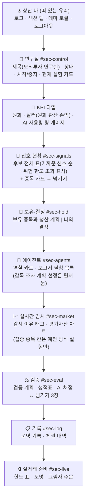

# 🎨 화면 디자인 · Aurora Glass

> 라이트(반투명 유리)와 다크(네온 우주) 두 테마를 지원하는 화면 디자인입니다. 프레임워크나 빌드 도구 없이 **HTML · CSS · JavaScript 세 파일**로 만들었습니다.

| 라이트 · 글래스 | 다크 · 네온 |
|---|---|
|  |  |

> 스크린샷은 실제 계좌가 아닌 **합성 데모 데이터**입니다.

## 📑 목차

1. [디자인 방향](#1-디자인-방향)
2. [테마](#2-테마)
3. [디자인 토큰](#3-디자인-토큰)
4. [화면 구성](#4-화면-구성)
5. [컴포넌트](#5-컴포넌트)
6. [동작 설계에서 내린 결정](#6-동작-설계에서-내린-결정)
7. [접근성](#7-접근성)
8. [검증 방법](#8-검증-방법)
9. [자주 바꾸는 것](#9-자주-바꾸는-것)

---

## 1. 디자인 방향

세 장의 레퍼런스에서 공통된 특징을 뽑아 하나의 시스템으로 만들었습니다.

| 레퍼런스 | 가져온 특징 | 적용된 곳 |
|---|---|---|
| **① 글래스 대시보드** | 반투명 유리 카드, 광택 구체, 큰 숫자 KPI 타일, 링·도넛 게이지, 부드러운 곡선 차트, 광택 아이콘 타일 | 배경 구체, KPI 타일(남색 유리), AI 호출 링, 평가자산 차트, 관심종목 아바타, 역할 아이콘 |
| **② 협회 웹사이트** | 파랑-보라 블롭 배경, 둥근 흰 카드, 좌측 문구 + 우측 떠 있는 카드, 알약형 탭 | 히어로(좌측 제목 + 우측 실험 카드), 30분/60분 토글, 칩·필 |
| **③ 다크 우주 랜딩** | 다크 네온 테마, 그라데이션 제목·버튼, 빛나는 테두리의 강조 카드, 아이콘 특징 카드 | 다크 테마, `컨트롤룸` 그라데이션 제목, 실험 카드 테두리, 분석 중인 역할 카드, 히어로 특징 3개 |

**공통 문법:** 큰 둥근 모서리 · 파랑-보라-청록 그라데이션 · 유리/빛 번짐으로 만드는 깊이 · 넉넉한 여백 · 굵고 큰 숫자.

---

## 2. 테마

| | 라이트 (글래스) | 다크 (네온) |
|---|---|---|
| 배경 | 연보라-하늘색 오로라 + 광택 구체 | 짙은 남색 + 보라·파랑 성운 + 별 |
| 카드 | 흰색 62% 유리, 흐림 18px | 남보라 유리, 보라빛 테두리 |
| 강조 | 보라→파랑 그라데이션 | 같은 계열, 빛 번짐(glow) 강화 |
| 어울리는 때 | 낮, 표가 많은 화면 | 미국 정규장 시간대(밤) |

| 동작 | 설명 |
|---|---|
| 전환 | 상단 해·달 버튼 |
| 기억 | 선택은 브라우저에 저장됩니다(`localStorage`). 저장이 막힌 환경에서도 화면은 정상 동작합니다. |
| 기본값 | 저장된 선택이 없으면 **기기의 라이트/다크 설정**을 따릅니다. |
| 깜빡임 없음 | 작은 동기 스크립트 `theme.js`가 첫 화면이 그려지기 전에 테마를 적용합니다. |

---

## 3. 디자인 토큰

모든 색·모서리·그림자는 `style.css` 맨 위의 CSS 변수입니다.

### 색

| 토큰 | 라이트 | 다크 | 용도 |
|---|---|---|---|
| `--ink` | `#1b1f4d` | `#eceeff` | 본문 |
| `--muted` | `#4b537d` | `#a3aadb` | 보조 글자 |
| `--accent` | `#4146c8` | `#9aa1ff` | 링크·강조 글자 |
| `--gain` | `#046b53` | `#4ce6b4` | 이익 |
| `--loss` | `#b81f3a` | `#ff7b8c` | 손실·오류 |
| `--warn` | `#8f5a0d` | `#ffc266` | 경고 |
| `--page` | `#e8ecfb` | `#06071a` | 페이지 바탕 |

### 그라데이션 두 종류

| 토큰 | 구성 | 용도 |
|---|---|---|
| `--grad` | 보라 → 파랑 → **청록** | 장식용: 링, 막대, 점, 테두리, 제목 글자 |
| `--grad-solid` | 보라 → 남색 → 파랑 | **흰 글자가 올라가는 면**: 주요 버튼, 활성 탭, 로고, 카운트 |

> 청록 끝부분은 흰 글자와의 대비가 낮아서(약 2:1) 글자가 올라가는 면에는 더 진한 `--grad-solid`를 씁니다.

### 모양

| 토큰 | 값 | 용도 |
|---|---|---|
| `--r-panel` | 26px | 큰 패널 |
| `--r-tile` | 24px | KPI 타일 |
| `--r-card` | 18px | 카드·행 |
| `--r-field` | 13px | 입력창·선택 |
| `--blur` | 18px (모바일 12px) | 유리 흐림 세기 |

---

## 4. 화면 구성

### 넘기는 카드 (`[data-carousel]`)

규칙 신호의 종목 카드와 검증 화면 3장은 옆으로 넘기는 카드입니다. 에이전트 보고서는 사용자 선호에 따라 **펼침 목록**으로 둡니다(2026-10-07).

| 동작 | 구현 |
|---|---|
| 다음 카드 살짝 보이기 | 카드 폭 `min(360px, 84%)`, `scroll-snap`(카드마다 멈춤) |
| 버튼·점 이동 | 520ms ease-out(cubic) 스크롤 애니메이션, 움직임 줄이기 설정이면 즉시 이동 |
| 점 표시 | 현재 카드의 점만 길게 늘어남, 키보드 ←/→ |
| 마우스로 끌기 | 누른 채 끌면 넘어가고 놓으면 가까운 카드에 맞춤 (클릭과 구분) |
| 갱신 중 위치 유지 | 2초마다 다시 그려도 보던 카드 위치를 유지 |

상단 탭은 스크롤 위치를 따라 현재 구역을 표시하고, 좁은 화면에서는 가로로 스크롤되며 활성 탭이 자동으로 보이게 이동합니다.

### 반응형

| 폭 | 변화 |
|---|---|
| ~1240px | 상단 탭이 아이콘만 표시 (활성 탭만 글자) |
| ~1100px | 히어로가 세로로 쌓임, KPI 2열 |
| ~820px | 상단 탭이 둘째 줄로 이동, 히어로 특징 카드 3열 압축, 구체 축소 |
| ~640px | 한 열, 흐림 효과 축소 |

---

## 5. 컴포넌트

| 컴포넌트 | 만드는 방법 | 참고 |
|---|---|---|
| 광택 구체 | CSS `radial-gradient` 여러 겹 + 안쪽 그림자, 천천히 떠다니는 애니메이션 | ① |
| 유리 카드 | 반투명 배경 + `backdrop-filter` + 안쪽 하이라이트. 미지원 브라우저는 불투명 배경으로 대체 | ①② |
| 그라데이션 테두리 | `mask-composite`로 테두리 링만 남긴 의사 요소 | ③ |
| KPI 타일 | 남색 유리 + 청록/보라 빛 번짐 + 스파크라인(SVG) | ① |
| 링 · 도넛 게이지 | `conic-gradient` + `radial-gradient` 마스크. 값은 CSS 변수(`--pct`) | ① |
| 비교 막대 | 0을 가운데로 둔 발산형 막대. 폭은 CSS 변수(`--w`), 이익은 초록·손실은 빨강, AI는 그라데이션 | ① |
| 차트 | 부드러운 곡선(값을 넘지 않도록 제어점 제한) + 면 그라데이션 + 마지막 점 | ① |
| 종목 아바타 | 종목 코드로 색을 정한 광택 그라데이션 타일 | ① |
| 역할 아이콘 | 인라인 SVG 스프라이트(외부 파일 없음) | ① |
| 분석 중 카드 | 그라데이션 테두리 + 숨쉬는 빛 | ③ |
| 세그먼트 토글 | 알약형 버튼 그룹(`aria-pressed`) | ② |
| 모서리·그림자 | 카드 26/24/18px, 다층 그림자 | 공통 |

---

## 6. 동작 설계에서 내린 결정

### ① 화면은 2초마다 다시 그려집니다

이 앱은 상태를 2초마다 받아 화면을 통째로 다시 그립니다. 그대로 두면 애니메이션이 매번 처음부터 다시 시작하고, 마우스 호버가 깜빡이며, 버튼을 누르는 순간 요소가 교체되어 클릭을 놓칠 수 있습니다.

→ `setHtml()`이 **내용이 바뀐 컨테이너만** 교체합니다. 그래서 분석 중 카드의 빛 번짐이 끊기지 않고, 열어 둔 보고서·선택한 통화가 유지됩니다.

### ② 엄격한 보안 정책(CSP) 안에서 만들었습니다

서버는 `script-src 'self'; style-src 'self'; img-src 'self' data:`로 응답합니다. 즉 인라인 스크립트·`style=` 속성·외부 폰트와 이미지를 쓸 수 없습니다.

| 필요한 것 | 대응 |
|---|---|
| 값에 따라 달라지는 게이지·막대 | HTML에 값을 `data-*`로 두고 JS가 CSS 변수를 설정 (스크립트로 스타일을 바꾸는 것은 허용됨) |
| 그라데이션 차트 색 | 색은 CSS 클래스(`stop-color: var(--…)`)로, 그라데이션 참조는 SVG 속성으로 |
| 아이콘 | 한 번 정의한 인라인 SVG 스프라이트를 `<use>`로 재사용 |
| 잠금 아이콘 등 CSS 안의 그림 | `data:` URI 마스크 |
| 폰트 | 시스템 폰트(Pretendard가 설치돼 있으면 우선 사용) |
| 테마 초기화 | 인라인 대신 별도 파일 `theme.js` (동기 로드) |

### ③ 손익 색은 기존 의미를 유지했습니다

이익은 초록, 손실은 빨강입니다. 한국 증권 앱처럼 "상승=빨강"으로 바꾸려면 `--gain` / `--loss` 두 값을 서로 바꾸면 됩니다.

### ④ 평평한 그래프

평가액이 아직 변하지 않은 새 실험처럼 값이 완전히 같으면 SVG 그라데이션(`objectBoundingBox`)이 높이 0이라 선이 사라집니다. 그라데이션 좌표를 고정(`userSpaceOnUse`)하고 선을 세로 중앙에 두어 해결했습니다.

---

## 7. 접근성

| 항목 | 결과 |
|---|---|
| 글자 대비 (WCAG AA) | 실제 렌더링 픽셀로 측정: 라이트·다크 × 데스크톱·모바일 각 약 950개, 총 **약 3,800개 글자 중 미달 0건**. 실행 중·승인 대기·손실 정지 상태도 별도 측정 (비활성 버튼은 기준에서 제외) |
| 키보드 | 모든 조작 요소에 포커스 표시 (기본 2px 외곽선, 입력창은 강조 테두리와 링) |
| 랜드마크 | `header` · `nav`(이름 있음) · `main` · `footer` |
| 현재 위치 | 상단 탭에 `aria-current`, 토글 버튼에 `aria-pressed` |
| 스크린 리더 | 링·도넛·차트에 `role="img"`과 수치가 든 설명 |
| 움직임 줄이기 | OS의 "동작 줄이기" 설정이면 모든 애니메이션·전환 끔 |

---

## 8. 검증 방법

### 자동 테스트 — `tests/test_ui_contract.py`

브라우저 없이 매번 실행됩니다. 화면을 다시 디자인할 때 조용히 깨지는 것을 막습니다.

| 검사 | 막는 문제 |
|---|---|
| JS가 쓰는 모든 `id`가 HTML에 정확히 한 번 존재 | 요소 이름을 바꿔서 화면이 멈추는 것 |
| JS·HTML이 쓰는 모든 클래스에 CSS 규칙 존재 | 스타일 없이 방치되는 요소 |
| 탭 링크가 실제 구역을 가리킴 | 죽은 링크 |
| 인라인 스크립트·`style=`·`<style>`·외부 리소스 없음 | 보안 정책에 막히는 화면 |
| `theme.js`가 동기로 먼저 로드, 두 테마 정의 | 테마 깜빡임 |
| 움직임 줄이기 규칙 존재 | 접근성 후퇴 |

일부러 결함을 넣은 복사본(id 이름 변경, 인라인 스타일 추가, 스타일 규칙 삭제)에서 세 검사가 모두 실패하는 것을 확인했습니다.

### 실제 브라우저 점검 — `tools/design-lab/`

운영과 분리된 데모 서버(합성 데이터)를 띄우고 헤드리스 브라우저로 확인하는 도구입니다. 사용법은 [`tools/design-lab/README.md`](../tools/design-lab/README.md)에 있습니다.

| 도구 | 하는 일 |
|---|---|
| `shot.py` | 라이트/다크 × 여러 폭의 스크린샷. `/api/state` 응답을 가로채 "실행 중", "승인 대기", "손실 정지", "빈 상태" 같은 상태도 재현 |
| `interact.py` | 테마 유지, 탭 이동, 30/60분 토글, 대화상자, **2초 갱신 뒤에도 요소가 유지되는지**, 키보드 포커스, 움직임 줄이기 (보안 정책을 켠 채 실행) |
| `contrast.py` | 글자를 투명하게 만든 배경을 찍어 글자마다 실제 대비를 측정 |

---

## 9. 자주 바꾸는 것

| 하고 싶은 것 | 방법 |
|---|---|
| 색 분위기 바꾸기 | `style.css` 맨 위 `:root` (라이트) / `:root[data-theme="dark"]` (다크) 토큰 |
| 기본 테마 고정 | `theme.js`에서 시스템 설정 대신 `'light'` 또는 `'dark'`로 고정 |
| 광택 구체 끄기 | `.orb{display:none}` |
| 흐림 효과 줄이기 (느린 기기) | `--blur` 값을 줄이거나 0 |
| 손익 색을 한국식으로 | `--gain` ↔ `--loss` 값 교환 |
| 새 구역을 상단 탭에 추가 | `index.html`에 `id`가 있는 구역과 `.topnav a`를 추가 (자동 테스트가 연결을 확인) |
| 글꼴 바꾸기 | `--font` 목록 앞에 원하는 글꼴 추가 (외부 글꼴은 보안 정책상 같은 서버에 파일로 두어야 함) |
