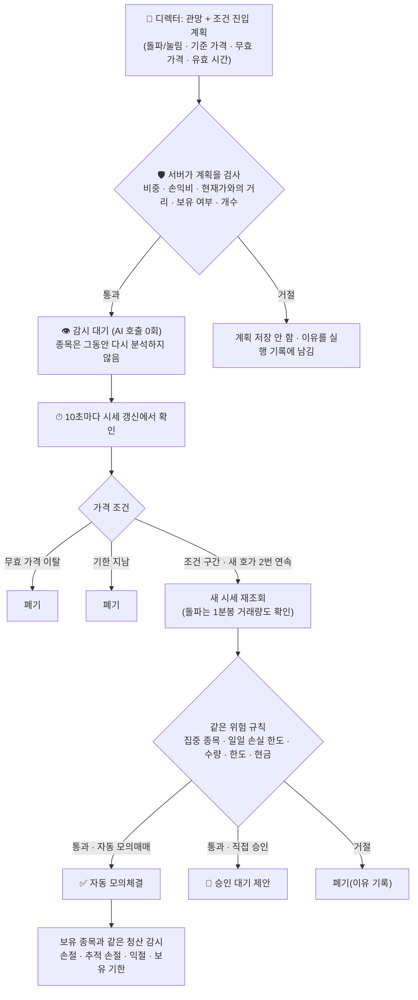

# 🎯 조건부 자동 진입 — 설계와 안전 규칙

AI가 **"지금은 아니지만 이 가격에 닿으면 사겠다"** 고 말하면, 서버가 그 가격만 지켜보다가 조건이 맞을 때 **AI를 다시 부르지 않고** 기존 위험 규칙 그대로 모의매수하는 기능입니다. 이름은 자동매매지만 **가상 계좌 전용**이며 실제 주문 경로는 없습니다.

> **수익을 보장하지 않습니다.** 가격 조건만 확인하므로, 조건을 정한 뒤 뉴스나 시장 분위기가 달라졌어도 서버는 모릅니다. 그래서 계획마다 **유효 시간과 "무효 가격"** 이 붙고, 오래되면 스스로 폐기됩니다. 이 기능이 실제로 나은지는 [판단 채점](#-판단-채점)으로 직접 재야 하며, 표본이 쌓이기 전에는 아무것도 증명하지 못합니다.

## 📑 목차
1. [왜 만들었나](#-왜-만들었나)
2. [전체 흐름](#-전체-흐름)
3. [AI가 남기는 계획](#-ai가-남기는-계획)
4. [서버가 계획을 받아 주는 조건](#-서버가-계획을-받아-주는-조건)
5. [감시와 체결](#-감시와-체결)
6. [계획이 끝나는 일곱 가지 방식](#-계획이-끝나는-방식)
7. [사용량과 안전 장치](#-사용량과-안전-장치)
8. [직전 분석 메모](#-직전-분석-메모)
9. [화면과 판단 채점](#-판단-채점)
10. [설정](#-설정)
11. [검증한 방법](#-검증한-방법)
12. [한계](#-한계)

---

## 💡 왜 만들었나

단타 실험에서 AI가 계속 **관망**만 냈습니다. 원인 가운데 구조적인 것이 하나 있었습니다.

| 문제 | 설명 |
|---|---|
| 조건은 말하지만 실행할 길이 없음 | AI는 관망하면서도 "○○원을 돌파하면 매수" 같은 조건을 글로 남기는데, 다음 분석은 5~10분 뒤라 그 조건이 맞는 순간을 놓침 |
| 다시 보는 값이 비쌈 | 분석 1회(최대 7번 호출)가 Claude 5시간 창의 약 9~19%를 씀. 조건을 확인하자고 분석을 자주 돌릴 수 없음 |

그래서 **AI는 조건을 구조화해서 내고, 서버가 가격만 감시**하게 나눴습니다. 가격 비교는 AI가 필요 없습니다.

## 🔁 전체 흐름

## 🧾 AI가 남기는 계획

디렉터(최종 전략 단계)에게만 네 칸이 더 있습니다. 다른 역할은 받지 않습니다.

| 필드 | 값 | 의미 |
|---|---|---|
| `entry_type` | `none` / `breakout` / `pullback` | 계획 없음 · **돌파**(현재가 위의 기준 가격을 넘으면 매수) · **눌림**(현재가 아래의 기준 가격까지 내려오면 매수) |
| `entry_level` | 가격 | 매수 기준 가격 |
| `entry_invalidate` | 가격 | 이 가격 **이하**로 내려가면 계획을 버리는 가격 (기준 가격보다 낮아야 함) |
| `entry_minutes` | 정수 분 | 계획을 유지할 시간 **30~1,440**분 |

- 계획은 **관망(HOLD)** 일 때만 남길 수 있습니다. 매수·매도면 그 판단이 곧 행동이므로 계획은 버려집니다.
- 그 진입에 쓸 `target_weight_pct`·`stop_loss_pct`·`take_profit_pct`·`max_holding_minutes`도 같이 채웁니다. 체결 때 이 숫자로 수량과 손절·익절 가격을 **서버가** 계산합니다(AI의 수량은 참고값).
- 형식이 틀린 계획(숫자가 아님, 무효 가격이 기준 가격 이상 등)은 **계획만 버리고 분석은 살립니다.** 계획 하나 때문에 분석 7번을 다시 돌리지 않습니다.
- 값을 빼먹은 옛 응답은 "계획 없음"으로 읽습니다.

## 🛡 서버가 계획을 받아 주는 조건

AI가 낸 계획은 **그대로 저장되지 않습니다.** 아래를 모두 통과해야 감시 대기에 들어갑니다. 못 들어가면 이유가 실행 기록(상태줄·보고서 아래 안내)에 남습니다.

| 검사 | 기준 |
|---|---|
| 판단 | 관망이어야 함 · 목표 비중 > 0 |
| 손익비 | 익절 폭 ≥ 손절 폭 × 1.5 (미달이면 어차피 매수 수량이 계산되지 않음) |
| 최소 익절 폭 | 익절 폭 ≥ 왕복 비용 × `MIN_TAKE_COST_RATIO`(기본 3). 실제 요율로 국내 주식 약 1.0%, ETF 약 0.4%, 미국 약 0.9%(+스프레드의 3배). 1개월 스윙은 익절 폭이 원래 3% 이상이라 스프레드가 넓은 종목에서만 걸림. 계획을 받을 때 한 번, **주문 직전에 호가로 한 번 더** 확인(그새 스프레드가 벌어지면 폐기) |
| 돌파 | 기준 가격이 **현재 매도호가보다 높아야** 함, 무효 가격은 현재 매수호가보다 낮아야 함 |
| 눌림 | 기준 가격이 **현재 매수호가보다 낮아야** 함 |
| 현재가와의 거리 | **15%** 이내 (그보다 멀면 그 달의 계획이 아님) |
| 무효 가격의 깊이 | 기준 가격에서 **15%** 이내 아래 |
| 유효 시간 | 30~1,440분으로 조정. 장이 닫힌 시간도 포함한 **실제 시간**이라 장이 닫혀 있는 동안에도 기한은 흐름(1,440분 ≈ 그날 남은 정규장 + 다음 날 장 초반). AI에게도 그렇게 안내(2026-10-07). 끝난 뒤 신호가 남아 있으면 다시 분석 |
| 보유 여부 | 이미 들고 있는 종목은 불가 (추가 매수용 계획은 없음) |
| 동시 대기 | 최대 **3개** |
| 스위치 | `CONDITIONAL_ENTRY=off`이면 저장하지 않음 |

같은 종목을 **새로 분석하면** 이전 계획은 (새 계획이 있든 없든) "새 분석으로 교체"로 닫힙니다.

## 👁 감시와 체결

감시는 기존 **10초 시세 갱신** 루프에 붙어 있고, 청산 감시·전량 매도 처리 **다음에** 돕니다(감시에 문제가 생겨도 청산이 막히지 않게). 새로 조회하는 것은 조건이 맞은 순간의 시세 1건과 돌파의 1분봉뿐입니다.

| 단계 | 내용 |
|---|---|
| 1. 시세 확인 | 갱신된 시세가 **정규장·30초 이내**일 때만 판단. 장이 닫혀 있거나 시세가 낡았으면 아무 판단도 하지 않음(기한은 그래도 흐름) |
| 2. 조건 | **돌파**: 기준 가격 ≤ 매도호가 ≤ 기준 가격 × **1.005** (이미 그 위로 달아났으면 **쫓아 사지 않고** 되돌림을 기다림). **눌림**: 매도호가 ≤ 기준 가격. **무효**: 매수호가 ≤ 무효 가격 |
| 3. 연속 확인 | 조건 구간의 **새 시세가 2번 연속**(약 10~20초) 나와야 함. 같은 시세를 두 번 세지 않음 |
| 4. 재확인 | 주문 직전에 시세를 한 번 더 조회해 조건이 아직 맞는지 봄. 그새 벗어났으면 횟수를 0으로 되돌림 |
| 5. 거래량 (돌파만) | 1분봉 20개 이상·최신·공백 없음을 확인하고, **직전 5분 평균 거래량 ≥ 그 전 20분 평균** 이어야 함. 모자라거나 1분봉을 못 읽으면 **30초 뒤** 다시 봄 |
| 6. 주문 | 분석이 낸 매수와 **같은 경로**(`place_desk_order`)로: 일일 손실 한도 · 집중 종목 · 레버리지 허용 · 호가 잔량 · 현금 · 종목당/1회 한도 · 손절 위험 기준 수량 → 모의체결 전 **복사본으로 시험 체결** → 체결 |

자동 모의매매 모드면 바로 체결하고, **직접 승인** 모드면 승인 대기 제안(180초)으로 올라옵니다. 체결된 포지션은 분석으로 산 것과 똑같이 손절·추적 손절·익절·보유 기한으로 관리됩니다.

## 🏁 계획이 끝나는 방식

| 상태 | 뜻 |
|---|---|
| `filled` 체결 | 조건이 맞아 자동 모의매수 |
| `proposed` 승인 대기 | 조건이 맞아 매수 제안으로 올림(직접 승인 모드) |
| `expired` 기한 만료 | 유효 시간 안에 조건이 안 맞음 |
| `invalid` 무효 가격 이탈 | 매수호가가 무효 가격 이하로 내려감 |
| `replaced` 교체 | 같은 종목의 새 분석이 나옴 |
| `blocked` 위험 규칙 보류 | 주문 단계에서 규칙이 거절(일일 손실 한도·수량 0·한도 등). 일시적인 문제(시세 공백)는 **최대 6번**(약 1분) 다시 시도한 뒤 폐기 |
| `cancelled` 취소 | 중지·전량 매도·운용 방식 변경·**긴 재시작**(마지막 시세에서 5분 넘게 멈췄다 켜짐), 또는 오늘의 집중 종목에서 빠짐 |

## 🧮 사용량과 안전 장치

| 항목 | 내용 |
|---|---|
| AI 호출 | 감시·체결에 **0회**. 계획을 기다리는 종목은 **다시 분석하지 않아** 분석 호출도 아낌 (직접 "지금 분석"은 예외) |
| 모든 종목이 대기 중이면 | 그 사이클은 AI를 부르지 않고 기다림 |
| 위험 규칙 | 분석이 낸 매수와 같은 함수를 통과. 조건 진입 전용 예외 없음 |
| 재시작 | **짧은 재시작**(마지막 시세에서 5분 이내, 예: 배포)은 대기 중인 계획을 그대로 유지하고 분석도 자동 재개. 그보다 오래 멈췄다 켜지면 AI 판단이 낡았을 수 있어 취소. 중지·전량 매도·운용 방식 변경은 항상 취소. 잔고·보유 종목은 그대로 |
| 기록 | 원장에 최근 종료된 60개 + 대기 중인 것 전부. 화면에는 대기 중 전부와 최근 종료 3개 |
| 실거래 | 여전히 **불가**. 그림자 주문 기록의 `source`만 `watch`로 구분 |
| 끄기 | `.env`에 `CONDITIONAL_ENTRY=off` (앱 재시작 필요) |

## 🧠 직전 분석 메모

같은 종목을 다시 분석할 때 AI는 기억이 없어서 매번 처음부터 조사했습니다. 이제 서버가 **직전 분석의 요약**을 입력(`context.previous`)에 넣어 줍니다.

| 항목 | 내용 |
|---|---|
| `minutes_ago` | 몇 분 전 분석인지 |
| `stance` · `summary` | 그때의 결론과 요약(500자까지) |
| `price_then` · `price_change_pct` | 그때 가격과 지금까지의 변동률 |
| `entry_plan` | 그때 남긴 조건 진입 계획과 결과(대기 중·기한 만료·무효 가격 이탈·체결 …) |

프롬프트는 "직전 이후 가격과 뉴스가 달라졌는지부터 확인하라, 이전 결론은 참고일 뿐이며 다르게 판단할 근거가 있으면 바꾸라"고 지시합니다. 업무 배정(플래너)에는 "이미 조사한 것을 되풀이하지 말고 달라졌을 수 있는 것을 조사하라"고 지시합니다. 메모는 결론을 굳히려는 것이 아니라 **조사 범위를 좁히려는** 것입니다.

## 📊 판단 채점

- 조건이 맞아 체결된 매수는 **별도의 판단 기록**으로 채점됩니다: 선정 방식 `조건`(`selected_by = watch`), AI 이름 뒤에 `· 조건 진입`. 원래의 관망 기록은 그대로 남아, 관망으로 채점됩니다.
- 그래서 "AI가 관망이라고 했을 때 그 조건 계획이 실제로 도움이 됐는가"를 같은 채점표(1·5·21거래일, 비용 차감)에서 볼 수 있습니다.
- 화면: 결정 카드 맨 위에 **조건 진입 대기** 카드(기준·현재 호가·조건까지 남은 %·무효 가격·남은 시간·연속 확인 횟수·AI 설명 3줄), 아래에 최근 종료 3개. 디렉터 보고서에 계획 블록, 실행 기록 아래에 등록/거절 안내, 체결 내역의 운용 방식에 "조건 진입" 표시.

## ⚙ 설정

| 변수 | 기본 | 설명 |
|---|---|---|
| `CONDITIONAL_ENTRY` | `on` | `off`이면 AI가 계획을 내도 저장하지 않음 (프롬프트는 그대로라 호출 비용은 같음) |

나머지 수치(추격 한도 0.5%, 연속 확인 2회, 거래량 배율 1.0, 재시도 6번, 동시 3개, 거리 15%)는 [`app/entry.py`](../app/entry.py) 맨 위의 상수입니다.

## ✅ 검증한 방법

- 단위·통합 테스트 82개: [`tests/test_entry.py`](../tests/test_entry.py)(계획 검사·가격 판정·거래량·원장·AI 응답 검증·요청에 실린 스키마) + [`tests/test_entry_desk.py`](../tests/test_entry_desk.py)(계획 저장 → 감시 → 체결, 끝나는 7가지 방식, 수동 승인, 스윙, 직전 분석 메모, 모니터 루프 순서).
- **변조 테스트**: 규칙을 하나씩 일부러 망가뜨려(추격 제한 제거·경계값 뒤집기·연속 확인 1회·거래량 확인 제거·재시도 무한·위험 규칙 예외 삼키기·취소 누락·모니터 연결 해제 등 34가지) 테스트가 잡는지 확인.
- 화면은 합성 데이터 데모 서버에서 DOM으로 점검(카드 구성·부호·폰 폭 가로 넘침 없음·다크 테마·글자 대비 WCAG AA 위반 0, [`tools/design-lab/watch_check.py`](../tools/design-lab/watch_check.py)).

## ⚠ 한계

- **가격 조건만** 봅니다. 조건을 정한 뒤 나온 악재·공시는 모릅니다. 유효 시간을 짧게 두고 무효 가격을 두는 이유입니다. 그래도 계획이 살아 있는 동안은 뉴스가 바뀌어도 체결될 수 있습니다.
- 확인 주기가 10초(연속 확인 포함 10~20초)라 **순간적인 급등락**은 놓치거나, 놓친 뒤의 가격에 체결될 수 있습니다. 체결가는 조건 가격이 아니라 그 시점의 호가입니다.
- 거래량 확인은 **돌파**에만 있고 1분봉 기준입니다. 눌림은 가격만 봅니다(떨어지는 칼날을 잡을 수 있음 — 무효 가격과 손절이 막습니다).
- 조건 진입으로 산 포지션도 손절이 체결 가격을 보장하지 않습니다.
- 대기 중인 종목은 다시 분석하지 않으므로, 계획이 길면 그만큼 **새 정보 없이** 기다립니다.
- 표본이 없습니다. 이 기능이 관망만 나오던 문제를 풀어 줄지, 손실만 늘릴지는 채점이 쌓여야 알 수 있습니다.
