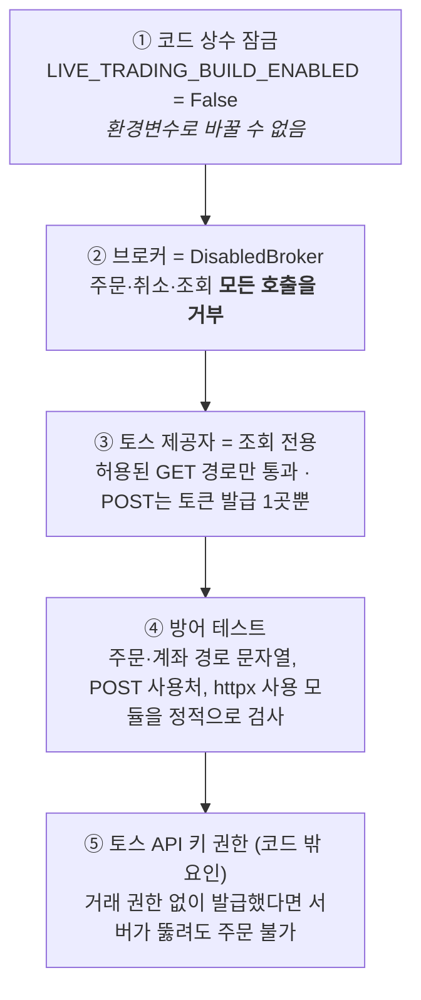
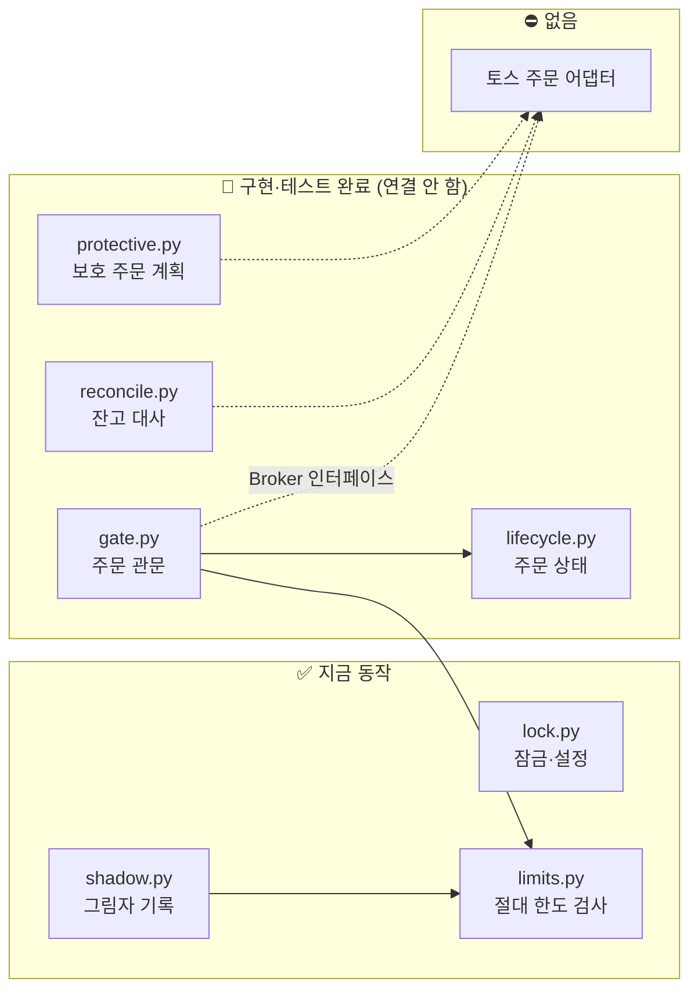
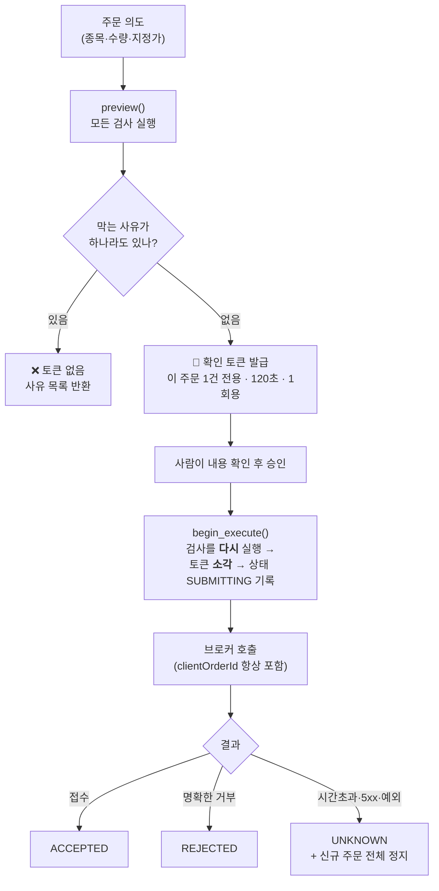
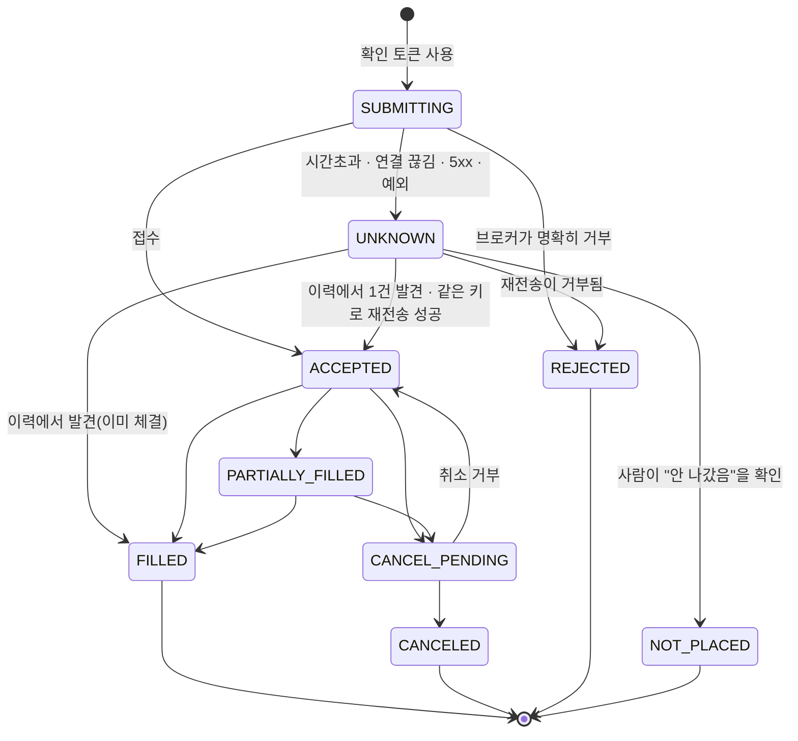
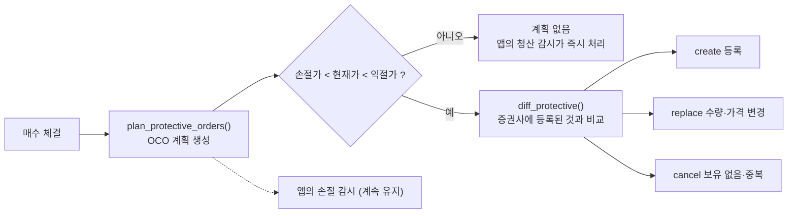

# 🔒 실거래 전환 설계 (구조만 구현 · 현재 잠김)

> **이 버전은 실제 주문을 보낼 수 없습니다.** 이 문서는 나중에 실거래로 바꿀 때 필요한 안전 구조를 어떻게 만들어 두었는지, 무엇이 아직 없는지, 전환 전에 무엇을 해야 하는지를 정리합니다.

## 📑 목차

1. [현재 상태 한눈에 보기](#1-현재-상태-한눈에-보기)
2. [실거래가 안 되는 이유: 5겹 잠금](#2-실거래가-안-되는-이유-5겹-잠금)
3. [구성 요소와 구현 수준](#3-구성-요소와-구현-수준)
4. [주문 관문: 미리보기 → 확인 토큰 → 실행](#4-주문-관문-미리보기--확인-토큰--실행)
5. [주문 상태와 "결과 불명확" 처리](#5-주문-상태와-결과-불명확-처리)
6. [절대 금액 한도](#6-절대-금액-한도)
7. [증권사 잔고 대사](#7-증권사-잔고-대사)
8. [증권사 측 손절·익절 주문](#8-증권사-측-손절익절-주문)
9. [그림자 모드](#9-그림자-모드)
10. [토스 공식 API와의 대응](#10-토스-공식-api와의-대응)
11. [실거래 전환 체크리스트](#11-실거래-전환-체크리스트)
12. [알려진 한계](#12-알려진-한계)

---

## 1. 현재 상태 한눈에 보기

| 항목 | 상태 |
|---|---|
| 실제 주문 전송 | ❌ **불가능** (코드에 주문 경로가 없음) |
| 증권사 계좌·잔고 조회 | ❌ 하지 않음 (앱은 시세 조회 API만 호출) |
| 잠금 방식 | 코드 상수 `LIVE_TRADING_BUILD_ENABLED = False` (환경변수로 못 켬) |
| `.env`에 `LIVE_TRADING=on`을 쓰면 | 요청만 기록되고 **무시됨**. 화면에 "무시" 사유가 표시됨 |
| 지금 동작하는 것 | **그림자 모드**: 모의 제안마다 "실거래였다면 나갔을 주문"을 기록만 함 |
| 구조만 만든 것 | 주문 관문, 주문 상태, 절대 한도, 잔고 대사, 증권사 측 보호 주문 계획 |
| 아직 없는 것 | **토스 주문 어댑터**(실제로 증권사와 통신하는 부분) |

---

## 2. 실거래가 안 되는 이유: 5겹 잠금

| 겹 | 위치 | 확인 방법 |
|:-:|---|---|
| ① | `app/live/lock.py` | `tests/test_no_live_trading.py::test_build_lock_is_closed` |
| ② | `app/live/broker.py` | 모든 메서드가 `LiveTradingLocked`를 던지는지 테스트 |
| ③ | `app/providers.py` `READ_ONLY_ROUTES` | 주문·계좌·조건주문 경로가 허용 목록에 안 걸리는지 테스트 |
| ④ | `tests/test_no_live_trading.py` | 앱 코드에 `/api/v1/orders` 등이 **한 글자도 없어야** 통과 |
| ⑤ | 토스 개발자 콘솔 | ⚠ **직접 확인 필요** (키가 조회 전용인지) |

> 실거래를 켜는 것은 "설정 변경"이 아니라 **코드 변경**입니다. 그 변경은 ④의 방어 테스트를 일부러 고쳐야만 통과하므로, 검토 없이 실수로 켜질 수 없습니다.

---

## 3. 구성 요소와 구현 수준

| 모듈 | 하는 일 | 구현 수준 | 앱에 연결됨 |
|---|---|:-:|:-:|
| `lock.py` | 잠금 상수, 설정(`LiveConfig`) 읽기 | ✅ 완성 | ✅ |
| `limits.py` | 원화·달러 절대 한도 검사, 허용 수량 계산 | ✅ 완성 | ✅ (그림자) |
| `shadow.py` | 모의 제안 → "실거래 주문" 기록 | ✅ 완성 | ✅ |
| `intent.py` | 주문 내용(불변) · 중복 방지 키 생성 | ✅ 완성 | ✅ (그림자) |
| `gate.py` | 미리보기·확인 토큰·실행·불명확 처리 | 🧩 로직 완성 | ❌ |
| `lifecycle.py` | 주문 상태와 허용되는 전이 | 🧩 로직 완성 | ❌ |
| `reconcile.py` | 앱 장부 ↔ 증권사 잔고·주문 비교 | 🧩 로직 완성 | ❌ |
| `protective.py` | 증권사 측 손절·익절 계획, 목표 상태 동기화 | 🧩 로직 완성 | ❌ (계획만 그림자에 기록) |
| `broker.py` | 브로커 인터페이스 + 잠긴 스텁 | 🧩 인터페이스만 | ❌ |
| **토스 어댑터** | 실제 증권사와 통신 | ⛔ **없음** | — |

---

## 4. 주문 관문: 미리보기 → 확인 토큰 → 실행

`tossinvest-cli`의 "미리보기 후 확인 토큰이 있어야 실행" 모델을 참고하고, 토스 공식 API의 멱등키 규칙을 결합했습니다.

### 검사 항목 (`evaluate()`) — 모든 사유를 한 번에 모아서 반환

| 코드 | 차단 조건 |
|---|---|
| `locked` | 실거래가 꺼져 있거나 이 빌드에서 잠김 |
| `buy-not-allowed` / `sell-not-allowed` | 매수·매도 권한이 각각 꺼져 있음 (`LIVE_ALLOW_BUY`, `LIVE_ALLOW_SELL`) |
| `no-broker` | 주문을 보낼 수 있는 브로커가 없음 |
| `halted` | 정지 상태 (수동 정지 또는 미확인 주문) |
| `unresolved-orders` | 결과를 확인하지 못한 주문이 남아 있음 |
| `invalid-intent` | 수량 0, 지정가 없음 등 주문 자체가 잘못됨 |
| 한도 관련 | [6장](#6-절대-금액-한도) 참고 |

### 토큰 보안 규칙

| 규칙 | 이유 |
|---|---|
| 막힌 미리보기는 토큰을 만들지 않음 | 차단된 주문이 실행될 경로를 원천 차단 |
| 토큰 = 미리보기 ID + HMAC 서명 (서버 비밀키) | 위조 불가 |
| 토큰은 주문 내용의 해시에 묶임 | 승인 뒤 수량·가격을 바꿔치기하면 거부 |
| 유효 120초 · 1회용 | 오래된 승인이 재사용되지 않음 |
| **브로커 호출 전에** 토큰을 소각 | 호출 중 프로세스가 죽어도 같은 토큰으로 재실행 불가 |
| 실행 시점에 한도·정지 상태를 다시 검사 | 미리보기 이후 상태가 바뀐 경우 대비 |

### 중복 주문 방지 (토스 공식 API 규칙 반영)

| 사실 (공식 명세) | 우리의 대응 |
|---|---|
| `clientOrderId`를 보내지 않으면 **멱등성이 없음** → 재요청이 별개 주문이 됨 | **항상** 전달 (미리보기마다 새로 생성, 36자 영숫자) |
| 같은 값으로 재요청하면 이전 결과를 그대로 반환 | 같은 키로만 재전송 |
| 멱등키는 **10분간만** 유효 | 재전송은 **8분 이내**로 제한 (여유 2분) |
| 주문 조회 결과에 `clientOrderId`가 **없음** | 이력 대조는 종목·방향·수량·가격·시각으로 함 (완벽하지 않음) |

> 관문은 저장소와 네트워크를 직접 다루지 않습니다. 상태는 JSON 딕셔너리(`book`)에 두고 호출자가 장부와 함께 저장하며, 실제 구현 때는 `begin_execute` → (DB 트랜잭션 **밖에서** 브로커 호출) → `complete_execute` 순서로 나눠 씁니다.

---

## 5. 주문 상태와 "결과 불명확" 처리

### 핵심 규칙 두 가지

1. **`UNKNOWN`은 추측으로 없애지 않습니다.** 증권사 이력이라는 증거, 또는 사람의 명시적 결정으로만 벗어납니다.
2. **`UNKNOWN` 주문이 하나라도 있으면 새 주문을 보내지 않습니다.** 포지션이 얼마인지 모르는 상태이기 때문입니다.

### `UNKNOWN` 해결 절차 (`resolve_unknown`)

| 이력 조회 결과 | 판정 | 다음 행동 |
|---|---|---|
| 일치하는 주문 **1건** | `adopted` | 그 주문의 상태를 그대로 채택 → 정지 해제 |
| 일치하는 주문 **2건 이상** | `ambiguous` | 자동 처리 안 함. 사람이 확인 |
| 없음 + 제출 후 **8분 이내** | `retry-allowed` | **같은 `clientOrderId`로** 재전송 가능 (공식 규칙상 중복 안 생김) |
| 없음 + 8분 초과 | `manual` | 자동 재전송 불가(새 주문으로 취급될 위험). 사람이 증권사 앱에서 확인 후 `mark_not_placed` |

`mark_not_placed`는 **처리자 이름과 사유가 필수**이며 기록에 남습니다.

### 증권사 상태 → 우리 상태

| 토스 상태 | 우리 상태 | 비고 |
|---|---|---|
| `PENDING`, `PENDING_REPLACE` | ACCEPTED | 정정은 쓰지 않으므로 살아있는 주문으로 취급 |
| `PARTIAL_FILLED` | PARTIALLY_FILLED | |
| `FILLED` | FILLED | |
| `PENDING_CANCEL` | CANCEL_PENDING | |
| `CANCELED`, `REJECTED` | CANCELED, REJECTED | **일부 체결이 있을 수 있음** → 체결 수량을 반드시 확인 |
| `CANCEL_REJECTED`, `REPLACE_REJECTED`, `REPLACED`, 그 외 새 값 | **UNKNOWN** | 명세가 "모르는 값도 허용하라"고 함 → 추측 금지 |

체결 수량은 **줄어들지 않습니다.** 오래됐거나 이상한 보고가 와도 이미 체결된 주식이 사라져 보이지 않게 합니다.

---

## 6. 절대 금액 한도

모의투자는 평가자산의 **비율**로 주문 크기를 정합니다. 실거래에서는 버그나 잘못된 가격, 반복 실행이 있어도 **금액 단위의 딱딱한 천장**이 있어야 합니다.

### 기본값 (자리표시자 — 실거래 전에 반드시 본인 원금에 맞게 재설정)

| 한도 | KRW | USD | 환경변수 |
|---|--:|--:|---|
| 1회 주문 금액 | 100,000 | 100 | `LIVE_MAX_ORDER_KRW` / `_USD` |
| 하루 누적 주문 금액 | 300,000 | 300 | `LIVE_MAX_DAILY_NOTIONAL_KRW` / `_USD` |
| 하루 주문 횟수 | 10 | 10 | `LIVE_MAX_DAILY_ORDERS` |
| 하루 손실 한도 | 30,000 | 30 | `LIVE_MAX_DAILY_LOSS_KRW` / `_USD` |
| 종목당 보유 금액 | 200,000 | 200 | `LIVE_MAX_POSITION_KRW` / `_USD` |
| 미체결 주문 수 | 3 | 3 | `LIVE_MAX_OPEN_ORDERS` |
| 지정가 허용 범위 (착오 방지) | ±1% | ±1% | `LIVE_PRICE_BAND_PCT` |
| 허용 종목 | 005930, 000660 | AAPL, MSFT | `LIVE_ALLOWED_SYMBOLS` |

- 기본 허용 종목에 **레버리지 ETF(122630, TQQQ, SQQQ)는 일부러 뺐습니다.** 넣으려면 직접 추가해야 합니다.
- 값이 숫자가 아니거나 음수면 앱이 **시작할 때 오류로 알려줍니다** (조용히 기본값으로 대체하지 않음).

### 매수와 매도는 다르게 다룹니다

| 검사 | 매수 | 매도(청산) |
|---|:-:|:-:|
| 허용 종목 목록 | ✅ | — |
| 1회·하루 금액, 하루 횟수, 미체결 수, 종목 보유 한도 | ✅ | **면제** |
| 하루 손실 한도 도달 시 차단 | ✅ | **면제** |
| 지정가 허용 범위 (착오 방지) | ✅ | ✅ |
| **보유 수량 초과 금지 (공매도 불가)** | — | ✅ |

> **이유:** 한도 때문에 손절 매도가 막혀 포지션에 갇히면 안 됩니다. 매도는 "가격이 이상하지 않은지"와 "가진 것보다 많이 팔지 않는지"만 확인합니다.

한도에 걸리면 `suggested_quantity`(한도 안에서 가능한 최대 수량)를 함께 돌려줍니다.

---

## 7. 증권사 잔고 대사

실거래에서는 **증권사가 진실**이고, 앱의 장부는 그 거울입니다. 거울이 맞는지 `reconcile()`이 증권사 스냅샷과 비교합니다.

| 불일치 | 심각도 | 결과 |
|---|:-:|---|
| 종목 보유 수량이 다름 | 🔴 critical | **거래 정지** — 사람이 해결할 때까지 |
| 현금이 5% 넘게 다름 | 🔴 critical | 거래 정지 |
| 현금이 0.5%~5% 다름 (수수료·반올림 오차 허용 밖) | 🟡 warning | 알림 |
| 앱이 냈다고 믿는 주문이 증권사에 없음 (접수된 상태) | 🔴 critical | 거래 정지 |
| 같은 상황이지만 `UNKNOWN`/`SUBMITTING` | 🟡 warning | 이미 관문이 정지 중 |
| 주문 상태가 서로 다름 | 🟡 warning | 증권사 상태로 갱신 |
| 앱이 보내지 않은 미체결 주문이 증권사에 있음 | 🟡 warning | 앱·웹에서 직접 낸 주문일 수 있음 |

허용 오차: 현금은 통화별 최소 금액(KRW 1,000 / USD 1)과 비율 중 큰 값.

> 이 로직은 **순수 함수**라 증권사 계좌를 읽지 않고도 합성 데이터로 테스트했습니다. 실제 잔고를 읽는 코드는 어댑터와 함께 만들어야 하며, 앱이 실계좌 정보를 읽게 되는 큰 변화이므로 지금은 만들지 않았습니다.

---

## 8. 증권사 측 손절·익절 주문

**지금의 약점:** 손절은 앱이 10초마다 가격을 보고 직접 실행합니다. 서버·네트워크·프로세스가 멈추면 **보유 포지션을 지켜주는 것이 없습니다.**

**설계:** 매수가 체결되면 손절·익절을 증권사에 **OCO 조건주문**(둘 중 하나가 체결되면 나머지 자동 취소)으로 등록하고, 앱의 감시는 두 번째 안전망으로 유지합니다.

### 공식 API가 정한 제약 (명세 v1.2.19)

| 제약 | 의미 | 설계 반영 |
|---|---|---|
| OCO는 **두 조건 모두 지정가(LIMIT)만** 지원 | 손절이 "손절가 도달 → 지정가 주문"이라 **급하락(갭)에는 체결이 안 될 수 있음** | 손절 지정가를 트리거보다 **0.5% 낮게** 설정. 앱의 손절 감시는 그대로 유지 |
| OCO: 익절 트리거 > 현재가 > 손절 트리거여야 함 | 이미 손절가 아래면 등록 불가 | 이 경우 계획을 만들지 않고 앱이 즉시 청산 |
| 국내 주식은 **정규장에서만** 발동 | 시간외에는 보호 안 됨 | 계획 메모에 명시 |
| **만료일(`expireDate`)이 필수** | 만료되면 자동 소멸 | 시장 현지 날짜로 지정, 다시 등록 필요 |
| 가격은 **호가 단위**에 맞아야 함 | 안 맞으면 400 오류 | 호가 단위 정규화는 어댑터 담당(`normalize_price`) |

목표 상태 동기화는 가격 차이 0.1% 이내를 같은 것으로 봅니다(호가 단위 반올림 때문에 무한히 교체하는 것을 방지).

---

## 9. 그림자 모드

**지금 실제로 동작하는 유일한 실거래 준비 기능**입니다. 브로커를 호출하지 않고 기록만 합니다.

| 항목 | 내용 |
|---|---|
| 언제 기록 | 모의 제안(AI 매수·매도, 손절·익절·시간·마감 청산)이 만들어질 때마다 |
| 무엇을 기록 | 실거래라면 나갔을 **지정가 주문**(매수는 매도 1호가, 매도는 매수 1호가), 금액, 한도 통과 여부, 차단 사유, 허용 가능 수량, 증권사 측 보호 주문 계획 |
| 한도 계산 방식 | 앞서 "전송 가능"이었던 그림자 주문은 **실제로 나간 것처럼** 하루 한도에 누적 |
| 권한 플래그 | `locked`, `no-broker`, `buy-not-allowed`, `sell-not-allowed`는 **차단 사유에서 제외** ("켜져 있다고 가정") |
| 안전성 | 기록 중 어떤 오류가 나도 **예외를 삼키고** 모의매매는 계속함 (이벤트 로그에만 남김) |
| 끄는 법 | `SHADOW_MODE=off` |
| 보관 | 최근 500건 |

화면의 **"실거래 준비"** 패널에서 다음을 볼 수 있습니다.

| 보이는 것 | 알 수 있는 것 |
|---|---|
| 잠금 상태와 사유 | 실거래가 꺼져 있는지, `.env` 요청이 무시됐는지 |
| 절대 한도 표 | 지금 적용될 한도 |
| 그림자 주문 요약 | 전송 가능 건수, 막힌 건수, **주요 차단 사유** |
| 최근 그림자 주문 표 | 개별 주문의 결과와 보호 주문 계획 |

> **막힌 주문이 많다면:** 모의투자의 주문 크기가 실거래 한도보다 크다는 뜻입니다. 실거래 전에 한도와 주문 크기를 함께 조정해야 합니다.

---

## 10. 토스 공식 API와의 대응

공식 명세 v1.2.19 기준입니다. **"지금 사용"인 것만** 앱이 호출합니다.

### 시세·시장 정보 (조회 전용)

| 엔드포인트 | 용도 | 지금 사용 |
|---|---|:-:|
| `GET /api/v1/prices` | 현재가 (최대 200종목 다건) | ✅ |
| `GET /api/v1/orderbook` | 호가 (**종목당 1회 호출**, 다건 불가) | ✅ 병렬 조회 |
| `GET /api/v1/candles` | 1분봉·일봉 | ✅ |
| `GET /api/v1/market-calendar/{KR,US}` | 장 운영 시간 | ✅ |
| `GET /api/v1/rankings` | 거래량·거래대금·급등락 순위 (상위 100) | ✅ AI 종목 선정 참고 |
| `GET /api/v1/stocks/{symbol}/investor-trading` | 투자자별 매매동향 (국내만) | ✅ AI 종목 선정 참고 |

### 주문·계좌 (⛔ 앱 코드에 존재하지 않음)

| 엔드포인트 | 실거래 어댑터에서의 역할 |
|---|---|
| `POST /api/v1/orders` | 주문 (`clientOrderId` 필수로 사용, 1억원 이상은 `confirmHighValueOrder`) |
| `POST /api/v1/orders/{id}/cancel` | 취소 |
| `GET /api/v1/orders` | 주문 이력 (`OPEN`/`CLOSED`) — `UNKNOWN` 해결, 대사 |
| `POST/GET/DELETE /api/v1/conditional-orders` | 증권사 측 손절·익절(OCO) |
| `GET /api/v1/holdings`, `/buying-power`, `/sellable-quantity` | 잔고 대사, 사전 검증 |
| `GET /api/v1/accounts` | 계좌 식별 (`X-Tossinvest-Account` 헤더 값) |
| 웹소켓 `wss://openapi-ws.tossinvest.com/ws/v1` | 실시간 체결·호가·**본인 주문 이벤트** |

### 호출 제한

- 토스는 호출 한도를 **그룹별 초당 토큰 버킷**으로 관리합니다(`MARKET_DATA`, `RANKING`, `ORDER` 등). 문서에는 수치가 없고 **응답 헤더(`X-RateLimit-Limit`)로만** 알려줍니다.
- 2026-09-29 운영 서버에서 실제로 관측한 초당 한도(변경될 수 있음): 시세·호가 15 · 순위 5 · 수급 10 · 장 달력 3.
- 앱은 **그룹별로** 처리합니다. 순위 조회가 429를 받아도 시세 조회는 멈추지 않습니다(시세는 청산 감시에 쓰이므로). 429를 받은 그룹만 `Retry-After`(최대 30초) 동안 쉽니다.
- 호가 병렬 조회 수는 **시세 그룹의 한도**로만 제한됩니다(기본 4개, `TOSS_PARALLEL` 1~8). 순위 그룹의 작은 한도가 시세 조회를 느리게 하지 않습니다.
- 순위 조회는 호출 사이에 0.25초를 두고, 한도에 걸리면 그 라운드를 멈춥니다. 실패한 목록만 15초 뒤 다시 시도합니다.
- 주문 그룹(`ORDER`, `ORDER_HISTORY`, `CONDITIONAL_ORDER` 등)의 한도도 같은 방식으로 다뤄야 하며, 어댑터를 만들 때 반영해야 합니다.

---

## 11. 실거래 전환 체크리스트

> 아래는 제안입니다. 숫자 기준(건수·기간)은 본인의 위험 감수 수준에 맞게 정하세요.

### A. 코드 작업 (개발)

- [ ] **토스 주문 어댑터** 구현 (`Broker` 인터페이스 충족)
  - [ ] 주문·취소·이력 조회·잔고·조건주문
  - [ ] **모든 주문에 `clientOrderId` 전달**
  - [ ] 호가 단위 정규화 (`normalize_price`), 손절 지정가는 내림
  - [ ] 응답을 `BrokerRejected`(명확한 거부)와 `BrokerUncertain`(불명확)로 정확히 구분
- [ ] 주문 관문을 엔진에 연결: 승인 화면 → `preview` → 확인 토큰 → `execute`
  - [ ] `begin_execute` / `complete_execute`를 나눠 **DB 트랜잭션 밖에서** 브로커 호출
  - [ ] 관문의 `book`(주문·정지 상태)을 장부에 **영속화** (재시작 후에도 `UNKNOWN` 기억)
- [ ] 잔고 대사 주기 실행 + 🔴 불일치 시 자동 정지, 장 마감 후 전체 대사
- [ ] 증권사 측 보호 주문 동기화 (`diff_protective`), 앱 손절 감시는 유지
- [ ] 웹소켓으로 본인 주문 이벤트 구독 (체결 반영 지연 최소화)
- [ ] `LIVE_TRADING_BUILD_ENABLED = True` **와 함께** `tests/test_no_live_trading.py`를 일부러 수정 (코드 리뷰 필수)

### B. 근거 확인 (그림자 기간)

- [ ] 그림자 모드를 충분한 기간 운영 (**AI 판단 채점 60분 기준 30건 이상**은 최소, 100건 이상 권장)
- [ ] "AI 판단 검증" 화면에서 AI가 **"항상 관망"과 4개 규칙 기반 기준보다 비용 차감 후 꾸준히 나은지** 확인
- [ ] 그림자 주문 **차단률**이 낮아지도록 주문 크기와 한도를 조정
- [ ] 차단 사유별로 원인 확인 (한도가 너무 작은지, 주문이 너무 큰지)

### C. 계정·권한 (외부)

- [ ] 토스 Open API 키의 **거래 권한** 여부 확인, 서버 공인 IP 허용 목록 확인
- [ ] 별도로 잃어도 되는 **소액**으로 시작, 시작 한도는 기본값 수준으로 작게
- [ ] 가능하면 거래 전용 계좌 분리 (다른 자산과 섞이지 않게)

### D. 운영 절차

- [ ] 킬스위치 위치 (`LIVE_ALLOW_BUY=off` → 재시작, 또는 수동 정지 `halt`)
- [ ] `UNKNOWN` 주문이 생겼을 때 절차: 토스 앱에서 직접 확인 → `mark_not_placed` 또는 채택
- [ ] 서버가 죽었을 때 수동 청산 방법 (토스 앱), 증권사 측 보호 주문 유효 여부 확인
- [ ] 첫 1~2주는 매일 장 마감 후 앱 장부와 증권사 잔고를 눈으로 대조

---

## 12. 알려진 한계

| 한계 | 설명 |
|---|---|
| 어댑터 없음 | 이 문서의 구조는 **로직과 테스트**까지입니다. 실제 증권사와의 통신은 검증되지 않았습니다. |
| 호가 단위 | 시장별 호가 단위 표는 어댑터가 정해야 합니다(공식 API가 틀리면 400과 함께 올바른 단위를 알려줌). |
| 이력 대조의 불완전성 | 주문 조회 결과에 `clientOrderId`가 없어 종목·방향·수량·가격·시각으로만 대조합니다. 같은 주문이 여러 건이면 자동 판단하지 않습니다. |
| OCO 손절의 한계 | 두 조건이 모두 지정가라서 급락 시 체결이 안 될 수 있습니다. |
| 대사 데이터 | 증권사 스냅샷을 읽는 코드가 없어, 대사 로직은 합성 데이터로만 검증했습니다. |
| 세금·환전 | 이 구조는 세금, 환전, 해외 소수점 주문, 미수·신용을 다루지 않습니다. |
| 보관 | 관문의 주문 기록 보관 기간·정리 정책은 아직 정하지 않았습니다. |

> ⚠️ 이 문서와 코드는 실거래의 **안전 장치 설계**이며 수익을 보장하지 않습니다. 실제 돈으로 운용하기 전 충분한 검증과 소액 시험이 필요합니다.
