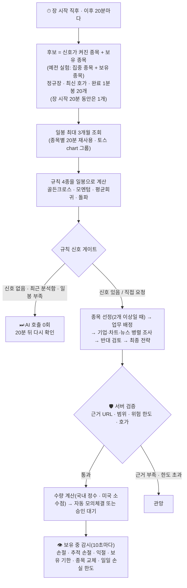
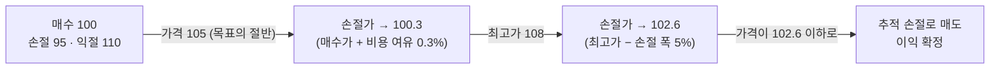

# 📅 1개월 스윙 전략 — 설계와 안전 규칙

종목을 **최대 30일** 들고 가며 한 달 안에 가장 큰 이익을 노리는 전략입니다. 2026-10-01부터 **유일한 투자 기간**입니다(당일 단타는 제거).

> **수익을 보장하지 않습니다.** 한 달 동안 들고 가면 밤사이·주말 갭, 실적 발표, 시장 전체의 하락을 그대로 맞습니다. 손절가는 체결 가격을 보장하지 않습니다. 이 전략이 실제로 나은지는 [판단 채점](#-판단-채점)으로 직접 재야 하고, 표본이 쌓이기 전에는 아무것도 증명하지 못합니다.

## 📑 목차
1. [전체 흐름](#-전체-흐름)
2. [단타를 뺀 이유](#-단타를-뺀-이유)
3. [규칙 신호 게이트 — 신호가 없으면 AI를 부르지 않음](#-규칙-신호-게이트)
4. [분석에 들어가는 3개월 기록](#-분석에-들어가는-3개월-기록)
5. [매매 계획의 범위](#-매매-계획의-범위)
6. [추적 손절 — 이익 지키기](#-추적-손절)
7. [보유 종목과 종목 교체](#-보유-종목과-종목-교체)
8. [판단 채점](#-판단-채점)
9. [설정](#-설정)
10. [검증한 방법](#-검증한-방법)
11. [한계](#-한계)

---

## 🔁 전체 흐름

## ⚖ 단타를 뺀 이유

같은 장 안에서 사고파는 당일 단타(최대 2시간, 마감 전 청산)는 2026-10-01에 제거했습니다.

| 이유 | 내용 |
|---|---|
| 기본 확률 | 개인 단타는 비용을 빼고 꾸준히 버는 사람이 극히 드뭅니다(대만·브라질 연구) |
| 속도 | 뉴스는 초 단위로 가격에 반영되는데, AI 분석은 한 번에 2~3분 걸립니다 |
| 비용 | 2026년 국내 주식 매도 거래세 0.20%: 거래가 잦을수록 불리합니다 |
| 사용량 | 분석이 잦을수록 AI 구독 사용량이 빨리 바닥납니다 |

1개월 스윙은 규칙 신호가 있을 때만 분석하고, 목표 수익이 비용보다 훨씬 커서(익절 3% 이상) 같은 비용의 부담이 상대적으로 작습니다. 예를 들어 익절 10%·손절 5%·왕복 비용 0.33%면 손익분기 승률은 약 36%입니다.

## 📡 규칙 신호 게이트

AI 분석 한 번은 최대 7번의 호출입니다. 일봉 기준으로는 한 세션 안에 같은 그림이 계속 보이므로, **AI를 부르기 전에** 서버가 단순 규칙 4종([`app/rules.py`](../app/rules.py))을 일봉으로 계산해 볼 가치가 있는 종목만 남깁니다. ([`app/gate.py`](../app/gate.py))

| 종목 상태 | 분석 대상이 되는 조건 |
|---|---|
| 보유하지 않은 종목 | 규칙 4종 중 **하나라도 매수 신호** |
| 보유하지 않은 종목 (새 실험) | 위 조건에서 **연구로 뺀 매수 신호**(`signal_filter=research_v2`: 국내 주식의 골든크로스·모멘텀·돌파. 미국은 넓은 손절·63거래일 기준으로 다시 재 보니 모두 플러스라 제외 없음. 예전 `research`는 미국 주식의 모멘텀·돌파, 미국 ETF의 돌파도 뺌)는 세지 않음. 1주만 사도 손절 위험이 거래당 한도를 넘는 국내 종목은 제외 |
| 보유 중인 종목 | 집중 종목 실험: 규칙 4종 중 **하나라도 매도 신호**. 후보 전체 확인 실험(`scan=pool`): 매도 신호로 AI를 부르지 않음(사전 등록 비교에서 매도 신호에 파는 쪽이 나빴음). 손절·추적 손절·익절·기한은 AI 없이도 작동 |
| 장 시작 직후 | 장 시작 20분 동안은 당일 완료된 1분봉이 1개만 있어도 분석(그 뒤에는 20개). 장이 닫혀 있을 때는 30초마다 확인하므로 열리자마자 첫 분석, 이후 20분 간격 (2026-10-08) |
| 방금 분석한 종목 | **6시간 안에는 다시 분석하지 않음.** 단, 그 뒤 가격이 **±3% 이상** 움직였거나 **새 규칙 신호**가 생기면 다시 봄 |
| "지금 분석"으로 지정 | 신호와 관계없이 분석 |
| 일봉을 읽지 못함 · 23개 미만 | 신호로 치지 않음 (**모르면 부르지 않음**) |

- 대상이 하나도 없으면 그 사이클은 **AI 호출 0회**이고, 상태줄에 이유와 다음 확인 시각이 표시됩니다: `규칙 신호가 없어 AI를 호출하지 않았습니다 · 삼성전자 신호 없음 · … · 다음 확인 10:40`
- 화면의 에이전트 데스크 위쪽 줄에 종목별 결과와 AI 호출을 건너뛴 사이클 수가 나옵니다. 이벤트 기록은 상태가 **바뀔 때 한 번만** 남깁니다.
- 대상이 2개 이상이면 그중에서만 AI가 종목을 고르고(호출 1회 추가), 1개면 고르는 호출도 생략합니다.
- 시험(demo) 모드는 응답이 미리 정해져 있어 게이트를 끕니다.

규칙은 튜닝하지 않은 교과서적 기본값이라 **뉴스로 갑자기 움직이는 종목은 놓칩니다.** 그 대신 AI 사용량을 크게 아낍니다. 이 트레이드오프를 채점 결과로 확인하세요.

## 🗓 분석에 들어가는 3개월 기록

토스 일봉 API(조정주가, 완료된 봉만)에서 **70거래일**을 읽어 **최근 92일**만 남깁니다. 진행 중인 오늘 봉은 넣지 않습니다.

| 자료 | 내용 |
|---|---|
| 일봉 표 | 날짜·시가·고가·저가·종가·거래량 (오래된 날부터) |
| 서버가 계산한 요약 | 1주·1개월·3개월 수익률, 3개월 고점·저점과 그 날짜, 고점 대비·저점 대비 위치, 5·20·60일선과 20·60일선 대비, 하루 변동폭(ATR), 20일 평균 거래량과 최근 5일 배율, 20일 중 상승일 비율, 3개월 최대 낙폭 |
| 규칙 신호 | 4종 각각의 값과 **왜 지금 분석하는지**(매수/매도 쪽, 어떤 규칙) |
| 이 종목의 기록 | 이 실험에서 최근 3개월 안의 지난 판단(판단·가격·처리·이후 수익률)과 체결 |
| 오늘의 집중 종목 사유 | (예전 집중 종목 실험만) 아침 뉴스 브리핑의 테마·재료·이미 반영됐을 위험 |
| 과거 근거 묶음 | 신호의 20년 성적·이 종목 재현 성적(실험의 청산 방식 기준)·비슷한 상황·시장 상황·재무·공시·상장 이후 장기 요약 |
| 최근 1분봉 최대 30개 | 진입 시점의 급등락 확인용 (압축 표, 장 시작 직후에는 몇 개뿐) |

- 계산할 수 없는 값(봉이 모자란 경우)은 **`null`** 로 전달하고 추정하지 않습니다.
- 분석 입력이 커지지 않도록 1분봉은 30개만, **한 번만** 보냅니다: 합성 시세로 재 보니 분석 입력이 단타 때 약 25,000자에서 약 13,000자로 줄었습니다(실제 토스 1분봉은 120개라 단타는 더 큽니다).
- 기준일이 하루 늦습니다. 봉은 다음 날 0시에 "완료"로 표시되므로 오늘 장 중에는 **어제까지**의 일봉으로 신호를 계산합니다.

## 🎚 매매 계획의 범위

AI는 판단과 비중만 제안하고 **주식 수는 서버가 계산**합니다 (거래당 손절 위험 0.5%, 종목당 최대 30%(실험에서 조정), 현금 한도. 미국 종목은 소수점 수량까지). 범위를 벗어난 값은 [응답 검증](../app/agents.py)과 [수량 계산](../app/risk.py) 두 곳에서 거부합니다.

| 필드 | 1개월 스윙 범위 | 비고 |
|---|---|---|
| `target_weight_pct` | 0 ~ 30 | 통화별 평가자산 대비 |
| `stop_loss_pct` | 2 ~ 15 | 하루 변동폭(ATR)보다 좁으면 노이즈에 잘림. 새 실험(`exit_profile=market`)의 **미국 종목은 서버가 ATR의 3배로 정함** |
| `take_profit_pct` | 3 ~ 40 | 매수 시 손절 폭의 1.5배 이상, 한 달 안에 도달할 현실적인 목표. 미국 종목(`market`)은 손절 폭의 3배 |
| `max_holding_minutes` | 1,440 ~ 43,200 | 1일 ~ 30일 (분 단위 정수), 실험의 최대 보유 기간이 상한 |

### 시장별 손절 폭 (`exit_profile`, 2026-10-07)

| 값 | 동작 | 근거 |
|---|---|---|
| `market_long` (새 실험 기본, 2026-10-07) | `market`과 같고, 미국 종목만 최대 90일(63거래일) 보유 | `research_plan_us_hold.json`: 21거래일은 거래의 62%가 기한 종료, 63거래일이 두 기간 모두 수익·위험 대비 수익이 나음. 그 당시 상위 종목으로 다시 계산해도 예전 방식보다 낫지만 S&P 500 보유보다는 낮음 |
| `market` | 미국 종목: 손절 = ATR14 × 3 (2~15%), 익절 기준 = 손절 × 3 (3~40%), 추적 폭 = 손절 폭. 디렉터의 값은 `ai_stop_take`로 기록만. 국내 종목: 디렉터가 정함 | 사전 등록 연구(`tools/data/research_plan_market.json`): 미국은 2006~2018·2019~2026 모두 넓은 손절이 나았고, 750달러 계좌 시뮬레이션의 최대 낙폭도 S&P 500보다 얕았음. 국내는 2019년 이후 수익이 낮아져 제외 |
| `ai` (이전 실험) | 모든 종목을 디렉터가 정함 | |

같은 연구에서 **국내 단타 6가지**(시간봉 3년)는 모두 비용 차감 후 손실이라 채택하지 않았습니다.

레버리지·인버스 ETF는 일일 복리 때문에 한 달 가까이 들고 가면 기초지수와 어긋납니다. 프롬프트가 이를 경고하지만 **기본 설정은 실험별로 포함 여부를 선택**합니다.

## 🪜 추적 손절

보유 중 가격이 오르면 손절가를 따라 올려 **번 이익을 지킵니다.** 서버가 10초마다 계산하며 AI 호출과 무관합니다. ([`trailed_stop`](../app/risk.py))

| 규칙 | 내용 |
|---|---|
| 시작 | 가격이 매수가와 익절가의 **중간**에 닿은 뒤부터 |
| 첫 이동 | 매수가 + 0.3%(왕복 비용 여유) |
| 이후 | 그때까지의 **최고 매수호가 − 계획한 손절 폭** |
| 방향 | **올라가기만 함.** 내려가지 않고 익절가에 닿지도 않음 |
| 추가 매수 | 손절가·추적 폭·기한을 **느슨하게 바꾸지 않음** |
| 표시 | 보유 표에 "추적 중", 매도 사유는 `추적 손절(이익 보호)` |

## 🔄 보유 종목과 종목 교체

- 새 실험(후보 전체 확인, `scan=pool`): 신규 매수는 **신호가 켜진 종목과 조건 진입을 기다리는 종목**만, 보유 종목에는 추가 매수하지 않습니다. 신호가 꺼졌다고 팔지 않고(종목 교체 매도 없음), 보유 종목은 추적 손절·보유 기한으로만 청산합니다.
- 예전 집중 종목 실험(`scan=focus`): 신규 매수는 **오늘의 집중 종목**으로 한정되고, 목록에서 빠진 보유 종목은 추세가 유지되면 그대로 두고 꺾였으면 **다음 개장 20분 뒤** 매도합니다. ([UNIVERSE.md](UNIVERSE.md))
- 감시 순서: 일일 손실 한도 → 손절/추적 손절 → 익절 → 보유 기한 → 종목 교체. **장 마감 전 일괄 청산은 하지 않습니다** (단타 포지션만 적용).
- 장이 닫혀 있으면 청산은 다음 정규장까지 미뤄집니다. 갭으로 시작하면 손절가보다 나쁜 가격에 체결될 수 있습니다.

## 🎯 사고 싶은 가격이 있을 때 — 조건부 진입

규칙 신호가 잡혀 분석했는데 "지금은 이르다, 20일선 근처까지 내려오면 사겠다"는 결론이 나올 수 있습니다. 이때 디렉터는 관망과 함께 **가격 조건 계획**(눌림/돌파 · 기준 가격 · 무효 가격 · 유효 시간 30~1,440분)을 남길 수 있고, 서버가 AI 없이 그 가격만 지켜보다가 조건이 맞으면 **같은 위험 규칙**으로 모의매수합니다. 계획을 기다리는 동안 그 종목은 다시 분석하지 않습니다. 스윙 계획은 마감 뒤에도 이어질 수 있지만(감시는 정규장에만 작동), 집중 종목 목록에서 빠지면 취소됩니다. ([ENTRY.md](ENTRY.md))

## 📈 판단 채점

| 기준 | 계산 |
|---|---|
| 1거래일 뒤 | 판단일 다음 거래일 종가 ÷ 판단 시점 중간가격 |
| 5거래일 뒤 (1주) | 판단일로부터 5번째 거래일 종가 |
| 21거래일 뒤 (1달) | 21번째 거래일 종가 |

- **완료된 일봉 종가**로 채점합니다. 15분마다 필요한 종목의 일봉을 읽어 채우고, 시간이 지나도 봉이 안 오면 "누락"으로 닫습니다.
- 비용(왕복 수수료·슬리피지·스프레드)을 차감하고, 항상 관망·매번 매수·규칙 4종과 같은 시점·같은 비용으로 비교합니다.
- 규칙 4종은 이 판단 시점에 **일봉으로 계산한 값**이 기록됩니다.
- 한 달짜리 판단은 하루 몇 건뿐이라 **표본 30건이 쌓이기까지 몇 주** 걸립니다. 그 전의 숫자는 참고용입니다.

## ⚙ 설정

| 위치 | 항목 | 값 |
|---|---|---|
| 새 실험 화면 | 투자 기간 | 1개월 스윙 (단타는 제거) |
| 새 실험 화면 | 최대 보유 기간 | 1 ~ 30일 (기본 30일 = 연구의 21거래일) |
| 새 실험 화면 | 익절 방식 · 매수 신호 거르기 · 과거 근거 · 확인할 종목 · 손절·익절 폭 | `trail` · `research_v2` · `on` · `pool` · `market_long` (기본) |
| `.env` | `ANALYSIS_INTERVAL_SECONDS` | `1200` (20분) |
| API | `POST /api/experiments` | `horizon`: `month`, `max_holding_minutes` (생략하면 30일), 위 다섯 설정 |
| 상수 | 재분석 대기 6시간 · ±3% ([`gate.py`](../app/gate.py)), 추적 시작 50% · 비용 여유 0.3% ([`risk.py`](../app/risk.py)) | 코드 상수 |

## ✅ 검증한 방법

- 자동 테스트: 게이트(신호 없음·보유 종목·재분석 대기·직접 요청·일봉 없음), 계획 범위와 만료, 추적 손절(시작·이동·단조 증가·목표 아래), 3개월 입력, 일봉 채점, 화면 계약. 전체 테스트 수는 [README](../README.md#-테스트)를 보세요.
- **안전장치를 일부러 망가뜨려 보기**: 게이트 통과·재분석 대기 무시·마감 전 청산·추적 손절 제거·범위 완화·채점 오프셋 등 23가지를 하나씩 망가뜨렸을 때 모두 테스트가 잡아냈습니다 (기준 테스트가 통과하는 상태에서 비교, 보호가 중복돼 결과가 같은 변형 2개는 제외).
- 브라우저(헤드리스)로 화면 확인: 전략 이름·게이트 줄·추적 표시·채점 탭·새 실험 폼(일 ↔ 분 전환, 범위 검사, 전송 값)·폰 폭 가로 넘침·보안 정책 위반 없음.

## ⚠ 한계

- 규칙 4종은 튜닝하지 않은 기본값입니다. 신호가 없으면 AI를 부르지 않으므로 **뉴스로 갑자기 오르는 종목을 놓칩니다.**
- 밤사이·주말 갭은 손절이 지켜주지 못합니다. 손절가 아래로 갭이 나면 장 시작 첫 가격에 팔고(증권사 예약 손절 주문도 같은 시가에 체결) `gap_pct`로 기록해 성적표에 "갭 손절"로 집계합니다. 실적 발표 전 매수를 피하는 규칙은 사전 등록 연구 Q6가 검증합니다(DART 자료가 다 모이면 자동 실행).
- 주식 분할은 자동 반영합니다(`app/splits.py`): 정상 범위를 벗어난 한 번의 가격 변화는 확인 전까지 평가·손절·조건 진입에 쓰지 않고, 수정주가 일봉이나 수집 자료의 분할 기록으로 비율을 확인해 수량·가격을 맞춥니다. 확인이 안 되면 최대 36시간 손절이 멈춥니다.
- 시세 분석 입력은 최근 92일입니다. 그보다 긴 흐름은 근거 묶음(20년 신호 성적·상장 이후 장기 요약)으로 봅니다.
- 미국 넓은 손절은 거래 하나가 오래 가므로 30일 기한에 걸려 끝나는 거래가 늘어납니다. 연구의 후보 목록은 지금의 대형주라 수익률에 사후 선택이 섞여 있습니다.
- 일봉은 하루 늦게 "완료"로 표시되어, 오늘 장 중의 급변은 신호에 반영되지 않습니다.
- 채점은 표본이 쌓이기 전에는 아무것도 증명하지 못합니다.
- 조건부 진입은 가격 조건만 보므로, 계획을 남긴 뒤 나온 뉴스·실적 발표는 반영하지 못합니다. ([ENTRY.md](ENTRY.md#-한계))
- AI 구독 사용량은 다른 작업과 계정 단위로 공유됩니다. 이 전략은 호출을 줄이지만 0으로 만들지는 못합니다.
