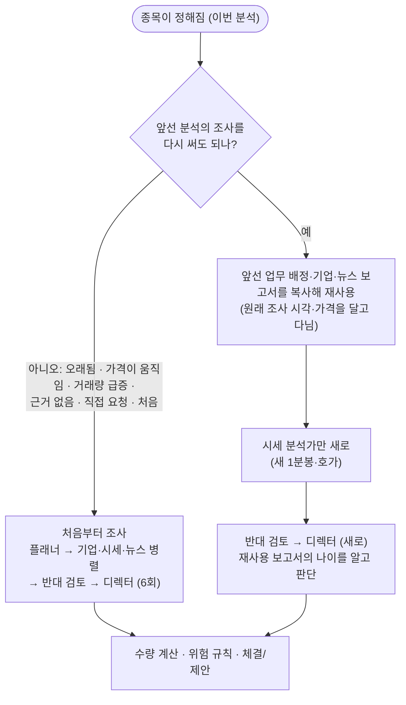

# 🔁 조사 재사용 — 같은 종목을 다시 볼 때 AI 호출 절반

분석 1건은 AI 호출 6번(종목 선정까지 7번)이고, 그중 **3번이 조사**입니다. 업무 배정(플래너)·기업·상품 분석·뉴스·공시 분석이고, 웹 검색을 쓰는 뒤의 둘이 가장 무겁습니다. 그런데 회사와 뉴스에 대한 조사는 몇십 분 사이에 거의 바뀌지 않습니다. 같은 종목을 곧 다시 분석할 때 **앞선 조사를 다시 쓰고 시세 분석·반대 검토·최종 판단만 새로** 하면 호출이 6번에서 **3번**이 됩니다.

> **수익을 보장하지 않습니다.** 재사용은 비용을 줄이려는 것이고, 조사가 최대 1시간 묵는다는 대가를 치릅니다. 그 사이 나온 공시·뉴스는 가격이나 거래량이 눈에 띄게 움직이지 않으면 감지하지 못합니다. 품질에 미치는 영향은 아직 재 본 적이 없고, 재 볼 수 있게 판단 기록에 `reused` 표시를 남깁니다.

## 📑 목차
1. [전체 흐름](#-전체-흐름)
2. [재사용해도 되는 조건](#-재사용해도-되는-조건)
3. [무엇을 새로 하고 무엇을 다시 쓰나](#-무엇을-새로-하고-무엇을-다시-쓰나)
4. [연쇄 재사용](#-연쇄-재사용)
5. [AI와 화면에 알리는 방법](#-ai와-화면에-알리는-방법)
6. [사용량 효과](#-사용량-효과)
7. [설정](#-설정)
8. [검증한 방법](#-검증한-방법)
9. [한계](#-한계)

---

## 🔁 전체 흐름

## ✅ 재사용해도 되는 조건

아래를 **모두** 만족할 때만 다시 씁니다. 하나라도 어긋나면 조용히(또는 이유를 남기고) 처음부터 조사합니다.

| 조건 | 기준 |
|---|---|
| 앞선 분석 | **같은 종목 · 같은 투자 기간(스윙/단타)** 으로 **끝난** 가장 최근 분석 (그보다 오래된 분석으로 거슬러 가지 않음) |
| 보고서 | 업무 배정 · 기업·상품 · 뉴스 보고서가 **모두** 있고, 플래너가 세 분석가에게 과제를 모두 배정했음 |
| 나이 | 가장 오래된 보고서가 `RESEARCH_REUSE_SECONDS`(기본 **3,600초 = 1시간**) 이내 |
| 근거 | 기업 또는 뉴스 보고서에 **출처 근거(evidence)** 가 하나라도 있음 (없으면 디렉터가 어차피 관망하게 되므로 다시 조사) |
| 가격 | 조사 때 가격과 지금 가격의 차이가 `RESEARCH_REUSE_MOVE_PCT`(기본 **1.5%**) 미만 — 오르든 내리든. 이유를 실행 기록에 남김 |
| 거래량 | 직전 5분 평균 거래량이 그 전 20분 평균의 **3배 미만** (급증은 뉴스일 가능성이 큼). 이유를 실행 기록에 남김 |
| 요청 | 사용자가 **"지금 분석"** 으로 직접 요청한 분석이 아님 (직접 요청은 늘 처음부터) |
| 스위치 | `RESEARCH_REUSE_SECONDS`가 0이 아님 |

## 🧩 무엇을 새로 하고 무엇을 다시 쓰나

| 역할 | 재사용 분석에서 |
|---|---|
| 🧭 업무 배정(플래너) | **다시 씀** — 과제 목록(시세 분석가의 과제 포함)을 그대로 사용 |
| 🏢 기업·상품 분석가 | **다시 씀** |
| 📰 뉴스·공시 분석가 | **다시 씀** |
| 📊 시세 분석가 | **새로** — 지금의 1분봉·호가를 봐야 하므로 항상 새로 |
| ⚖️ 반대 검토자 | **새로** |
| 🎯 디렉터 | **새로** — 직전 분석 메모, 조건 진입 계획도 그대로 낼 수 있음 |
| 🎯 종목 선정 | 해당 없음 (종목이 정해진 뒤에 판단) |

## ⛓ 연쇄 재사용

재사용한 보고서는 **원래 조사의 시각과 가격을 그대로** 달고 다닙니다(`time`, `research_price`). 그래서 재사용을 거듭해도 한도 시간은 **처음 조사한 시각부터** 흐르고, 가격이 움직였는지도 **처음 조사한 가격** 기준으로 봅니다. 1.0%씩 두 번 올라 누적 2%가 된 경우 "직전 분석보다 1%"가 아니라 "조사 때보다 2%"로 판단해 새로 조사합니다.

## 📣 AI와 화면에 알리는 방법

| 대상 | 내용 |
|---|---|
| 반대 검토자·디렉터 | 입력의 `context.reports`에서 재사용한 보고서는 `reused: true`, `age_minutes`(몇 분 전 조사)가 붙어 있고, 프롬프트가 "그 뒤에 새 소식이 나왔을 수 있다는 점을 위험으로 반영하라"고 지시 |
| 시세 분석가 | 재사용한 업무 배정에서 자기 과제(`assignment`)를 받고, 다른 분석가와 마찬가지로 업무 배정 보고서만 앞선 보고서로 봄 |
| 실행 기록 | 분석 시작 때 "조사 재사용: 기업·뉴스 조사(N분 전)를 다시 쓰고 … (AI 호출 3회 절약)", 가격·거래량 때문에 새로 조사하면 그 이유 |
| 화면 | 에이전트 데스크 위쪽 "· 조사 N분 전 자료 재사용(AI 3회 절약)", 역할 카드 "재사용 · N분 전", 보고서 제목 "· 재사용 N분 전" (보고서의 시각은 원래 조사 시각) |
| 데이터 | 실행 `run.reuse`, 보고서 `reused`·`age_minutes`·`research_price`, 판단 기록 `reused: true`. 재사용 보고서의 토큰 사용량은 비움(새로 쓴 것이 아니므로) |

## 📉 사용량 효과

- 분석 1건: **6회 → 3회**, 웹 검색을 쓰는 가장 무거운 두 호출이 빠집니다.
- 분석 비용은 사이클마다 실측해 학습하므로(`pacing.py`), 싸진 만큼 **분석 간격이 자동으로 짧아집니다**(같은 구독 창 안에서 더 자주 봄).
- 같은 종목을 자주 보는 단타에서 효과가 크고, 신호가 있을 때만 분석하는 스윙에서는 재사용 기회가 적습니다.
- 처음 몇 사이클의 실제 절감 폭은 아직 측정 전입니다.

## ⚙ 설정

| 변수 | 기본 | 설명 |
|---|---|---|
| `RESEARCH_REUSE_SECONDS` | `3600` | 한도 시간(초). `0`이면 끔 |
| `RESEARCH_REUSE_MOVE_PCT` | `1.5` | 조사 때보다 이 비율(%) 이상 움직이면 새로 조사 (최소 0.1) |

거래량 급증 기준(3배)은 [`app/reuse.py`](../app/reuse.py)의 `SPIKE_RATIO` 상수입니다.

## ✅ 검증한 방법

- 단위 테스트(`tests/test_reuse.py`)와 데스크 통합 테스트(`tests/test_reuse_desk.py`): 위 조건 하나하나, 보고서 불변, 두 번째 분석의 호출이 시세 분석가 → 반대 검토 → 디렉터뿐인지, 각 역할이 받는 입력, 가격·거래량·나이·직접 요청·출처 없음·다른 종목·끄기, 시세 분석 실패, 연쇄 재사용, 스윙.
- **변조 테스트**: 한도 시간 검사 제거·가격 검사 제거·거래량 검사 제거·근거 검사 제거·복사 대신 원본 전달·원래 가격 대신 직전 가격 사용·직접 요청 우회 제거 등 30가지를 하나씩 망가뜨렸을 때 테스트가 잡는지 확인.
- 화면은 합성 데이터 데모 서버에서 DOM으로 확인(역할 카드·보고서 제목·상단 문구, 폰 폭 가로 넘침 없음).

## ⚠ 한계

- 조사가 **최대 1시간** 묵습니다. 가격·거래량이 움직이지 않는 공시·뉴스는 감지하지 못합니다. 위험하다고 느끼면 한도 시간을 줄이거나 `0`으로 끄세요.
- 거래량 급증은 1분봉 기준 근사입니다. 거래가 얇은 종목은 오탐이 잦을 수 있고(그러면 그냥 새로 조사), 급증 없이 나온 뉴스는 놓칩니다.
- 재사용한 업무 배정은 처음 분석 때의 시세를 보고 만들어졌으므로, 시세 분석가의 과제가 지금 장면과 조금 어긋날 수 있습니다(분석가는 새 시세를 직접 봅니다).
- 품질 영향은 표본이 쌓여야 알 수 있습니다. 판단 기록의 `reused` 표시로 재사용 분석과 전체 분석의 성과를 나중에 나눠 볼 수 있지만, 지금은 비교 화면이 없습니다.
