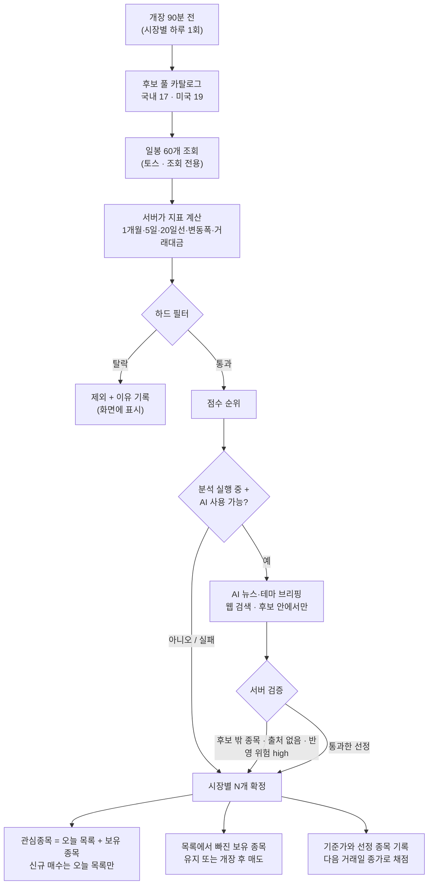

# 🎯 오늘의 집중 종목 — 설계와 안전 규칙

매일 개장 전에 **시장별로 그날 살펴볼 종목**을 다시 고르는 기능입니다. 종목 구성을 "고정 7종목"에서 "그날의 추세와 뉴스에 맞는 3종목(시장별)"으로 바꾸되, 잘못 고를 수 있는 경로를 코드로 막는 것이 설계의 중심입니다. **좋은 종목의 기준은 투자 기간에 따라 다릅니다**: 1개월 스윙은 오르는 추세 종목을, 당일 단타는 하루에 많이 움직이고 거래가 활발한 종목을 고릅니다 ([아래](#-투자-기간에-따라-달라지는-선정-기준)).

> **2026-10-01 변경**: 당일 단타가 제거되어 실제로 쓰이는 선정 기준은 **추세 우선(`trend`)** 하나입니다. 아래의 "변동성 우선(`volatility`)" 기준과 그 검증 기록은 제거된 기능의 설명으로 남겨 두었고, 새 실험에서는 쓰이지 않습니다.

> **수익을 보장하지 않습니다.** 지난 한 달의 강세와 오늘의 뉴스는 다음 거래일의 방향을 알려주지 않습니다. 이 기능은 "살펴볼 가치가 있는 종목"을 좁히는 도구이고, 실제로 더 나은지는 [선정 성과 채점](#-선정-성과-채점)으로 직접 재야 합니다.

## 📑 목차
1. [전체 흐름](#-전체-흐름)
2. [언제 계산하나](#-언제-계산하나)
3. [투자 기간에 따라 달라지는 선정 기준](#-투자-기간에-따라-달라지는-선정-기준)
4. [① 데이터 검사](#-데이터-검사)
5. [② AI 뉴스·테마 브리핑](#-ai-뉴스테마-브리핑)
6. [③ 목록 확정](#-목록-확정)
7. [지켜야 할 주의점과 강제 방법](#-지켜야-할-주의점과-강제-방법)
8. [이미 보유한 종목](#-이미-보유한-종목)
9. [실패했을 때](#-실패했을-때)
10. [선정 성과 채점](#-선정-성과-채점)
11. [설정](#-설정)
12. [검증한 방법](#-검증한-방법)
13. [한계](#-한계)

---

## 🔁 전체 흐름

## ⏰ 언제 계산하나

| 상황 | 동작 |
|---|---|
| 시장 정규장 시작 **90분 전**부터 종료 전까지 | 그 거래일 목록이 없으면 계산 (시장별 하루 1회) |
| 분석이 꺼져 있을 때 | **데이터만으로** 목록을 만들고 AI는 부르지 않음 |
| 이후 분석을 시작했을 때 | 같은 목록에 AI 브리핑만 추가하고 다시 고름 (일봉은 다시 읽지 않음) |
| 휴장일 | 시장 일정에 정규장이 없으면 건너뜀 |
| 계산 실패 | 10분 뒤 재시도, **3번 실패하면 그 거래일은 기본(고정) 종목 사용** |
| 목록이 30시간보다 오래됨 | 무시하고 기본 종목 사용 |
| 새 실험을 만들거나 종목 구성 방식이 바뀜 | 계산 도중이던 결과는 폐기 |

## 🔀 투자 기간에 따라 달라지는 선정 기준

새 실험의 **투자 기간**이 목록을 만드는 방식을 정합니다. 서버가 실험 설정(`horizon`)을 보고 프로필을 고릅니다. (`app/universe.py`, `app/focus.py`)

| | 1개월 스윙 (`trend`) | 당일 단타 (`volatility`) |
|---|---|---|
| 좋은 종목 | 한 달 동안 오르는 추세가 이어질 종목 | **하루에 많이 움직이고 거래가 활발한** 종목 |
| 방향 | 상승 추세만 (20일선 위 · 1개월 수익률 > 0) | **거르지 않음.** 하락 추세여도 통과하고 방향은 장중에 AI가 판단 |
| 걸러내는 것 | 하락 추세 · 이미 급등한 종목(추격 금지) · 너무 조용하거나 거친 종목 · 거래대금 부족 | 하루 변동폭이 작은 종목 · 너무 거친 종목 · 5일 −15% 이하 급락 중인 종목 · 거래대금 부족 · 데이터 이상 |
| 점수 | 추세 35 · 일관성 15 · 매매 적합도 20 · 유동성 15 · 시장 관심 15 − 과열 감점 | **변동성 45 · 유동성 20 · 시장 관심 20 · 거래 활발도 15** |
| AI 브리핑 | 앞으로 한 달 이익이 기대되는 종목과 이미 반영된 뉴스 | **오늘 하루 변동이 커질 재료**(뉴스·실적·일정)가 있는 종목 |
| 채점 | 다음 거래일 종가 수익률을 후보 전체와 비교 | 다음 거래일 **하루 변동폭**을 후보 전체와 비교 |
| 화면 | 최근 1개월 · 5일 · 20일선 대비 | 하루 평균 변동폭 · 평균 등락 · 어제 거래량 배율 · 5일 |

- 이전에 저장된 실험(투자 기간이 없는 것)은 단타로 취급합니다. 단타로 새 실험을 만들 때만 아래 "변동성 우선" 기준이 적용됩니다.
- 변동성은 **이익 기회이자 손실 위험**입니다. 움직임이 크다는 사실만으로 수익이 나지 않습니다. 그래서 수량은 여전히 손절 위험(거래당 0.5%)으로 제한하고, 너무 거친 종목과 급락 중인 종목은 뺍니다.
- 후보 풀은 **닫힌 36종목**입니다. 그 안에서 변동성 큰 종목만 남기므로 KODEX 200·SPY 같은 조용한 종목은 빠지고, 레버리지·인버스 ETF는 실험이 허용할 때만 들어옵니다. 후보 풀을 넓히는 것(토스 순위 기반)은 [한계](#-한계)를 보세요.
- 분석 사이클마다 종목을 고르는 AI도 각 후보의 **하루 변동폭 요약**(`daily_volatility`)을 함께 봅니다. 새로 요청하는 API 호출은 없고 오늘 목록을 만들 때 계산한 값을 그대로 씁니다.

### 변동성 우선 — 데이터 검사와 점수

일봉 60개(완료된 봉만)에서 **최근 10거래일**의 하루 평균 고저 변동폭(`range_pct` = (고가−저가)÷종가), 종가 기준 평균 등락률(`avg_move_pct`), 어제 거래량÷20일 평균(`volume_ratio`)을 서버가 계산합니다. 고가·저가가 없으면 종가 변동으로 대신합니다.

| 필터 (하나라도 걸리면 제외, 이유가 화면에 표시됨) | 주식 | ETF | 레버리지·인버스 ETF |
|---|:-:|:-:|:-:|
| 하루 평균 변동폭 **하한** (비용을 넘길 만큼 움직여야 함) | 1.8% | 1.2% | 2.0% |
| 하루 평균 변동폭 **상한** (호가 공백·급변 위험) | 15% | 10% | 20% |
| 최근 5일 수익률 | −15% 이하 제외 (매수만 하는 매매라 떨어지는 칼날 제외) | 〃 | 〃 |
| 일봉 하루 등락 | 45% 초과 시 데이터 이상으로 제외 | 〃 | 〃 |
| 평균 거래대금 하한 | 국내 500억원 · 미국 3억 달러 (실시세 모드) | 〃 | 〃 |
| 일봉 26개 미만 · 최신 봉이 8일보다 오래됨 | 제외 (데이터 부족) | 〃 | 〃 |

| 점수 항목 | 가중치 | 계산 |
|---|:-:|---|
| 변동성 | 45% | 변동폭 하한 → 0점, 이상 구간(주식 5% · ETF 3% · 레버리지 6%) 이상 → 100점 |
| 유동성 | 20% | 거래대금이 하한의 10배면 100점 |
| 시장 관심 | 20% | 거래대금·거래량·**상승·하락 순위** 중 가장 좋은 순위: 10위 이내 100 · 30위 75 · 100위 45 · 밖 20 · 순위 정보 없음 50 |
| 거래 활발도 | 15% | 어제 거래량이 20일 평균의 0.8배 → 0점, 2.0배 이상 → 100점 (정보 없음 50) |

## 🔎 데이터 검사

> 이 절은 **1개월 스윙(상승 추세)** 기준입니다. 당일 단타의 기준은 [위 표](#변동성-우선--데이터-검사와-점수)를 보세요.

일봉 60개(완료된 봉만)로 서버가 계산합니다. **진행 중인 오늘 봉은 쓰지 않습니다.**

| 지표 | 의미 |
|---|---|
| 1개월 수익률 | 최근 21거래일 전 대비 |
| 5일 수익률 | 최근 5거래일 |
| 20일선 대비 | 종가가 20일 평균에서 얼마나 위/아래인지 (과열 판단) |
| 하루 변동폭 | 14일 평균 실제 변동폭(ATR) ÷ 종가 |
| 상승일 비율 | 최근 20일 중 오른 날 |
| 평균 거래대금 | 최근 20일 종가 × 거래량 평균 |
| 시장 관심 | 토스 공식 거래대금·거래량 순위 (없으면 중립) |

### 하드 필터 (하나라도 걸리면 제외, 이유가 화면에 표시됩니다)

| 필터 | 주식 | ETF | 레버리지·인버스 ETF |
|---|:-:|:-:|:-:|
| 종가가 20일선 아래 | 제외 | 제외 | 제외 |
| 1개월 수익률 ≤ 0% | 제외 | 제외 | 제외 |
| 20일선보다 높은 정도 | > 12% | > 10% | > 25% |
| 최근 5일 상승 | > 18% | > 14% | > 35% |
| 하루 변동폭 허용 범위 | 0.8~6% | 0.5~5% | 1.5~12% |
| 일봉 하루 등락 | 45% 초과 시 데이터 이상으로 제외 | 〃 | 〃 |
| 평균 거래대금 하한 | 국내 500억원 · 미국 3억 달러 (실시세 모드) | 〃 | 〃 |
| 일봉 26개 미만 · 최신 봉이 8일보다 오래됨 | 제외 (데이터 부족) | 〃 | 〃 |

### 점수 (0~100)

| 항목 | 가중치 | 계산 |
|---|:-:|---|
| 추세 | 35% | 1개월 수익률 0%→0점, 15% 이상→100점 (그 이상은 가산 없음) |
| 일관성 | 15% | 상승일 비율 40%→0점, 70% 이상→100점 |
| 매매 적합도 | 20% | 변동폭이 이상 구간이면 100점, 너무 조용하거나 거칠수록 감점 |
| 유동성 | 15% | 거래대금이 하한의 10배면 100점 |
| 시장 관심 | 15% | 거래대금 순위 10위 이내 100 · 30위 75 · 100위 45 · 밖 20 · 순위 정보 없음 50 |
| 과열 감점 | 최대 −25 | 20일선 대비 허용 한도의 절반을 넘으면 감점 |

## 🗞 AI 뉴스·테마 브리핑

데이터 검사를 통과한 **상위 8개**만 AI에게 보여줍니다. 숫자는 모두 서버가 계산한 값입니다.

| AI가 하는 일 | 서버가 하는 검증 |
|---|---|
| 웹 검색으로 오늘 시장 분위기·테마·일정 확인 | 응답 구조가 다르면 거부 (다음 공급자로 넘어감) |
| 후보 중 우선순위 순서로 종목 선택 | **후보에 없는 종목은 무시**하고 무시한 개수를 기록 |
| 종목마다 재료와 "이미 가격에 반영됐을 위험"(low/medium/high) 표시 | **high는 제외**하고, 빈자리를 데이터 점수로 채울 때도 다시 넣지 않음 |
| 오늘 피할 종목(avoid) 지정 | avoid 종목은 목록에 넣지 않음 |
| 근거 URL·게시일 제시 | **실제 검색 결과에 있던 URL만 인정**. 인정된 근거가 하나도 없으면 브리핑 전체를 무시 |

AI 공급자는 Claude → Codex 순서이고, 구독 사용률이 전환 기준(80%)을 넘었거나 소진됐으면 **다음 AI를 쓰고**, 쓸 수 있는 AI가 없으면 브리핑을 건너뜁니다(일봉 데이터만으로 진행). 자세한 규칙은 README의 "AI 공급자 전환과 사용량 관리"를 보세요.

## ✅ 목록 확정

1. AI가 고른 종목을 **선반영 위험이 낮은 순 → AI가 적은 순서**로 앞에 둡니다.
2. 시장별 개수(`FOCUS_PER_MARKET`, 기본 3)에 모자라면 데이터 점수 순으로 채웁니다 (avoid·high는 제외).
3. 통과한 종목이 아예 없으면 **빈 목록**입니다. 그 시장은 그날 신규 매수를 하지 않습니다.

## 🛡 지켜야 할 주의점과 강제 방법

| 주의점 | 강제하는 방법 | 확인하는 테스트 |
|---|---|---|
| **뉴스는 이미 가격에 반영됐을 수 있다 → 추격 금지** | 20일선 대비·5일 상승 한도 필터, AI가 "반영됨"으로 표시한 종목 제외, 근거 없는 뉴스 판단은 무시 | `test_a_name_far_above_its_20_day_average_is_not_chased` · `test_a_five_day_spike_is_not_chased` · `test_a_name_the_ai_calls_priced_in_is_dropped_and_not_filled_back_in` · `test_a_read_without_cited_sources_is_ignored_entirely` |
| **AI가 없는 종목을 지어낼 수 있다** | 후보는 코드 안의 닫힌 카탈로그. AI는 서버가 준 후보 중에서만 고를 수 있고 그 밖은 무시 | `test_an_invented_symbol_can_never_enter_the_list` · `test_symbols_outside_the_offered_candidates_are_ignored_and_reported` |
| **과열된 소형주가 섞일 수 있다** | 후보 풀이 대형·고유동 종목뿐. 거래대금 하한, 변동폭 상한, 일봉 급변 제외, 레버리지 ETF는 실험 설정이 허용할 때만 | `test_thinly_traded_names_are_excluded_but_relaxed_mode_skips_only_that_floor` · `test_too_quiet_or_too_wild_names_are_excluded` · `test_leveraged_etfs_are_never_picked_when_the_experiment_forbids_them` |
| **우위가 있는지 아무도 모른다** | 선정 종목과 기준가를 기록해 다음 거래일 종가로 후보 전체·기존 고정 종목과 비교. 표본 수를 항상 표시 | `test_outcome_compares_the_picks_with_the_whole_pool_and_the_fixed_lineup` · `test_summary_shows_the_sample_size_and_never_invents_numbers` |
| **목록 밖 종목을 사면 안 된다** | 매수 검문(`desk_buy_allowed`)이 목록 밖을 거부. 주문 체결 경로(`fill`)도 같은 검문을 지남 | `test_new_buys_outside_the_list_are_refused_everywhere` |
| **실패가 매매를 막거나 오래된 목록으로 매매하면 안 된다** | 실패 시 기본 종목, 3번 실패하면 그 거래일 포기, 30시간 지난 목록 무시 | `test_unreadable_market_data_keeps_the_fixed_lineup_and_gives_up_after_three_tries` · `test_a_stale_list_is_ignored` |

위 안전장치를 하나씩 일부러 망가뜨려 테스트가 실패하는지 확인했습니다 (12가지 모두 실패로 잡힘). 단타용 기준(변동폭 하한·상한·급락 제외·프로필 선택·AI 프롬프트·채점)도 16가지를 같은 방식으로 확인했습니다.

## 💼 이미 보유한 종목

목록에서 빠진 종목을 보유 중이면 **추가 매수 없이** 다음 규칙으로 처리합니다. 손절·익절·최대 보유 시간·마감 전 청산 규칙은 언제나 그대로 작동합니다.

| 종목 추세 | 평가손익 | 결정 | 이유 |
|---|---|---|---|
| 유지 (20일선 위, 5일 −3% 이내, AI가 피하라고 하지 않음) | 이익 | **유지** | 이익을 키울 기회를 목록 변경으로 자르지 않음 |
| 유지 | 손실 | **유지** | 손절 규칙이 관리. 목록이 바뀌었다는 이유로 손실을 확정하지 않음 |
| 꺾임 | 이익 | **개장 20분 뒤 매도** | 이익을 지킴 |
| 꺾임 | 손실 | **개장 20분 뒤 매도** | 손실이 더 커지기 전에 정리 |
| 일봉 데이터 없음 | — | 유지 | 기존 청산 규칙에만 맡김 |

- 매도는 **장 시작 20분 뒤**부터 실행합니다 (시초가 변동 구간 제외). 청산 사유는 "종목 교체 청산"으로 기록됩니다.
- 이 종목이 다음 계산에서 다시 목록에 들어오면 매도 예약이 취소됩니다.
- 이 규칙도 이익을 보장하지 않습니다. 추세가 유지된다는 판단이 틀릴 수 있습니다.

## 🧯 실패했을 때

| 실패 | 결과 |
|---|---|
| 일봉 조회 429 | 3초 쉬고 최대 3번 재시도, 그래도 막히면 나머지는 "일봉 데이터 부족"으로 제외 |
| 읽을 수 있는 종목이 5개 미만 | 목록을 만들지 않고 10분 뒤 재시도 (3번 실패하면 기본 종목) |
| AI 브리핑 실패·출처 없음 | 데이터만으로 확정, 화면에 사유 표시 (호출 실패는 10분 뒤 1번 더 시도, 출처 없는 답은 다시 부르지 않음) |
| 목록을 만드는 사이 계좌가 교체됨 | 결과 폐기 |
| 어떤 예외든 | 루프는 계속 돌고 시세·청산·매매에 영향 없음 |

## 📈 선정 성과 채점

- 계산 시점의 마지막 완료 종가를 기준가로 저장하고, **다음 거래일의 완료된 종가**가 생기면 선정 종목 평균 수익률을 계산합니다.
- 비교 대상은 ① 그 시장 **후보 전체 평균** ② **기존 고정 종목 평균**입니다.
- 화면에 **표본 일수**, 평균 초과 수익, 이긴 날 수를 표시합니다.
- **종가 기준 하루 수익률**이라 실제 매매 손익(장중 진입·청산·비용)과 다릅니다. 표본이 적으면 우연일 수 있습니다.
- **단타 목록은 방향이 아니라 움직임으로 채점합니다.** 다음 거래일 완료된 일봉의 (고가−저가)÷기준 종가를 선정 종목 평균과 후보 전체 평균으로 비교하고, "더 크게 움직인 날 수"를 표시합니다. 많이 움직였다는 뜻일 뿐 수익을 뜻하지 않습니다.

## ⚙ 설정

| 위치 | 이름 | 기본값 | 설명 |
|---|---|---|---|
| `.env` | `FOCUS_PER_MARKET` | `3` | 시장별 개수 (1~6) |
| `.env` | `FOCUS_AI` | `on` | `off`면 AI 브리핑 없이 데이터만 |
| 새 실험 화면 | 종목 구성 방식 | 일일 집중 종목 | `고정 종목`을 고르면 기존 7종목 방식 |
| 새 실험 화면 | 투자 기간 | 1개월 스윙 | 추세 우선 선정 (단타와 변동성 우선 선정은 제거) |

`.env` 변경은 앱 재시작(재빌드) 후 적용됩니다. 기존 실험(설정에 값이 없는 경우)은 일일 집중 방식으로 동작합니다.

## 🧪 검증한 방법

| 방법 | 결과 |
|---|---|
| 판단 로직 단위 테스트 (추세 기준) | 46개 |
| 엔진 통합 테스트 (개장 시점·실패·매수 제한·보유 종목·채점·API) | 33개 |
| 단타용(변동성 우선) 단위·엔진 테스트 | 27개 |
| 안전장치 12개를 하나씩 망가뜨려 테스트 실패 확인 | 12/12 |
| 단타용 기준 16개를 하나씩 망가뜨려 테스트 실패 확인 | 16/16 |
| 단타 실험 화면 검사 (합성 데이터, 브라우저) | 18개 항목 · 목록의 변동폭·제외 이유·문구 |
| 실제 브라우저에서 화면 검사 | 24개 항목 · 모바일 폭 가로 넘침 없음 |
| 화면 XSS 검사 (모든 문자열에 주입 표식) | 8개 구성 모두 안전 |
| 운영 실데이터 (토스 일봉 19종목) | 6초 안에 목록 생성 · 하락·과열 종목 제외 사유 확인 |
| 실제 Claude 브리핑 1회 | 44초 · 출처 7개 인정 · 데이터 1위였던 급등주를 "이미 반영됨"으로 제외 |

## ⚠ 한계

- 과거 1개월 성과와 당일 뉴스 기반이며 **수익을 보장하지 않습니다.**
- **원금과 종목당 한도가 작으면 국내는 살 수 있는 종목이 줄어듭니다.** 국내 종목은 정수 주식이라 1주 가격이 종목당 한도(평가자산×종목당 최대 비중)를 넘으면 목록에서 제외됩니다(이유가 화면에 표시). 미국 종목은 소수점 거래라 이 검사를 하지 않습니다.
- 후보 풀은 닫힌 36종목입니다. 새로 뜨는 종목·소형주는 대상이 아닙니다. **단타는 이 풀 안에서 가장 많이 움직이는 종목만 고르므로**, 국내는 후보가 적고(대형주 위주) 조용한 날에는 목록이 비어 그 시장은 신규 매수를 하지 않습니다. 오늘 실제로 가장 많이 움직이는 종목(토스 상승·하락·거래대금 순위)까지 넓히려면 종목 정보와 거래 경고(거래정지·투자경고 등)를 검사하는 **열린 후보 풀**이 필요하며, 닫힌 목록의 안전 규칙을 완화하는 일이라 아직 만들지 않았습니다.
- 단타 기준의 변동폭 하한(1.8%·1.2%·2.0%)과 상한은 튜닝하지 않은 값입니다. 변동성은 손실 위험이기도 해서, 많이 움직이는 종목을 골라도 손익이 나아진다는 증거는 아직 없습니다.
- 후보가 모두 하락 추세인 날은 그 시장에서 신규 매수를 하지 않습니다 (미국은 인버스 ETF가 후보에 있어 하락장에서 올라올 수 있음).
- 개장 전에는 호가가 없어 스프레드는 거래대금으로 대신 거르고, 실제 스프레드 검사는 장중 매매 단계에서 합니다.
- 데이터만으로 고른 목록은 1개월 강세 종목을 위로 올립니다. 뉴스가 이미 반영된 뒤의 종목이 섞일 수 있으며, AI 브리핑이 있을 때 이를 한 번 더 거릅니다.
- 브리핑은 시장별 하루 1회 웹 검색 호출이 추가됩니다 (Claude 구독 사용량).
