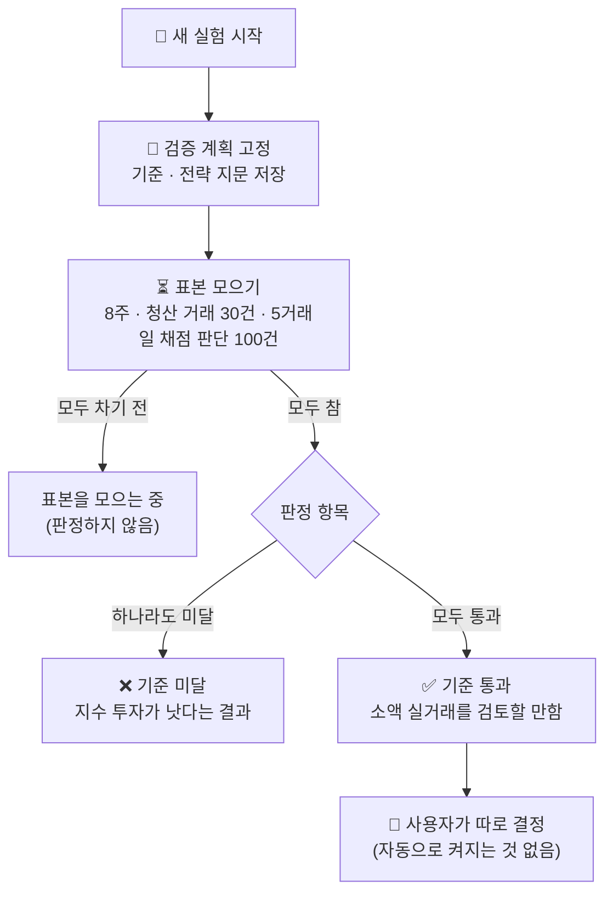

# ✅ 검증 계획 · 거래 성적표 — "실제 돈을 맡길 만한가"를 판정하는 장치

이 시스템으로 실제 돈을 벌 수 있는지는 **감이나 며칠의 결과로 알 수 없습니다.** 그래서 실험을 시작하는 순간 판정 기준을 고정해 두고, 표본이 다 찰 때까지 기다렸다가 그 기준대로만 판정합니다. 기준을 통과해도 아무것도 자동으로 켜지지 않으며, "아주 작은 금액의 실거래를 검토할 만하다"는 뜻일 뿐입니다.

> **수익을 보장하지 않습니다.** 개인의 단기 매매는 비용을 빼고 꾸준히 버는 경우가 드뭅니다. 통과하지 못하면 "낮은 비용의 지수 투자가 낫다"는 것을 확인한 셈이고, 그것도 돈을 지키는 결론입니다.

## 📑 목차
1. [전체 흐름](#-전체-흐름)
2. [고정되는 기준](#-고정되는-기준)
3. [거래 성적표](#-거래-성적표)
4. [지수 ETF 보유 비교](#-지수-etf-보유-비교)
5. [AI 판단 vs 규칙대로](#-ai-판단-vs-규칙대로)
6. [전략 지문 — 검증 중 전략 변경 감지](#-전략-지문)
7. [실제처럼 계산하는 비용과 체결](#-실제처럼-계산하는-비용과-체결)
8. [통과한 뒤의 순서](#-통과한-뒤의-순서)
9. [판 뒤의 흐름](#-판-뒤의-흐름)
10. [검증한 방법](#-검증한-방법)
11. [한계](#-한계)

---

## 🔁 전체 흐름

대시보드의 **검증 계획 · AI 판단 채점** 칸 맨 위에 진행률, 판정 항목별 통과·미달·대기, 거래 성적표, 지수 비교가 2초마다 다시 계산되어 보입니다.

## 📌 고정되는 기준

새 실험(1개월 스윙)을 만들 때 `state.verification`에 저장되고, 이후 코드나 설정이 바뀌어도 **이 실험의 기준은 그대로**입니다.

| 구분 | 기준 | 이유 |
|---|---|---|
| 기간 | 최소 **56일(8주)** | 한 달짜리 판단의 21거래일 결과가 쌓이려면 한 달 이상 필요 |
| 청산 거래 | 최소 **30건** | 거래당 기대값과 신뢰구간을 계산할 최소 표본 |
| 채점된 판단 | 5거래일 뒤 채점 **100건** | AI 판단 vs 규칙대로 비교의 최소 표본 |
| 기대값 | 거래당 기대값 > 0, **95% 신뢰구간 하한 > 0** | 평균이 플러스여도 우연일 수 있음. 표본이 작으면 t분포로 구간을 넓게 잡음 |
| 지수 비교 | 계좌 수익률 ≥ 같은 기간 **지수 ETF 보유** (통화별) | 그 돈을 지수에 넣어 두는 것보다 나아야 이 시스템을 쓸 이유가 있음 |
| 낙폭 | 최대 낙폭 ≤ 같은 기간 **지수 ETF의 최대 낙폭** (통화별, 시장이 조용해도 3%까지는 허용) | 주식만 사는 계좌는 시장이 빠지면 같이 빠집니다. "그냥 지수를 들고 있었을 때보다 더 아프지 않은가"가 현실적인 질문입니다. 2006~2026년 계좌 시뮬레이션에서 신호를 거른 뒤에도 최악의 낙폭은 약 25%였습니다 |
| 운 배제 | 가장 좋았던 **3일**을 빼도 플러스 (통화별) | 한두 번의 운으로 만든 성적이 아님 |
| 레버리지 | 레버리지 ETF 거래가 있으면, 빼고도 기대값 > 0 | 시장 방향에 2~3배로 건 결과를 실력으로 착각하지 않음 |

- 원금이 0인 통화는 판정 대상에서 빠집니다.
- 계산할 수 없는 항목(예: 지수 일봉을 아직 못 읽음)이 있으면 "대기"로 두고, 기간·표본이 다 찼어도 판정을 미룹니다. 이미 미달이 확정된 항목이 있으면 그때는 미달로 판정합니다.
- 수치는 [`app/verification.py`](../app/verification.py)의 `CRITERIA`이며, 새 실험부터 적용됩니다.
- **기준 2판 (2026-10-03)**: 낙폭 기준을 고정 5%에서 지수 비교로 바꿨습니다. 그 전에 시작한 실험은 계획에 저장된 5% 기준을 그대로 씁니다.

## 📋 거래 성적표

[`app/scorecard.py`](../app/scorecard.py)가 체결 장부에서 직접 계산합니다.

| 항목 | 정의 |
|---|---|
| 거래 1건 | 보유 0주에서 처음 산 때부터, 나눠 팔더라도 **보유가 0주가 될 때까지** |
| 거래 수익률 | (그 거래의 실현 손익 합) ÷ (산 금액 + 매수 수수료). 매도 수수료·세금은 실현 손익에 이미 들어 있음 |
| 승률 · 평균 이익/손실 | 수익률 > 0이면 승, 0 이하이면 패 |
| 손익비 | 평균 이익 ÷ 평균 손실의 크기 |
| 수익 팩터 | 이긴 거래 수익률 합 ÷ 진 거래 수익률 합의 크기 |
| 거래당 기대값 | 거래 수익률의 평균과 **95% 신뢰구간** (표본 2건부터) |
| 나눠 보기 | AI 분석 매수 / 조건 진입, 조사 재사용 / 새 조사, 레버리지 ETF / 그 외 |

## 📈 지수 ETF 보유 비교

| 통화 | 비교 대상 | 계산 |
|---|---|---|
| KRW | KODEX 200 (069500) | 실험 시작 때 이미 정해져 있던 마지막 종가(국내 15:30, 미국 16:00 마감)에 사서 그냥 들고 있었다면의 수익률·최대 낙폭 |
| USD | SPDR S&P 500 (SPY) | 같은 방식 |

- 일봉은 15분에 한 번 읽고(토스 chart 그룹), 시작 종가는 처음 정해진 뒤 바뀌지 않습니다. 예외 하나: 일봉은 날짜가 지난 자정에야 완료로 표시되므로, 장 마감 뒤·자정 전에 시작한 실험은 처음엔 그 전 거래일 종가로 잡혔다가 시작일 일봉이 들어오면 그 종가로 한 번 옮겨집니다(같은 날 움직임을 지수에만 넣지 않도록).
- 양쪽 모두 배당·분배금은 넣지 않아 비교는 대체로 공정하지만, 지수 쪽은 마지막 **완료** 일봉 기준이라 장중에는 하루 늦을 수 있습니다.

## ⚖ AI 판단 vs 규칙대로

1개월 스윙의 분석은 모두 **규칙 신호에서 시작**합니다(보유하지 않은 종목은 매수 신호. 보유 종목의 매도 신호는 집중 종목 실험에서만 — 후보 전체 확인 실험은 보유 종목을 추적 손절·보유 기한에 맡깁니다). 그래서 같은 시점에 "AI 없이 신호대로 샀다/팔았다면"과 AI의 실제 판단(관망 포함)을 같은 비용으로 비교하면, **AI가 신호를 거르는 것(거부권)이 가치를 더하는지** 잴 수 있습니다.

| 값 | 의미 |
|---|---|
| AI | AI 판단의 평균 순수익률 (매수는 수익률−비용, 매도는 하락 회피−비용, 관망은 0) |
| 규칙대로 | 그 분석을 시작하게 한 신호대로 했을 때의 평균 순수익률 |
| 차이 · 95% 구간 | AI − 규칙대로. 꾸준히 0보다 작으면 AI 없이 규칙만 쓰는 편이 싸고 낫다는 뜻 |

직접 요청("지금 분석")으로 시작한 분석은 신호가 없어 이 비교에서 빠집니다. 판정 항목은 아니고 참고 지표입니다.

## 🔏 전략 지문

계획과 함께 **전략을 정의하는 것들의 해시**(16자리)를 저장합니다: 1개월 스윙 프롬프트 전체, 손절·익절·보유 범위, 추적 손절 값, 규칙 신호 게이트·규칙 값, 일봉 기간, 집중 종목 기준, 조건 진입·조사 재사용 값, 비용 가정, 최소 익절 배수, 분석 간격, 사용하는 AI와 모델 분담 설정. 지금 값으로 다시 계산한 해시가 다르면 대시보드에 **"검증을 시작한 뒤 전략이 바뀌었습니다"** 경고가 뜹니다. 그 실험의 결과에는 두 전략이 섞여 있으므로 새 실험으로 다시 재야 합니다. 버그 수정처럼 전략을 바꾸지 않는 수정은 지문을 바꾸지 않습니다. 해시가 볼 수 없는 논리를 바꿀 때는 `STRATEGY_VERSION`을 올립니다.

## 💸 실제처럼 계산하는 비용과 체결

돈만 가상이고 나머지는 실제처럼 계산합니다.

| 항목 | 값 (2026년) | 적용 |
|---|---|---|
| 국내 수수료 | 0.015% (토스증권) | 매수·매도 모두 |
| 미국 수수료 | 0.1% (토스증권) | 매수·매도 모두. 주문 1건 체결 금액이 10달러 이하이면 0 |
| 국내 거래세 | 0.20% (코스피 0.05% + 농특세 0.15%, 코스닥 0.20%) | 국내 **주식 매도**에만. ETF는 면제 |
| 슬리피지 | 0.05% (가정) | 호가 스프레드를 건너는 것에 더해 |
| 익절 | 목표가 **지정가** | 시세가 목표보다 더 올라 있어도 목표가로 체결 (증권사 괄호 주문처럼) |
| 손절·추적 손절·기한·교체 청산 | 그때의 매수호가 | 갭으로 손절가 아래에서 시작하면 그 가격에 팔림 |
| 체결 시간 | 정규장만 | 국내 09:00~15:20, 미국 09:30~16:00(뉴욕) |
| **배당** | 배당락일 전에 산 보유 종목에 입금 | 주당 배당 × 보유 수량, **원천징수 국내 15.4% · 미국 15%** 차감. 날짜·금액은 데이터 보관소의 배당 기록(배당락일 기준). 입금은 배당락일에 반영(실제 지급일은 몇 주 뒤) |
| **환율** | 미국 계좌를 원화로도 평가 | 새 실험을 만드는 순간의 원/달러 환율(+환전 비용 0.05%)로 달러를 산 것으로 기록하고, 10분마다 읽는 환율(−0.05%)로 원화 가치를 다시 계산. 원화 기준 손익을 주가 몫과 환율 몫으로 나눠 표시. 판정은 달러 기준(지수 SPY도 달러)이라 환율 영향은 판정에 섞이지 않음 |
| **해외 주식 양도세** | 추정만 표시 | 올해 미국 주식 실현 이익 × 환율 − 250만 원 공제 → 22%. 실제 세금은 다른 해외 거래와 합산되므로 성적·판정에는 빼지 않고 참고로 표시 |

## 🔒 공식 판정 고정

기간 없이 계속 돌리면서 판정을 매번 다시 보면, 실력이 없어도 운 좋은 구간에 언젠가 "통과"가 찍힙니다(중간에 멈춰 보는 문제). 그래서 **표본이 처음 다 찬 순간의 통과/미달을 공식 판정으로 고정**하고(`plan.official`, 15분마다 확인), 그 뒤 판정은 참고로만 보여 줍니다. 대시보드에는 "공식 · 기준 통과/미달"과 고정 시각이 나옵니다.

## 🚦 통과한 뒤의 순서

1. 대시보드가 "기준 통과"를 보여 줘도 **자동으로 바뀌는 것은 없습니다.**
2. 사용자가 결정하면: 잃어도 되는 금액(예: 50만~100만 원)으로 4~8주, 직접 승인 방식부터, 손절·익절은 증권사 쪽 주문(OCO)으로 걸어 서버가 꺼져도 보호.
3. 그때 필요한 주문 연결은 아직 없습니다(실거래 잠금). 구조와 체크리스트는 [LIVE_TRADING.md](LIVE_TRADING.md)에 있습니다.

## 🔭 판 뒤의 흐름

"목표가에 다 팔기(A)"가 맞는지, "팔지 않고 추적 손절로 계속(C)"이 나은지는 매매 종류에 따라 다르다는 근거가 있습니다(추세형은 C, 박스권·평균회귀형은 A). 그래서 규칙을 미리 바꾸지 않고 **실제 결과로 재는** 장치를 둡니다([`app/afterexit.py`](../app/afterexit.py)).

| 항목 | 내용 |
|---|---|
| 대상 | 손절·추적 손절·익절·기한·교체 청산으로 끝난 거래(사용자의 전량 매도 제외) |
| 판 뒤 | 판 가격 대비 5·20거래일 뒤 종가 |
| C − A | 익절 거래만: 같은 추적 손절 폭·같은 보유 기한으로 계속 들고 있었다면의 매도 가격과 실제 익절 가격의 차이(%). 일봉으로 보수적으로 재연(손절 아래 갭은 시가, 같은 봉의 저가를 고가보다 먼저 확인) |
| 나눠 보기 | 매수를 일으킨 분석의 규칙 신호: 추세형(골든크로스·모멘텀·돌파) · 평균회귀형 · 둘 다 · 정보 없음. 조건 진입은 계획을 남긴 분석의 신호 |
| 추적 손절 실험 | 새 실험(`exit_mode=trail`)은 익절가를 넘겨 계속 들고 가므로 반대로 잽니다: 익절가에 닿았던 거래가 끝나면 "그때 익절가에 팔았다면(A)"의 가격은 익절가 그대로이므로, **실제 청산 가격 − 익절가**가 C − A입니다(재연이 아니라 실제 값) |
| 성격 | 참고 지표. 판정 항목도 전략 지문도 아니며 매매 규칙을 바꾸지 않음 |

과거 데이터로 같은 비교를 미리 재는 백테스트는 [tools/data](../tools/data/README.md)에 있습니다(AI 판단이 아니라 규칙 신호대로 산 거래 기준).

## ✅ 검증한 방법

- `tests/test_verification.py`: 신뢰구간(t분포), 거래 왕복 구성(나눠 판 거래 포함), 성적표·나눠 보기, 지수 보유 비교(시작 종가 고정·낙폭), 판정(통과·항목별 미달·수집 중·계산 불가), 전략 지문 변화 감지, 규칙대로 비교, 하루 단위 평가자산 기록(400일), 새 실험이 계획을 고정하는지.
- `tests/test_realism.py`: 실제 요율의 수수료·세금(ETF 면제·미국 소액 무료), 손절 위험 계산의 세금, 익절 지정가·손절 시장가 체결.
- **변조 테스트**: 기대값·지수·낙폭·운 배제·레버리지 판정, 표본 기준, 신뢰구간 계산, 왕복 구성, 지문, 비용 규칙, 체결 방식 등을 하나씩 망가뜨려 테스트가 잡는지 확인(결과가 같은 변형 1개 제외 모두 검출).
- 브라우저(합성 데이터)로 검증 칸·새 실험 양식·비용 안내·폰 폭·다크 테마·글자 대비를 DOM으로 확인.

## ⚠ 한계

- 기준(8주·30건·100건)은 **최소치**입니다. 1개월 스윙은 거래가 적어 30건을 채우는 데 몇 달이 걸릴 수 있고, 30건으로도 작은 우위는 우연과 구분하기 어렵습니다.
- 지수 비교는 계좌 전체(현금 포함) 수익률과 지수 100% 보유를 비교합니다. 현금 비중이 크면 상승장에서는 불리하고 하락장에서는 유리합니다. 이것이 "그 돈을 어디에 둘까"라는 질문에 맞는 비교라고 보았습니다.
- 보유 종목의 배당은 입금합니다(원천징수 후). 지수 비교는 배당 반영 일봉이 아니라 종가 기준이라 지수 쪽이 약간 불리합니다. 액면분할은 처리하지 않습니다.
- 모의체결은 최우선 호가 잔량 안에서만 체결하고 변동성 완화장치(VI)·부분 체결은 흉내 내지 않습니다. 이런 차이는 소액 실거래 단계에서 모의와 실제 체결을 비교해 재야 합니다.
