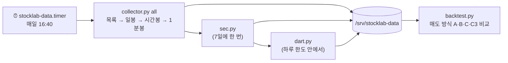

# 🗄 과거 데이터 보관소 · 매도 방식 백테스트

사이트와 **완전히 분리된** 수집·분석 도구입니다. 실시간 매매에 쓰는 토스 API는 쓰지 않고(토큰이 하나뿐), 공개 데이터만 서버 안에 모아 백테스트에 씁니다. **모은 데이터와 키는 저장소에 올리지 않습니다.**

## 📑 목차
1. [무엇을 모으나](#-무엇을-모으나)
2. [흐름](#-흐름)
3. [폴더 구조](#-폴더-구조)
4. [설치](#-설치)
5. [백테스트](#-백테스트)
6. [한계](#-한계)

## 📦 무엇을 모으나

| 데이터 | 출처 | 범위 | 갱신 |
|---|---|---|---|
| 종목 목록 | Nasdaq Trader 심볼 목록, KRX KIND 상장 목록, 네이버 ETF 목록 | 미국 주식·ETF 약 1.2만, 국내 코스피·코스닥·ETF 약 3.8천 | 매일 |
| 일봉 | Yahoo Finance 차트(비공식, 개인 연구용) | 상장 이후 전체. 분할 반영 가격 + 배당 반영 가격 + 배당·분할 기록 | 매일(한 달에 한 번 전체 다시) |
| 시간봉 | Yahoo | 거래대금 상위 미국 1,500 · 국내 600 종목의 최근 730일 | 매일 이어 붙임 |
| 1분봉 | Yahoo | 거래대금 상위 미국 800 · 국내 300 종목, 최근 7일 | 매일 이어 붙임(쌓일수록 커짐) |
| 거시 지표 | Yahoo | 주요 지수, VIX, 미국 국채 금리, 달러 지수, 원/달러, 유가·금·구리, 비트코인 등 23개 | 매일 |
| 미국 재무·공시 | SEC EDGAR 대량 파일 | 모든 제출 회사의 XBRL 재무 수치(**공시일 포함**)와 공시 목록 | 매주 |
| 국내 재무·공시 | DART 오픈API | 상장사 공시 목록(2015~), 전체 재무제표(2015~, 연결 없으면 별도) | 매일, 키의 하루 한도(2만 건) 안에서 이어 받음 |

- 재무 수치에는 **공시일**(`filed`, DART는 접수번호 앞 8자리)이 있어, 백테스트에서 그 시점에 이미 알려진 숫자만 쓸 수 있습니다.
- FRED는 이 서버에서 접속되지 않아 거시 지표는 Yahoo에서 받습니다.

## 🔁 흐름



## 📁 폴더 구조

```
/srv/stocklab-data/
├── universe/{us,kr,macro}.parquet
├── daily/{US,KR,MACRO}/{종목}.parquet     # date, open, high, low, close, adjclose, volume
│   └── events/{종목}.json                  # 배당·분할
├── hourly/{US,KR}/{종목}.parquet
├── minute/{US,KR}/{종목}/{YYYY-MM}.parquet
├── sec/{facts,filings}/part-*.parquet, companies.parquet, tickers.parquet
├── dart/corps.parquet, list/*.parquet, fin/{연도}_{보고서}/part-*.parquet, progress.json
└── results/report-*.json, trades-*.parquet
```

## 🛠 설치

```bash
sudo mkdir -p /opt/stocklab-data /srv/stocklab-data && sudo chown 10001:10001 /srv/stocklab-data
sudo install -m 644 tools/data/*.py tools/data/Dockerfile /opt/stocklab-data/
docker build -t stocklab-data /opt/stocklab-data
# SEC는 User-Agent에 연락처를, DART는 API 키를 요구합니다. 관리자 전용 파일에만 둡니다.
sudo sh -c 'umask 077; printf "SEC_CONTACT=you@example.com\nDART_KEY=발급받은키\n" > /opt/stocklab-data/contact.env'
sudo install -m 644 tools/data/stocklab-data.service tools/data/stocklab-data.timer /etc/systemd/system/
sudo systemctl daemon-reload && sudo systemctl enable --now stocklab-data.timer
```

컨테이너는 읽기 전용 루트, 모든 권한 제거, 메모리·CPU 제한, 낮은 우선순위로 돌아 사이트에 영향을 주지 않습니다. 전체 첫 수집은 일봉만 약 6시간, DART는 약 10일 걸립니다. `python collector.py status`로 진행 상황을 봅니다.

## 🧪 백테스트

`backtest.py`는 **사이트의 규칙 신호**(`app/rules.py`)로 매수한 뒤, 같은 매수에서 매도 방식만 바꿔 비교합니다(짝지은 비교).

| 방식 | 내용 |
|---|---|
| **A** (사이트 현재) | 목표가에 전량 익절 |
| **B** | 목표가에서 절반 익절, 나머지는 추적 손절 |
| **C** | 목표가에서 팔지 않고 추적 손절로 계속 |
| **C3** | C와 같고 보유 한도만 63거래일(약 3개월) |

- 계획은 사이트의 방식을 흉내 냅니다: 손절 = 14일 평균 변동폭 × 1.5(2~15%), 목표 = 손절 × 1.5(3~40%), 목표의 절반에 닿으면 손절을 매수가+0.3%로, 이후 최고가−손절 폭으로 올림, 보유 21거래일.
- **보수적으로 읽습니다**: 손절 아래 갭은 시가에 팔림, 한 봉이 손절과 목표를 모두 건드리면 손절로 침, 봉의 고가는 다음 봉부터 손절을 올림.
- 실제 비용(국내 1.5bp + 주식 매도세 20bp, 미국 10bp, 슬리피지 5bp, 양쪽), 배당 반영 가격, 매수 시점에 이미 알려진 거래대금 기준(국내 50억·미국 2천만 달러 이상)만 사용.
- 결과는 신호 종류(추세형 · 평균회귀형 · 둘 다), 시장, 기간(2006~2015 / 2016~2026)별로 나눠 보고, 95% 구간은 같은 달의 거래를 한 묶음으로 봅니다(같은 달 거래는 함께 움직이므로).
- `check_signals.py`가 벡터 계산 신호를 사이트 규칙 코드와 봉 단위로 대조합니다(6,600개 값 일치 확인).

```bash
docker run --rm -e DATA=/data -v /opt/stocklab-data:/code:ro -v /opt/stock-lab:/app:ro \
  -v /srv/stocklab-data:/data stocklab-data python backtest.py --workers 3
```

## ⚠ 한계

- **생존 편향**: 지금 상장된 종목만 있어 절대 수익률은 실제보다 좋게 나옵니다. 방식끼리의 비교(같은 매수)는 영향이 작습니다.
- **AI 판단은 백테스트할 수 없습니다**: 모델이 과거에 무슨 일이 있었는지 이미 알기 때문입니다. AI의 성적은 사이트의 검증 계획(실시간)으로만 잽니다.
- Yahoo 데이터는 비공식 경로라 가끔 틀린 값이 있습니다(하루 ±60% 이상 움직인 구간은 매수에서 제외).
- 분봉은 무료 경로가 최근 7일만 주므로 과거가 아니라 **앞으로 쌓입니다**.
